在科目一考试中，“246 351”是一套针对**停车距离**和**能见度限速**的常用记忆口诀。

这组数字实际上是把复杂的交通法规简化成了几个关键量化指标。以下是详细的拆解和含义：

---

## 1. “351”：停车距离口诀

这组数字主要用于记忆“不得停车”的距离规定。

* **3（30米）：** 指的是**“站”**类地点。
* 公交站、加油站、消防栓、急救站、消防队门前等，这些地方的前后**30米**内不得停车。

* **5（50米）：** 指的是**“口”**或**危险路段**。
* 路口、转弯处、窄路、桥梁、隧道、陡坡、铁道口等，这些地方的前后**50米**内不得停车。

* **1（150米）：** 指的是**高速公路事故警告**。
* 在高速公路上车辆发生故障或事故，警告标志（三角牌）应当设置在故障车方向**150米**以外。

> **记忆锦囊：** 记住 **“口五站三”**。凡是带“站”的选30米，凡是带“口”或比较险要的路段选50米。

---

## 2. “261”：能见度与限速（高速公路）

这通常对应高速公路上遇到恶劣天气（雾、雨、雪等）时的**能见度、限速、车距**规定，标准口诀通常被称为“261、145、520”。

* **2（261）：** 能见度小于 **200米**，车速不得超过 **60公里/小时**，车距保持 **100米** 以上。
* **4（145）：** 能见度小于 **100米**，车速不得超过 **40公里/小时**，车距保持 **50米** 以上。
* **6（520）：** 能见度小于 **50米**，车速不得超过 **20公里/小时**，并尽快**从最近的出口驶离**高速公路。

> **注意：** 这里的数字可能因为不同的口诀编排略有差异（比如有的学生把 200m-60km-100m 简称为“261”），但核心考核点始终是这三组对应的数值。

---

## 3. 其他常见的速度口诀（补充）

除了“351 261”，科目一还有一个关于**普通道路限速**的口诀非常实用：

| 道路类型 | 城内（有/无中心线） | 城外/公路（有/无中心线） |
| --- | --- | --- |
| **无中心线** | **30** 公里/小时 | **40** 公里/小时 |
| **有中心线（单行道）** | **50** 公里/小时 | **70** 公里/小时 |

**速记口诀：** “城三公四，城五公七”（城市道路无线30、公路无线40；城市道路有线50、公路有线70）。

---

### 您现在准备到哪个阶段了？

如果是刚开始刷题，这类口诀能帮你直接秒杀掉约 15% 的题目。如果你需要，我可以为你整理一份**“科目一高频易错题避坑指南”**，或者帮你分析一下**吊销/撤销/扣留证件**的区别。

 

 

 

这道题的正确答案是 **B. ACC**。

在汽车术语中，**ACC** 代表的是 **Adaptive Cruise Control**，中文翻译为**自适应巡航控制系统**。

为了帮你更好地记忆和区分这些常见的汽车缩写，我整理了选项中各个缩写的具体含义：

| 缩写 | 全称 | 中文含义 | 主要功能 |
| --- | --- | --- | --- |
| **ACC** | **Adaptive Cruise Control** | **自适应巡航控制** | 自动调节车速，与前车保持安全距离。 |
| **EBD** | Electronic Brakeforce Distribution | 电子制动力分配 | 自动调节各个车轮的制动力，提高制动效能。 |
| **ABS** | Anti-lock Braking System | 防抱死制动系统 | 防止紧急制动时车轮抱死，保持车辆转向能力。 |
| **BSD** | Blind Spot Detection | 盲点监测系统 | 监测车辆侧后方盲区，通过后视镜等提醒驾驶员。 |

---

### 重点了解 ACC (自适应巡航)

ACC 是传统定速巡航的“升级版”。它通过安装在车前的雷达或摄像头：

1. **感应前车：** 实时监测前方车辆的距离和速度。
2. **自动跟车：** 如果前方没车，按设定速度行驶；如果前方有车，会自动减速跟车。
3. **保持距离：** 始终与前车保持驾驶员设定的安全时间间隔。

这在长途高速驾驶时能显著减轻驾驶疲劳。

你需要我为你总结更多关于驾照考试或车辆电子系统的常见缩写吗？
 

 

 

### 1. **LDW (Lane Departure Warning) - 正确答案**

* **含义：** **车道偏离预警系统**。
* **功能：** 当车辆在未开启转向灯的情况下偏离原行驶车道时，系统通过声音、视觉或震动（如方向盘震动）来提醒驾驶员。

### 2. **TSR (Traffic Sign Recognition)**

* **含义：** **交通标志识别系统**。
* **功能：** 识别路边的限速、禁止超车等交通标志，并将其显示在仪表盘或抬头显示（HUD）上，防止驾驶员漏看标志。

### 3. **TMC (Traffic Message Channel)**

* **含义：** **交通信息频道**。
* **功能：** 这是一种用于实时传送交通和路况信息（如拥堵、事故）的技术，通常与车载导航系统配合使用。

### 4. **ALC (Adaptive Light Control / Auto Lane Change)**

* **含义：** **主动转向大灯** 或 **自动辅助变道**。
* **功能：**
* 在灯光领域：指灯光会根据方向盘转角自动调整照射角度。
* 在自动驾驶领域：指驾驶员拨动转向灯杆后，车辆在确保安全的情况下自动完成变道。

---

### 💡 记忆小技巧

* **LDW** 中的 **W** 代表 **Warning（报警/预警）**。
* **TSR** 中的 **S** 代表 **Sign（标志）**。
* 如果您以后遇到 **LKA** (Lane Keeping Assist)，那它是比 LDW 更进一步的“车道保持辅助”，它不仅会预警，还会**主动微调**方向盘把车拉回车道。

需要我为您总结更多常见的驾考或汽车辅助系统缩写（如 ABS, ESP, ACC 等）吗？
 

 

 

### 1. 圆形标志：非机动车行驶

* **形状**：圆形，蓝底白图案。
* **含义**：指示非机动车可以沿此路段行驶，主要用于引导行驶方向。
* **关键区别**：这个标志**并不代表**该路段是专门的非机动车道，该路段可能存在机动车与非机动车**混行**的情况。
 

### 2. 方形标志：非机动车车道

* **形状**：方形（矩形），蓝底白图案，标志中除了自行车还有**车道线**和**箭头**的图形。
* **含义**：表示该路段是**专门**为非机动车设置的独立车道，**机动车不得驶入**。
* **作用**：明确划分了道路的使用权限，为非机动车提供相对独立和安全的行驶空间。

---

### 回到你最初的那道判断题

原来的题目是：**“这个标志（圆形蓝色自行车）的含义是提醒车辆驾驶人前方是非机动车道。”**

结合你给出的这两张新图，这道题之所以选“错误”，原因其实更丰富了：

1. **功能描述不对**：圆形蓝色标志是“指示标志”，而题干用的“**提醒……前方是**”属于“警告标志（黄色三角）”的描述语。
2. **定义不匹配**：你提供的截图明确指出，圆形标志叫“非机动车**行驶**”，且不代表是专门的“车道”；而方形标志才叫“非机动车**车道**”。

**总结一下：**

* **圆**：告诉你非机动车可以走这里（可能混行）。
* **方**：这里是专属非机动车的路（机动车禁入）。
* **黄三角**：提醒司机注意前方有非机动车（警告）。

你找出的这两张对比图非常专业，建议在复习时重点关注标志里是否有那两条**白色的车道虚线**。

如果要继续练习，你想看更多关于“指示标志”和“警告标志”的对比吗？
 

 

步行:前方道路只供步行,任何车辆不准进
入。
 

人行横道:表示该处为人行横道,机动车驾驶
人应注意观察行人,遇行人已进入人行横道时
应停车让行人通过。
 

注意行人:警告前方道路设有人行横道线,应
减速慢行,注意行人。
 

注意儿童:警告前方是儿童频繁出入的地点,
应减速慢行,注意儿童。

 

 

 

好，下面给你一份**「科目一交通标志速记表（最易混淆版）」**。
我按**考试出题思路**来整理，背这一套，命中率很高 👌

---

# 🚦 科目一交通标志速记表（必背）

## 一、先记这句「总口诀」（90% 题靠它）

> **圆形看能不能**
> **方形看是什么路**
> **三角形看前方危险**
> **八角形只管停车**

---

## 二、形状 + 颜色 = 出题核心

### 🔵 蓝色圆形（指示标志）

👉 **“可以 / 必须”做什么**

| 标志      | 含义      | 易错点        |
| ------- | ------- | ---------- |
| 自行车     | 非机动车行驶  | ❌ 不等于非机动车道 |
| 直行 / 左转 | 按指示方向行驶 | 不是“前方”     |
| 行人      | 行人通行    | 不是人行横道     |

📌 **口诀**：

> 蓝圆＝**当下路段允许你这么走**

---

### 🔴 红色圆形（禁令标志）

👉 **“不能 / 禁止”**

| 标志   | 含义     |
| ---- | ------ |
| 禁止通行 | 所有车都不行 |
| 禁止驶入 | 不能进去   |
| 限速   | 不能超过   |

📌 **口诀**：

> 红圆＝**一律不许**

---

### 🟦 蓝色方形（指路 / 车道标志）

👉 **“这是什么路 / 哪条车道”**

| 标志     | 含义     | 关键     |
| ------ | ------ | ------ |
| 非机动车车道 | 专供非机动车 | 🚗 不能进 |
| 人行横道   | 行人过街位置 |        |
| 停车场    | 这里能停车  |        |

📌 **口诀**：

> 蓝方＝**道路属性已确定**

---

### ⚠️ 黄色三角形（警告标志）

👉 **“前方有情况”**

| 标志      | 含义        |
| ------- | --------- |
| 注意行人    | 前方可能有人    |
| 注意非机动车  | 前方可能有非机动车 |
| 急弯 / 陡坡 | 前方危险      |

📌 **口诀**：

> 黄三＝**前方可能发生**

---

### 🛑 八角形（唯一）

👉 **停车让行**

| 标志   | 含义   |
| ---- | ---- |
| STOP | 必须停车 |

📌 **记住**：

> 八角＝**不用看字，也得停**

---

## 三、考试最爱挖坑对照表（必看）

### ❌ 最常错 1

**蓝色圆形自行车 ≠ 非机动车道**

✔ 正确区分：

* 🔵圆形：非机动车 **可以走**
* 🟦方形：这是 **非机动车道**

---

### ❌ 最常错 2

**“前方”≠“当前”**

| 说法   | 正确标志       |
| ---- | ---------- |
| 前方有  | ⚠️ 黄色三角    |
| 此路段是 | 🔵 / 🟦 蓝色 |

---

### ❌ 最常错 3

**看图别被文字骗**

考试规律：

> **文字是干扰项，形状和颜色才是答案**

---

## 四、3 秒判断流程（考场用）

1️⃣ 先看 **形状**
2️⃣ 再看 **颜色**
3️⃣ 最后才看 **图案**

👉 **不看文字，先定对错**

---

## 五、送你一条「压轴神口诀」

> **圆形管行为**
> **方形管归属**
> **三角管预警**
> **八角必停车**

---

如果你愿意，我还能给你做：

* ✅ **只考“判断题”的速杀版**
* ✅ **100%易错题专练**
* ✅ **和你刚才那题一模一样的“对比图背法”**

 

这是交通事故管理警告标志,用以警告前方路
段正在进行道路交通事故管理,车辆驾驶人应
减速慢行、停车等候或绕道行驶。该标志为粉
红色底或荧光粉红色底、黑文字。作为临时性
标志设在进行交通事故管理的路段前适当位
置。
 

 

### 高速公路分道限速标准（单位：km/h）

| 车道总数 | 第一车道（最左侧） | 第二车道 | 第三车道 | 第四车道（最右侧） |
| --- | --- | --- | --- | --- |
| **二车道** | 100 - 120 | 60 - 100 | / | / |
| **三车道** | 110 - 120 | 90 - 110 | 60 - 90 | / |
| **四车道** | 110 - 120 | 90 - 110 | 90 - 110 | 60 - 90 |

---

### 需要注意的几个细节：

1. **标志牌优先原则**：
上述数值是法律规定的“保底”标准。如果在实际行驶中，路边或龙门架上的**限速标志牌**标注了不同的数值（例如因施工限速 80 或特定路段最高 110），必须以标志牌为准。
2. **车型限制**：
* **最左侧车道**：通常只允许小型客车行驶。
* **大型车辆**：如大货车、大客车，通常被限制在右侧车道行驶，且其最高限速往往不得超过 100km/h（具体看车身标识和路段要求）。

3. **特殊天气**：
如果遇到雾、雨、雪、沙尘、冰雹等低能见度气象条件，法定的限速会进一步降低（如能见度小于 200 米时，时速不得超过 60km/h）。
4. **关于四车道的中间两道**：
正如你所写，四车道的第二和第三车道通常都维持在 90-110km/h 这个区间，这主要是为了保证中间车道的车流速度相对平均，减少频繁变道带来的风险。

 

 

根据《道路交通标志和标线》标准,免费停车
位的标线通常为蓝色虚线,表示该停车位免费
且限时停放(具体时间以辅助标志为准)。其
他颜色含义如下:
白色标线:收费停车位或专用停车位。
黄色标线:专属停车位(如消防车、警车等)
或禁止停放车辆。
红色标线:一般为禁停区域。

 

图案是电动自行车,是电动自行车行驶
标志,表示该道路仅供电动自行车通行。

图案是行人,是行人标志,表示该段道
路仅供行人步行,任何车辆不准进入。

图案是货车,是靠右侧车道行驶标志,
表示车辆除必要的超车行为外应靠右侧车道行
驶。

图案是行人与自行车,是非机动车与行
人共享空间通行标志,表示该道路仅供非机动
车与行人通行,机动车不准进入。

 

 

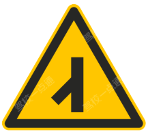
显示一个箭头向上,表示该道路为单向
通行,即单行路标志。
###  长方形（左图）：单行路

* **含义：** 表示整条道路都是**单向行驶**的。
* **理解：** 它告诉你这条路的“属性”。进了这条路，所有车都只能朝一个方向走，没有对向来车。
* **特征：** 箭头比较宽大，充满整个长方形。
 
 

直行,表明一切车辆在该路段应保持直
线行驶,不得转弯。
###  圆形（右图）：只准直行

* **含义：** 表示在该路口或路段**只能直行**，不能左转或右转。
* **理解：** 它是一个“指令”。主要出现在路口，限制你的行驶方向。虽然你只能直行，但对面可能有车开过来（双向车道）。
* **特征：** 箭头比较细长，放在圆圈中间。
 

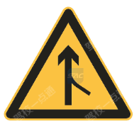
显示一个箭头向上,旁边有虚线,表示
直行车道标志,指示车辆在此车道只能直行。

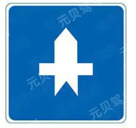
显示一个蓝色背景上的白色飞机图案,
表示路口优先通行标志,指示主要道路上的车
辆享有优先通行权。

显示一个向右的箭头,表示分隔带右侧
行驶标志,指示车辆应在分隔设施的右侧行
驶。

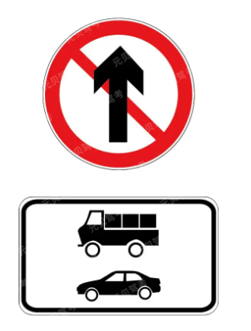
以上交通标志表示除小客车和货车外,其他车
辆可以直行。
 

单选 行人参与道路交通的主要特点是什么?(C)

A行动迟缓

B喜欢聚集、围观

C行走随意性大,方向多变

D以上都是
 

单选 夜间在照明不良的路段行驶,应如何使用灯光?(C)

A只开启远光灯

B只开启前照灯

C开启前照灯、示廓灯和后位灯

D只开启后位灯
 

这道题选 C 而不选 A（只开启远光灯），主要有两个核心原因：**法规要求的完整性**和**安全驾驶的避嫌性**。

简单来说，开车不仅要让自己**“看得见”**，还要让别人**“看见你”**。

### 1. 法律规定的“标配”

根据《中华人民共和国道路交通安全法实施条例》第五十八条：

> 机动车在夜间没有路灯、照明不良……情况下行驶时，应当开启**前照灯、示廓灯和后位灯**。

* **前照灯（前大灯）：** 负责照亮前方路面。它包含近光灯和远光灯。
* **示廓灯（示宽灯）：** 勾勒车辆轮廓，让侧面和侧后方的车辆看清你车的大小。
* **后位灯（尾灯）：** 让后车能看清你的位置，防止追尾。

**为什么 A 不对？**
选项 A 强调的是“**只**开启”。如果你“只”开了远光灯而没开示廓灯和后位灯，虽然你前面看得清了，但侧方和后方的车可能看不清你，极易引发事故。

---

### 2. 远光灯不能“一直开”

虽然在照明不良的路段建议使用远光灯以获得更好的视距，但远光灯在很多情况下是**禁止使用**的：

* **会车时：** 距对向来车 150 米以内必须切换为近光灯，否则会导致对方司机“瞬间致盲”。
* **跟车时：** 离前车近距离行驶时不能开远光，否则会通过前车的后视镜晃花对方司机的眼睛。
* **特殊路口：** 经过急弯、坡路、人行横道等，需要**交替使用**远近光灯示意。

**总结：** 远光灯是前照灯的一种模式，但在行驶中需要根据路况不断切换。题目中的“开启前照灯”已经包含了可以开启远光灯的意思，但必须配合示廓灯和后位灯一起使用。

 

图中标志为渡口标志,其核心元素是“汽车
+船+波浪”,提醒前方是车辆渡口,应谨慎
驾驶。
 

如图所示,校车在最右侧车道停靠上下学生
时,以下哪辆车可以通行?(1)
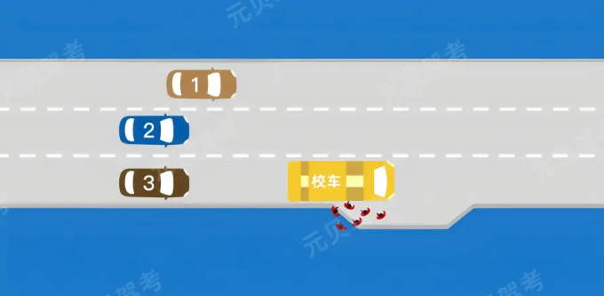
根据《道路交通安全法》和校车通行规则,校
车在最右侧车道(3车道)停靠上下学生时:
校车所在车道(3)及相邻左侧车道(2)的
车辆必须停车等待;其他车道(1)的车辆可
以正常通行。
图中3车道:校车所在车道(必须停车);2
车道:相邻车道(必须停车);1车道:非相
邻车道(可以通行)。所以能通行的是1。

 

单选 行车中超越同向行驶的自行车时,应怎样做?(B)

A让自行车先行

B注意观察动态,减速慢行,留有足够的安全
距离

C连续鸣喇叭提醒其让路

D持续鸣喇叭并加速超越

这是一个非常典型的驾照考试（科目一或科目四）题目。你的直觉没错，在普通超车（比如超越前方汽车）时，确实需要果断加速以缩短并行时间。

但在超越**自行车或行人**时，逻辑会完全不同。以下是为什么选 **B（减速慢行）** 而不是加速的原因：

### 1. 自行车的不确定性（防御性驾驶）

自行车属于“非机动车”，稳定性远不如汽车。

* **晃动风险：** 骑行者可能因为避让路面水坑、石子或者体力不支而突然左右晃动。
* **突然转向：** 自行车没有后视镜，骑行者可能在没有预警的情况下突然左转或掉头。
* **减速是为了留出反应时间：** 如果你高速飞驰而过，一旦对方倒地或晃动，你根本没有反应时间去制动。

### 2. 保持安全距离的物理因素

* **风压影响：** 当汽车高速从自行车旁经过时，产生的气流（风压）可能会导致自行车失去平衡，甚至将骑行者“吸”向汽车或将其带倒。
* **空间局限：** 自行车通常在路边行驶，空间较窄。减速慢行可以让你更精准地观察并控制与自行车之间的**横向间距**。

### 3. 考试逻辑：安全高于效率

在中国的交通法规考试中，有一个极其核心的逻辑：**“只要涉及非机动车、行人、学校、人行横道，选‘减速、观察、避让’永远是对的。”**

* **加速超车（选项 D）：** 被视为危险驾驶行为。
* **连续鸣喇叭（选项 C）：** 可能会惊吓到骑行者，导致其操作失误摔倒。

---

### 总结

* **超汽车：** 观察后加速，快进快出。
* **超自行车/行人：** **减速、预留大间距、观察动态**。

**考试小窍门：** 在做题时，凡是看到选项里有“加速”、“开启远光灯”、“持续鸣喇叭”、“强行”等词汇，基本都是干扰项；而看到“减速”、“停车避让”、“观察”、“安全距离”，大概率就是正确答案。

如果你还在备考，需要我帮你总结更多这类容易混淆的“考点逻辑”吗？
 

高速公路紧急停车带
 
 

错车道
这张图片中的蓝色标志正式名称叫做 **“错车道”**。它的功能确实和你提到的“避让对向来车”相关，但为了你在考试中精准区分，我们来梳理一下它的具体属性：

### 1. 标志辨析：错车道 (Passing Bay)

* **颜色背景**：**蓝色**。这表示该标志用于**普通道路**（如乡村公路、单车道山路等），而非高速公路。
* **图形特征**：标志中间的白色道路图形**没有虚线**。
* **功能定位**：专门设置在**单车道道路**上，供两辆对向行驶的车辆交会时，其中一辆车临时停靠以**避让对向来车**。

### 2. 它与“高速公路紧急停车带”的区别

虽然形状相似，但有两个核心区别可以帮你秒杀题目：

| 特征 | 错车道 (当前图片) | 高速公路紧急停车带 (上题图片) |
| --- | --- | --- |
| **底色** | **蓝色** (普通道路) | **绿色** (高速/快速路) |
| **中间虚线** | **没有虚线** | **有白色虚线** (代表高速车道线) |
| **主要用途** | 供对向来车 **“避让/错车”** | 供故障车辆 **“紧急停靠”** |

---
 
 

路口黄灯持续闪烁,提示车辆、行人通行时要
注意减速或停车瞭望,确认安全后通过。
【拓展知识】
黄灯的法律含义是警示,只闪黄灯表示此路口
交通信号暂时解除,过往车辆经过此路口的时
候需要提前减速观察周围情况决定停不停车,
这种信号灯往往设置在车流不大的路口或是夜
间等车流平峰时段。

 

 

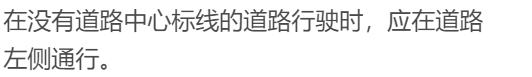
解析说走右边，可是我记得一个题目说走中间，行人和非机动车走两边
 

这是一个非常经典的易错点，你的记忆其实是**非常准确**的。

简单来说：题目中的说法是错误的，主要错在**“左侧”**这两个字。在中国，车辆是靠右行驶的，绝不存在靠左通行的道理。

针对你提到的“走中间”还是“走右边”的疑惑，我们可以根据《中华人民共和国道路交通安全法》来详细拆解：

### 1. 你的记忆是对的：法律规定“走中间”

根据《道路交通安全法》第36条规定：

> “没有划分机动车道、非机动车道和人行道的，**机动车在道路中间通行**，非机动车和行人在道路两侧通行。”

**为什么要走中间？**
因为在这种没有标线的窄路上，路两边通常会有行人或骑自行车的人。机动车走在中间，可以与两侧的非机动车和行人保持安全间距，防止发生刮擦。

### 2. 为什么解析会提到“靠右”？

这里存在两种理解角度，导致你看到的解析可能会说“靠右”：

* **原则上的靠右：** 中国是右侧通行国家。虽然法规说“走中间”，但当你**遇到对面来车（会车）**时，你必须减速并向**右**避让，把道路中心线左侧的空间让给对方。所以解析可能会强调“靠右”作为一种通用准则。
* **道路条件的区别：** * 如果是“没有划分机动车道/非机动车道”的窄路：**走中间**。
* 如果是“有道路但只有单向车道”或“较宽但没划线”的道路：通常默认遵循**靠右行驶**。

---

### 总结归纳

为了应付考试，你只需要记住这三句话：

1. **看到“左侧通行”：** 必错。（中国没有左侧通行）
2. **没有划分机动车/非机动车道：** 机动车走**中间**，其他人走**两旁**。
3. **遇到会车：** 必须**靠右**让行。

**所以这道题判定“错误”的原因很简单：它说要走“左侧”，这在我国交通规则里是绝对错误的。**

需要我帮你再找几道类似的易混淆题目练习一下吗？
 

超车不是要加速吗，为什么这里要减速
 

这是一个非常典型的驾照考试（科目一或科目四）题目。你的直觉没错，在普通超车（比如超越前方汽车）时，确实需要果断加速以缩短并行时间。

但在超越**自行车或行人**时，逻辑会完全不同。以下是为什么选 **B（减速慢行）** 而不是加速的原因：

### 1. 自行车的不确定性（防御性驾驶）

自行车属于“非机动车”，稳定性远不如汽车。

* **晃动风险：** 骑行者可能因为避让路面水坑、石子或者体力不支而突然左右晃动。
* **突然转向：** 自行车没有后视镜，骑行者可能在没有预警的情况下突然左转或掉头。
* **减速是为了留出反应时间：** 如果你高速飞驰而过，一旦对方倒地或晃动，你根本没有反应时间去制动。

### 2. 保持安全距离的物理因素

* **风压影响：** 当汽车高速从自行车旁经过时，产生的气流（风压）可能会导致自行车失去平衡，甚至将骑行者“吸”向汽车或将其带倒。
* **空间局限：** 自行车通常在路边行驶，空间较窄。减速慢行可以让你更精准地观察并控制与自行车之间的**横向间距**。

### 3. 考试逻辑：安全高于效率

在中国的交通法规考试中，有一个极其核心的逻辑：**“只要涉及非机动车、行人、学校、人行横道，选‘减速、观察、避让’永远是对的。”**

* **加速超车（选项 D）：** 被视为危险驾驶行为。
* **连续鸣喇叭（选项 C）：** 可能会惊吓到骑行者，导致其操作失误摔倒。

---

### 总结

* **超汽车：** 观察后加速，快进快出。
* **超自行车/行人：** **减速、预留大间距、观察动态**。

**考试小窍门：** 在做题时，凡是看到选项里有“加速”、“开启远光灯”、“持续鸣喇叭”、“强行”等词汇，基本都是干扰项；而看到“减速”、“停车避让”、“观察”、“安全距离”，大概率就是正确答案。
 

 

根据《刑法》的规定,交通肇事后的量刑需区分以下情形:
1,无逃逸情节:处3年以下有期徒刑;
2,致人死亡且逃逸(亡且逃):处3年以上7年以下有期徒刑;
3,因逃逸致人死亡(逃致亡):处7年以上有期徒刑。
 

 

驾驶机动车在道路上追逐竞驶,情节恶劣,会受到什么处罚?(A)

处拘役,并处罚金

处管制,并处罚金

处1年以上徒刑

处6个月徒刑
 

在我国刑法中，**拘役**和**管制**都是主刑的种类，但它们在对人身自由的限制程度、执行方式以及期限上有着本质的区别。

简单来说：**拘役是“要关起来”的短期刑罚，而管制是“不关起来”的社会矫正。**

以下是两者的详细对比：

### 1. 对人身自由的限制程度

* **拘役：** 属于**剥夺自由刑**。犯罪分子需要被关押在特定的监管场所（通常是看守所），失去人身自由。
* **管制：** 属于**限制自由刑**。犯罪分子不被关押，依然留在原工作单位或居住地，但其言行受到一定的监督和限制（如离开居住地需报批）。

### 2. 期限

* **拘役：** 期限较短，为 **1个月以上6个月以下**。数罪并罚时，最高不能超过1年。
* **管制：** 期限较长，为 **3个月以上2年以下**。数罪并罚时，最高不能超过3年。

### 3. 执行机关与方式

* **拘役：** 由**公安机关**就近执行（通常在看守所）。执行期间，受刑人每月可以回家一至两天；参加劳动的，可以酌量发给报酬。
* **管制：** 依法实行**社区矫正**。被判管制的犯罪分子在劳动中应当**同工同酬**（这是与拘役的重要区别之一）。

### 4. 刑期折抵（判决前的羁押时间）

* **拘役：** 羁押一日折抵刑期**一日**（1:1）。
* **管制：** 羁押一日折抵刑期**二日**（1:2）。这是因为管制本身不关押，为了公平，判决前的关押时间会“加倍”折抵。

### 核心区别对比表

| 比较项目 | 拘役 | 管制 |
| --- | --- | --- |
| **性质** | 剥夺自由（要关押） | 限制自由（不关押） |
| **期限** | 1个月 - 6个月 | 3个月 - 2年 |
| **执行场所** | 看守所/拘役所 | 社区/原居住地 |
| **劳动报酬** | 酌量发给报酬 | 同工同酬 |
| **探亲待遇** | 每月可回家1-2天 | 一直在社会上，无需探亲 |

---

**温馨提示：**
无论是拘役还是管制，一旦被判处，都会留下**刑事犯罪记录（案底）**，这与行政拘留（属于治安处罚，非刑事犯罪）是有本质区别的。

您是想了解某个具体案例的适用，还是在进行法律知识的学习？我们可以深入探讨这两者在实际判决中的考量因素。
 

单选 醉酒驾驶机动车在道路上行驶会受到什么处罚?(B)

A处2年以下徒刑

B处拘役,并处罚金

C处2年以上徒刑

D处管制,并处罚金

那驾驶证会被吊销吗
这道题的正确答案是 **B**。

根据《中华人民共和国刑法》第一百三十三条之一的规定，在道路上醉酒驾驶机动车的，构成**危险驾驶罪**，处以**拘役，并处罚金**。

### 详细解答

* **刑事处罚（题目选项）：**
* **正确选项：B（处拘役，并处罚金）**。
* “拘役”的期限通常为 1 个月以上 6 个月以下。
* 醉酒驾驶（血液酒精含量 ）属于刑事犯罪，即使没有造成交通事故，也会面临刑事处罚。

* **驾驶证处理（你的追问）：**
* **会被吊销。**
* 根据《道路交通安全法》第九十一条规定，醉酒驾驶机动车的，由公安机关交通管理部门约束至酒醒，**吊销机动车驾驶证**。
* **五年内不得重新取得**机动车驾驶证（如果是营运车辆，则十年内不得重新取得，且重新取得后不得驾驶营运车辆）。
* 如果饮酒或醉酒驾驶导致发生重大交通事故并构成犯罪，则**终生不得重新取得**驾驶证。

---

**提醒：**
法律对酒驾、醉驾采取“零容忍”态度。除了罚金和失去驾照，犯罪记录（案底）还会影响个人政审、子女参军或报考公务员等，务必谨记“喝酒不开车，开车不喝酒”。

如果你需要了解具体血液酒精含量的判定标准或不同车型的详细扣分细则，可以随时告诉我。
 

《刑法》第一百三十三条之一,【危险驾驶
罪】在道路上驾驶机动车,有下列情形之一
的,处拘役,并处罚金:
(一)追逐竞驶,情节恶劣的;
(二)醉酒驾驶机动车的;
(三)从事校车业务或者旅客运输,严重超过
额定乘员载客,或者严重超过规定时速行驶
的;
(四)违反危险化学品安全管理规定运输危险
化学品,危及公共安全的。
机动车所有人、管理人对前款第三项、第四项
行为负有直接责任的,依照前款的规定处罚。
 

单送
新规题
以下哪种行为处十日以下拘留,并处
一千元以上二千元以下罚款,吊销机
动车驾驶证?

A醉酒驾驶机动车的

B故意遮挡机动车号牌的

C使用其他车辆保险标志的

D因饮酒后驾驶机动车被处罚,再次饮酒后驾
驶机动车的
 

这道题的正确答案是 **D**。

根据《中华人民共和国道路交通安全法》第九十一条规定，针对不同程度的酒驾行为，处罚标准有严格区分。

### 题目解析

* **选项 A：醉酒驾驶机动车的**
* **后果：** 由公安机关交通管理部门约束至酒醒，**吊销**机动车驾驶证，依法追究**刑事责任**；五年内不得重新取得机动车驾驶证。
* **区别：** 醉驾涉及刑事处罚（危险驾驶罪），不仅仅是行政拘留。

* **选项 B：故意遮挡机动车号牌的**
* **后果：** 通常处警告或者二十元以上二百元以下罚款，并扣 9 分（新规）。不涉及拘留或吊销驾照。

* **选项 C：使用其他车辆保险标志的**
* **后果：** 由公安机关交通管理部门予以收缴，扣留该机动车，处二百元以上二千元以下罚款。

* **选项 D：因饮酒后驾驶机动车被处罚，再次饮酒后驾驶机动车的（正确项）**
* **法律规定：** 处**十日以下拘留**，并处**一千元以上二千元以下罚款**，**吊销**机动车驾驶证。

---

### 重点区分：饮酒 vs 再次饮酒 vs 醉酒

为了方便记忆，你可以参考下表：

| 行为类型 | 罚款金额 | 证件处理 | 行政处罚 | 刑事责任 |
| --- | --- | --- | --- | --- |
| **初次饮酒驾驶** | 1000-2000元 | 记12分，暂扣6个月 | 无 | 无 |
| **再次饮酒驾驶** | **1000-2000元** | **吊销驾照** | **10日以下拘留** | 无 |
| **醉酒驾驶** | / | 吊销，5年内禁考 | 约束至酒醒 | **依法追究刑责** |

> **注意：** 这里的“饮酒后”是指血液中酒精含量大于等于 20mg/100ml，小于 80mg/100ml；“醉酒后”是指大于等于 80mg/100ml。

 

 

单选
交通肇事致一人以上重伤,负事故全部或者主
要责任,并具有下列哪种行为的,构成交通肇
事罪?(C)

A未及时报警

B未抢救受伤人员

C严重超载驾驶的

D未带驾驶证
根据《关于审理交通肇事刑事案件具体应用法
律若干问题的解释》:交通肇事致一人以上重
伤,负事故全部或者主要责任,并具有下列情
形之一的,以交通肇事罪定罪处罚:
(一)酒后、吸食毒品后驾驶机动车辆的;
(二)无驾驶资格驾驶机动车辆的;
(三)明知是安全装置不全或者安全机件失灵的
机动车辆而驾驶的;
(四)明知是无牌证或者已报废的机动车辆而驾
驶的;
(五)严重超载驾驶的;
(六)为逃避法律追究逃离事故现场的。
 

这道题的正确答案是 **C（严重超载驾驶的）**。

你觉得 B（未抢救受伤人员）看起来很严重，这在道德和常理上是非常正确的，但在法律条文的**罪名认定**上，我们需要看《最高人民法院关于审理交通肇事刑事案件具体应用法律若干问题的解释》。

### 1. 为什么选 C 而不选 B？

根据法律规定，交通肇事致一人以上重伤，负事故全部或者主要责任，**必须具备特定的“恶劣情节”**才构成犯罪。

* **关于 C（严重超载）：** 法律明文规定，“严重超载驾驶”是触发“一人重伤即入罪”的法定情形之一。
* **关于 B（未抢救受伤人员）：** * 在法律术语中，与此相近的概念是“逃逸”。如果肇事后**为了逃避法律追究而逃离现场**，那是构成犯罪的条件。
* 但“未抢救”和“逃逸”在法理上不是一个概念。如果你留在现场报警了，但因为害怕或不知所措没去搬动伤者（未抢救），通常不会直接以此作为“一人重伤”入罪的唯一依据。
* **关键点：** 单纯的“不作为（不抢救）”如果没有伴随“逃避责任的逃逸”，在法律条文中并没有被列入这六种特定的“重伤入罪”情形中。

---

### 2. 法律依据：一人重伤入罪的 6 种情形

当事故只造成**一人重伤**且你负**全部或主要责任**时，只有具备以下任意一种行为，才定“交通肇事罪”：

| 序号 | 法定入罪情形 | 说明 |
| --- | --- | --- |
| 1 | **酒后、药后驾驶** | 饮酒或国家管制的精神药品、麻醉药品 |
| 2 | **无证驾驶** | 无驾驶资格驾驶机动车辆 |
| 3 | **明知安全装置失灵** | 明知车辆安全装置（如刹车）失灵而驾驶 |
| 4 | **明知无牌/报废车** | 明知是无牌证或者已报废的机动车辆 |
| 5 | **严重超载驾驶** | **（本题考点：C选项）** |
| 6 | **为逃避法律追究逃离现场** | 重点在于“逃避追究”和“逃离” |

---

### 3. 总结

* **A（未及时报警）和 D（未带驾驶证）：** 属于行政违法或一般违规，不直接导致交通肇事罪的刑事起诉。注意，“未带驾驶证”不等于“无证驾驶”。
* **B（未抢救受伤人员）：** 虽然行为恶劣，但在法律考题中，它不是法定的“重伤转刑事”的触发开关。

> **法律小贴士：** 在考试中，交通肇事罪的考点通常集中在“重伤人数”、“死亡人数”以及“是否有逃逸情节”。记住这 **6 种特殊情形**是应对此类单选题的关键。

你想了解一下如果发生了死亡事故，法律又是如何判定刑事责任的吗？
 

驾驶人的血液中酒精含量在80毫克/100毫升
(含)以上属于醉酒驾驶;驾驶人血液中的酒
精含量大于或者等于20毫克/100毫升,小于
80毫克/100毫升时,属于酒后驾驶。
 

危险驾驶罪:追逐竞驶情节恶劣;醉驾。
根据《刑法》第一百三十三条的规定:危险驾驶罪是指
在道路上驾驶机动车追逐竞驶,情节恶劣的;
醉酒驾驶机动车的;
从事校车业务或者旅客运输,严重超过定额乘员载客,或者严重超过规定时速行驶的;
违反危险化学品安全管理规定运输危险化学品,危害公共安全的行为。

而闯红灯、无证驾驶、疲劳驾驶虽然都属于交
通违法行为,且具有一定危险性,但它们并不
直接构成危险驾驶罪。
 

 

在我国法律中，“无证驾驶”和“危险驾驶罪”是两个不同的法律概念。简单来说，**无证驾驶通常属于“行政违法”，而危险驾驶罪属于“刑事犯罪”**。

之所以无证驾驶不直接等同于危险驾驶罪，主要有以下几个原因：

### 1. 罪刑法定原则（核心原因）

我国《刑法》实行**罪刑法定原则**，即“法无明文规定不为罪”。
在《刑法》第一百三十三条之一中，明确列举了构成“危险驾驶罪”的四种情形：

* **追逐竞驶**（飙车），情节恶劣的；
* **醉酒驾驶**机动车的（血液酒精含量  80mg/100ml）；
* **从事校车业务或旅客运输**，严重超员或严重超速的；
* **违反危险化学品安全管理规定**运输危险化学品，危及公共安全的。

**无证驾驶并未被列入这四项之中**。因此，法官不能在法律规定之外自行设立罪名。

### 2. 社会危害性的判定标准不同

* **危险驾驶罪：** 针对的是那些**行为本身就具有极高危险性**、足以直接威胁公共安全的情形（如醉酒后失去控制力、高速飙车）。这些行为即便没有造成交通事故，只要实施了，就构成犯罪。
* **无证驾驶：** 法律上倾向于认为其属于**“行政管理资格”的缺失**。虽然无证驾驶有风险，但并不意味着只要一开车就一定会发生危险（例如，一个驾驶技术纯熟但因过期未换证的人）。因此，它主要由《道路交通安全法》通过罚款、行政拘留等手段进行惩戒。

### 3. 立法上的“入罪控制”

如果将所有无证驾驶都纳入刑法，会导致刑事打击面过大。无证驾驶的情况非常复杂，包括：

* 从未取得驾照的人。
* 驾照被吊销、注销或暂扣期间的人。
* 驾照过期未办理换证的人。
如果全部作为刑事犯罪处理，会耗费巨大的司法资源，也不符合“刑法谦抑性”原则（即能用行政手段解决的，尽量不用刑法）。

---

### 注意：无证驾驶并非“免死金牌”

虽然无证驾驶本身不是“危险驾驶罪”，但它会导致更严重的刑事后果：

1. **触发“交通肇事罪”：**
如果无证驾驶发生了事故，致人重伤或死亡，无证驾驶会成为定罪的重要加重情节。普通人可能需要致人死亡才构成犯罪，但无证驾驶的人往往只要致一人重伤并负主要责任，就可能构成**交通肇事罪**。
2. **作为危险驾驶罪的加重情节：**
如果你**既无证又醉驾**，法院在判决“危险驾驶罪”时，会因为你“无证”而从重处罚，通常不适用缓刑。
3. **其他重罪：**
如果明知无证还疯狂驾驶，在闹市区横冲直撞，可能触犯更严重的**“以危险方法危害公共安全罪”**，最高可判死刑。

### 总结

**无证驾驶**目前由《道路交通安全法》管辖，面临的是**行政拘留（15天以下）和罚款**；而**危险驾驶罪**由《刑法》管辖，面临的是**拘役（1-6个月）和罚金**。

您是否正在处理与此类法律条款相关的具体案例，或是想了解最新的司法解释？
 

根据《刑法》的规定,在法律规定的国家考试
中,组织作弊的行为构成犯罪。具体处罚如下:
一般情节:处三年以下有期徒刑或者拘役,并
处或者单处罚金。
情节严重:处三年以上七年以下有期徒刑,并
处罚金。
 

 

这段顺口溜是驾考**科目一**（理论考试）中为了方便考生记忆“违法行为与罚款金额”对应的关系而总结的口诀。

它的核心逻辑是按**情节严重程度**和**涉及人数**来划分罚款梯队。我们可以把这些行为看作是一个“从轻到重”的逻辑链条：

---

### 1. 罚款等级解析

| 行为类型 | 核心关键词 | 罚款金额 | 记忆逻辑（你的逻辑） | 法律后果 |
| --- | --- | --- | --- | --- |
| **虚假材料** | 提供伪造证件申请 | **500元** | **看物不看人**：只是材料（纸）造假。 | 1年内不得再次申请。 |
| **弄虚作假** | 考试中作弊/不正当手段 | **1000元-2000元** | **个人行为**：一个人在考场里搞小动作。 | 成效作废，1年内不得再次申请。 |
| **贿赂** | 给钱买证/送礼 | **2000元** | **两人获利**：你出钱，对方收钱。 | 撤销驾驶证，3年内不得再次申请。 |
| **组织作弊** | 团伙作案/替考 | **20000元** | **多人/团伙**：性质最恶劣，规模化作恶。 | 属于刑事犯罪（组织考试作弊罪）。 |

---

### 2. 深度理解（帮你建立逻辑连接）

* **500元（虚假材料）：** 这属于“门槛阶段”。你还没开始考试，只是在申请阶段交了假证明（比如假身份证、假体检表）。因为还没对道路安全造成实质性威胁，所以罚款最轻。
* **1000-2000元（弄虚作假/作弊）：** 这属于“实战阶段”。你已经在考试了，或者通过欺骗手段拿到了证。这直接挑战了考试公平，所以罚款翻倍。
* **2000元（贿赂）：** 贿赂涉及到了“权钱交易”，不仅你自己作假，还腐蚀了管理人员。这在法律上定性比普通作弊更严重。
* **20000元（组织作弊）：** 这里的单位变成了“万”。这已经不是简单的交通违章，而是触犯了《刑法》。在科目一题库中，只要看到“组织”二字，直接找金额最大的选项即可。

---

### 3. 考试防坑指南

在实际做题时，除了罚款金额，通常还会考**“禁考时间”**。你可以顺便把这个“1-1-3”逻辑也记下来：

* **1年：** 假材料（申领时）、弄虚作假（考试中）。
* **3年：** 贿赂/不正当手段（已经拿到证后被发现，撤销驾驶证）。

> **💡 建议：**
> 如果你在做模拟题时遇到这类题，先看题目里有没有**“组织”**或**“万”**。如果有，通常选 2 万；如果是**“材料”**，找最小的 500。

 

图片里的这些内容可以看作是科目一处罚题里的**“刑侦/团伙犯罪版”**。

之前的口诀（500、1000、2000）主要针对的是**个人**在考试过程中的违规，而这张图里的内容针对的是**组织者**（也就是俗称的“蛇头”或“中介”）以及**利用这些行为赚钱**的人。

这里的处罚逻辑不再是固定金额，而是**“倍数 + 最高限额”**。我们可以这样通俗地理解：

---

### 1. 详细拆解

#### **① 组织/参与骗取证照（牟利）**

* **意思：** 也就是职业代办假证、或者通过非法手段组织一大群人去“骗取”驾驶证，并且以此**赚钱**。
* **处罚：** 违法所得的 **3倍以上 5倍以下**，最高 **10万元**。
* **记忆点：** 这是最严重的。既然是“骗证”，金额最高，顶格 **10万**。

#### **② 组织审验教育替学**

* **意思：** 驾驶证在审验时需要参加学习（比如记分多了要看视频、上课），“替学”就是找人代课。组织别人干这件事的人，就是被罚的对象。
* **处罚：** 违法所得 **3倍以下**，最高 **2万元**。
* **记忆点：** 只是“代课”，性质比卖分和骗证轻一点，所以上限是 **2万**（对应你之前口诀里“组织作弊”的2万上限）。

#### **③ 组织卖分（买卖分中介）**

* **意思：** 也就是我们常说的“分头”或中介，组织别人卖分、买分来消分。
* **处罚：** 违法所得 **5倍以下**，最高 **10万元**。
* **记忆点：** 国家现在严打买卖分，所以它的上限和骗证一样，都是 **10万**。

---

### 2. 逻辑对比表（帮你秒杀选择题）

为了方便你记忆，你可以对比来看：

| 行为类型 | 涉及对象 | 关键数字（上限） | 处罚逻辑 |
| --- | --- | --- | --- |
| **组织替学** | “代课”中介 | **2万元** | 3倍以下 |
| **组织卖分** | “卖分”中介 | **10万元** | 5倍以下 |
| **组织骗证** | “假证”团伙 | **10万元** | 3-5倍 |

---

### 3. 学习建议

在科目一考试中，遇到这类题目时，你只需要记住三个“关键词”：

1. 只要看到**“组织”**两个字，罚款金额基本都是**万元**起步了。
2. **替学**（看课）最轻，最高 **2万**。
3. **卖分**和**骗证**最重，最高 **10万**。

> **💡 小贴士：**
> 如果题目问的是**“参与”**买卖分的个人（不是组织者），通常是扣证 6 个月 + 罚款 2000 元。一定要看清题目问的是“组织者”还是“个人”。

这一块的法规确实比较绕，需要我帮你把这些“万元级”的罚款和之前那些“千元级”的处罚合并成一张通俗易懂的长图或表格吗？
 

 

#### **科目一违法处罚逻辑对照表**

| 类别 | 处罚金额/上限 | 核心行为关键词 | 记忆逻辑 | 附加后果 |
| --- | --- | --- | --- | --- |
| **个人** | **500元** | **虚假材料** | 还没考，只是“纸”造假 | 1年内不得申请 |
| **个人** | **1000-2000元** | **弄虚作假/作弊** | 正在考试，个人作弊 | 成绩作废，1年内禁考 |
| **个人** | **2000元** | **贿赂/不正当手段** | 已经拿证，买证被抓 | 撤销驾照，3年内禁考 |
| **组织** | **2万元（上限）** | **组织考试作弊** | 团伙作案，性质最恶劣 | 涉及刑法 |
| **组织** | **2万元（上限）** | **组织替学** | 找人代看课、代学习 | 违法所得3倍以下 |
| **组织** | **10万元（上限）** | **组织卖分** | 买卖分中介（蛇头） | 违法所得5倍以下 |
| **组织** | **10万元（上限）** | **组织/参与骗证** | 职业骗领驾照牟利 | 违法所得3-5倍 |

---

**💡 考前复习口诀（建议截图）：**

* **看人头**：一个人干（千元级），一群人干（万元级）。
* **找最小**：看到“材料”选 500。
* **找最大**：看到“组织”或“10万”直接选最高。
* **记时间**：造假禁考 1 年，买证撤销 3 年。
 

根据《刑法》的规定,在法律规定的国家考试
中,组织作弊的行为构成犯罪。具体处罚如
下:
一般情节:处三年以下有期徒刑或者拘役,并
处或者单处罚金。
情节严重:处三年以上七年以下有期徒刑,并
处罚金。
 

 

没问题，确实应该把**有期徒刑的具体量刑时间**加上去，因为在科目一关于“组织作弊”的判断题或选择题里，经常会考到“三年以下”还是“三年以上”。

以下是为您更新后的**最全处罚逻辑表（含罚金、禁考年限及刑期）**：

### 科目一处罚“全维度”对照表（2026版）

| 行为类别 | 关键词 | 罚款金额 | **处罚/禁考/刑期（重点）** | 法律/记忆逻辑 |
| --- | --- | --- | --- | --- |
| **个人申请** | **虚假材料** | **500元** | **1年**内不得再次申请 | 还没考试，只是“纸”造假 |
| **个人考试** | **弄虚作假/作弊** | **1000-2000元** | **1年**内不得再次申请 | 考试中作弊，成绩作废，禁考1年 |
| **非法拿证** | **贿赂/不正当手段** | **2000元** | **3年**内不得再次申请 | **撤销**驾驶证（拿证后被发现） |
| **组织作弊** | **组织/参与作弊** | **2万元（上限）** | **3年以下**有期徒刑/拘役 | **一般情节**（构成刑事犯罪） |
| **组织作弊** | **情节严重者** | **并处罚金** | **3年以上 7年以下**有期徒刑 | **严重情节**（如大规模团伙、高科技作弊） |
| **买卖分** | **组织卖分/中介** | **10万元（上限）** | **5-10日**行政拘留 | 还没到判刑程度，但要关几天 |
| **职业骗证** | **组织骗证** | **10万元（上限）** | 违法所得3-5倍罚款 | 重点罚钱，最高10万 |

---

### 💡 针对“有期徒刑”的考试要点：

1. **“3、3、7”原则：**
* **3年以下**：这是**基础刑期**。只要题目里说“组织作弊构成犯罪的，处三年以下有期徒刑”，就是**对**的。
* **3年-7年**：这是**加重刑期**。只有题目提到“情节严重”时才会出现。

2. **“拘役”与“有期徒刑”：**
* 组织作弊不仅可以判有期徒刑，还可以判**拘役**。如果在选项中看到“处三年以下有期徒刑**或者**拘役”，这就是最标准、最准确的描述。

3. **罚金与刑罚：**
* 刑事犯罪通常是“刑期+罚金”并用。所以题目里说“并处或者单处罚金”也是**正确**的。

---

### 总结你的“闯关口诀”：

> **假材料 1 年（500）；作弊 1 年（1000）；**
> **贿赂买证 3 年（2000）；**
> **组织作弊入刑法，3 年以下要记牢，情节严重 3 到 7！**
 

 

 

没问题！为了方便你复习和查阅，我将之前的零散信息合并成两张 **“全能通”大表**。

这两张表涵盖了 2022 年新规中最核心的考点，一张针对**超速**，一张针对**超员**。建议你保存这两张合并后的表格：

---

**补充注意：**

* **10% 宽限：** 所有车辆超速未达 10% 均不记分。
* **私家车福音：** 私家车在任何路上超速 **20% 以内** 都不记分。
* **最严警告：** 校车、货车在高速上超速 **20%** 就直接扣光 **12 分**。

---

# 2022版交通违法记分速查表

## 表一：【超速】记分全能表
| 车型分类 | 行驶路段 | 20%以下 | 20% ≤ 比例 < 50% | 50% 及以上 |
| :--- | :--- | :--- | :--- | :--- |
| **普通私家车** | 高速/快速路 | 不记分 | **6 分** | **12 分** |
| (其他机动车) | 普通道路 | 不记分 | **3 分** | **6 分** |
| **特殊车辆** | 高速/快速路 | 6分(10%-20%) | **12 分** | **12 分** |
| (校车/货车等) | 普通道路 | 1分(10%-20%) | **3 分** | **9 分** |

> **提示：** 私家车超速未达 20% 不记分；特殊车辆（校车/货车）在高速上超速达 20% 直接扣 12 分。

---

## 【超员】记分修正表 (2022官方版)
| 车辆类型 | 20% ≤ 比例 < 50% | 50% ≤ 比例 < 100% | 100% 及以上 |
| :--- | :--- | :--- | :--- |
| **7座以下**载客汽车 | **3 分** | **6 分** | **6 分** |
| **7座及以上**载客汽车 | **6 分** (重点) | **9 分** | **9 分** |

> **必考题提醒：** 8座面包车坐了10个人（超员25%），记 **6分**！千万别选3分。

> **提示：** “9分挡”是新规特有，专门针对7座以上车辆严重超员的情况。

**补充注意：**

* **9 分挡：** 这是新规特有的，专门给“大一点的车”严重超员（100%以上）准备的。
* **校车/营运客车：** 如果题目问的是校车、客运车超员，记分会更重（比如超员20%以上就可能记12分），但普通考试最常考的是上面这两类。

---

### 💡 考前冲刺“避坑总结”

如果你觉得表还是多，那就死记这几个**特殊记分值**：

1. **关于“9分”：** 只有两种情况记 9 分：
* **超速：** 特殊车辆在“普通路”超速 50% 以上。
* **超员：** 7座以上车辆超员 100% 以上。

2. **关于“6分”：**
* 私家车在**高速**上超速 20%-50%，一定要记 6 分（也就是你第一张图的题目）。
* 私家车在任何路上超员 50%-100%，记 6 分。

3. **关于“3分”：**
* 看到超员 **20%-50%**，无脑选 **3 分**（只要不是营运车）。
* 私家车在**普通路**超速 20%-50%，记 3 分。

这样合并后，是不是逻辑清晰多了？如果有具体的题目拿不准，随时发给我！
## 💡 考试必背补充（防坑指南）

除了上面的超速表，以下几点是新规中特别容易混淆的“深坑”，建议一并更新到你的笔记里：

### 1. 记分“宽限”政策

* **10% 宽限：** 无论什么车，在任何道路上超速 **未达 10%** 的，都不记分（但可能会处以警告）。
* **私家车 20% 宽限：** 特意留意，普通私家车超速 **未达 20%**，现在是不记分的。这就是为什么表格第一列显示“不记分”。

### 2. “9分”是新规的特色

* 在 2022 版新规中，新增了 **9分** 这一档。
* **记住这个考点：** 只有“特殊车辆”在“普通道路”超速 **50% 以上**，才会记 9 分。私家车没有 9 分这一档。

### 3. “超员”不要和“超速”弄混

* **超员记 3 分的情况：** 7座以下私家车，超员 20% ~ 50%（比如 5 人车坐了 6 人）。
* **超员记 6 分的情况：** 7座以下私家车，超员 50% ~ 100%（比如 5 人车坐了 8 人）。
* **超员记 12 分的情况：** 7座以下私家车，超员 100% 以上（比如 5 人车坐了 10 人）。

---

**总结你那张图片的题：**
关键词是“**高速公路**”+“**20%以上未达50%**”+“**普通机动车**”，对应我表格里的第一栏第二行，所以结果必须是 **6 分**。

如果你觉得这些数字很难背，需要我提供一套快速记忆口诀吗？
 

普路倒掉1逆3  高速倒掉逆12
 

 

《机动车登记规定》第七十八条,有下列情形
之一的,由公安机关交通管理部门处警告或者
二百元以下罚款:
(一)重型、中型载货汽车、专项作业车、挂
车及大型客车的车身或者车厢后部未按照规定
喷涂放大的牌号或者放大的牌号不清晰的;
因此,题干中罚款金额表述错误。
 

 

这个问题在驾照考试中确实容易让大家产生困惑。看起来 C（路政）和 D（绿化）是直接负责赔偿的部门，但在法律流程和实际操作中，**“报警”才是所有后续步骤的前提。**

以下是为什么 C 和 D 不可以作为首选答案的几个核心逻辑：

### 1. 法律强制要求

根据《中华人民共和国道路交通安全法》，在发生交通事故（包括撞毁路灯、护栏等公共设施的单方事故）时，驾驶人应当**立即报警并保护现场**。

* **警察的角色：** 只有交警有权出具《道路交通事故责任认定书》。
* **权责划分：** 路政或绿化部门是公共设施的“业主”，他们负责核定受损价值，但没有权力判定事故责任和出具法律文书。

### 2. 保险理赔的必要条件

如果你想让保险公司赔付受损的车辆和护栏费用，**交警的责任认定书是必不可少的。**

* 如果你直接找路政部门私下赔钱（即选项 C），保险公司通常会因为缺乏“警方证明”而拒绝理赔，这笔钱就得你个人全额承担。
* **流程顺序：** 报警 (122) → 交警出具认定书 → 联系保险公司 → 赔偿路政/绿化部门。

### 3. 规避“肇事逃逸”的风险

这是最关键的一点。如果你没有报警，直接联系路政或自行离开：

* 在法律上，这极有可能被定性为**肇事逃逸**。
* 即使你只是撞了护栏，只要没有通过警方登记备案就擅自变动现场，一旦被监控拍到，性质就变了，不仅保险不赔，还会面临扣分甚至拘留。

---

### 选项对比分析

| 选项 | 行为性质 | 结果 |
| --- | --- | --- |
| **B. 报警** | **法定义务** | 保护现场，获取责任认定书，确保保险公司后续赔付。 |
| **C. 联系路政** | 越过法律流程 | 缺乏官方认定，可能导致保险拒赔，且有逃逸风险。 |
| **D. 联系绿化** | 越过法律流程 | 同上。且图示中主要是护栏，通常归路政管，D 甚至对口部门都不一定准。 |

> **💡 小贴士：**
> 在考题中，只要涉及到**财产损失**（哪怕是路边的树或护栏），“报警”永远是最高优先级的标准答案。

---

这类关于“单方事故”的题目还有几种变体（比如在深山里撞了树怎么办），你想让我把相关的知识点一次性帮你梳理一下吗？
 

前雾灯
 

后雾灯
 

远光灯
 

近光灯
 

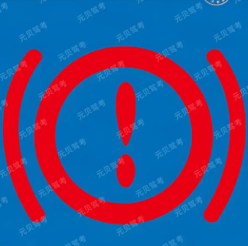
制动系统出现故障
 

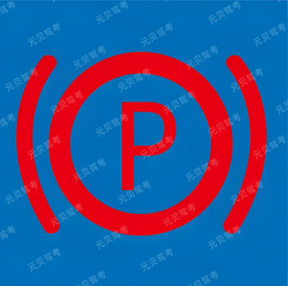
驻车制动没松
 

温度计图标-水温指示灯,该灯常亮,表示
发动机温度过高,发动机内冷却液的温度超过
规定值,需要立即暂停行驶;
 

危险报警闪光灯(双闪):与转向信号灯共用一套灯
具,当汽车发生故障停车或遇到紧急情况需要
处理时使用,发出交替的闪光信号,用于警告
后方车辆和行人。
 

前后位置灯:又称示廓灯、小灯,用于夜间和
特殊天气行驶时,标示汽车的宽度,提醒其他
车辆注意。
 

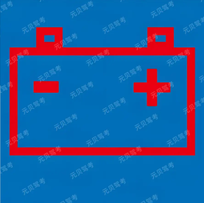
充电电路故障或发电机不向蓄电池充电
就是一个简单的长方形电池，中间有“+”“-”号，没有重影。
代表对象：所有汽车都有的普通 12V 蓄电池（小电瓶）。
 
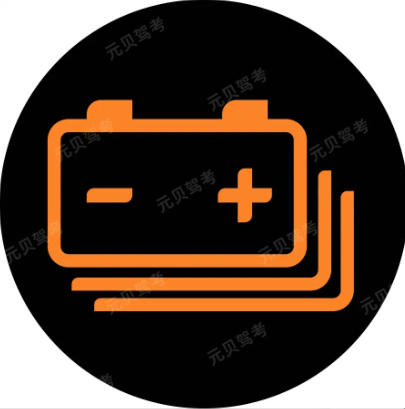
电动汽车低荷电状态警告
电池图标下面有多层重影（看起来像好几块电池叠在一起）。
代表对象：混合动力车或纯电动车的动力电池组（就是车底盘下面那一块巨大的高压电池）。
在驾考（尤其是涉及新能源汽车的题目）中，这两个选项确实非常容易混淆。不选 **C（动力蓄电池故障）** 而选 **A（低荷电状态警告）**，主要是因为图标细节上的“**程度差别**”。

以下是区分这两个选项的三个核心关键点：

### 1. 颜色等级（最直观的区分）

在汽车仪表盘的标准语境中，指示灯的颜色代表了问题的严重性：

* **黄色/橙色（图中的颜色）**：代表**警告、提醒或状态改变**。这对应“低荷电状态”（即电量低了，该充电了），属于一种提醒。
* **红色**：代表**严重故障或危险**。如果这个图标亮起红色，通常才会被定义为“故障（Failure/Fault）”。

### 2. 是否带有“感叹号”

这是驾考题库中最核心的视觉陷阱：

* **动力蓄电池故障（C选项）**：在标准的驾考题库中，代表“故障”的图标通常会在电池图形中间或者旁边加一个**感叹号（!）**，或者直接显示为红色。
* **低荷电状态警告（A选项）**：通常只是一个纯粹的电池叠影图标（表示动力电池组），中间只有正负号，没有感叹号。它表达的是“电池里没多少电了”，而不是“电池坏了”。

### 3. 词义理解：什么是“低荷电状态”？

“荷电状态”（State of Charge, SOC）是一个专业术语，简单理解就是**剩余电量百分比**。

* **低荷电状态** = 电量低。
* **动力蓄电池故障** = 电池包电路、温度或电芯出现了坏损。

---

### 💡 总结对比表

| 特征 | 低荷电状态警告 (正确答案 A) | 动力蓄电池故障 (选项 C) |
| --- | --- | --- |
| **图标形态** | 电池叠影（多层线） | 电池叠影 + **感叹号** |
| **指示颜色** | 通常为**黄色/橙色** | 通常为**红色** |
| **含义内容** | 提醒：电量即将耗尽，请及时充电 | 警告：电池系统损坏，需立即维修 |
| **严重程度** | 低（属于正常使用中的状态） | 高（属于非正常损坏状态） |

**简单记法：**
看到“叠影电池”先找有没有**感叹号**。**没感叹号就是电不够（低荷电），有感叹号就是电池坏（故障）。**

需要我再帮你找找新能源汽车特有的“驱动功率限制”（乌龟灯）或者“断电指示灯”来对比一下吗？
 

简单来说，这个图标之所以选 **B（故障状态）** 而不选 **C（工作状态）**，主要基于以下汽车设计的逻辑：

### 1. 仪表盘灯光的“警告”属性

在汽车设计中，仪表盘上的图标如果**持续亮起**（尤其是黄色或红色），通常意味着系统检测到了**异常或故障**，是在提醒驾驶员注意。

* **正常工作状态：** 如果安全气囊系统正常，它应该在车辆启动自检后**熄灭**。此时系统在后台“待命”，不需要亮灯提醒你它在工作。
* **故障状态：** 只有当系统检测到气囊可能无法正常弹出，或者传感器损坏时，这个灯才会**持续亮起**，提示你需要维修。

### 2. 如何区分“工作”与“故障”

你可以这样记忆：

* **工作状态（正常）：** 就像家里的灯，关着的时候是常态。
* **故障状态（警告）：** 就像报警器，只有出问题了才会响（亮灯）。

如果这个灯显示的是“工作状态”，那意味着你的气囊正处于“正在弹出”或“已经弹出”的瞬间，这在行驶过程中显然是不合理的。

---

### 💡 考点小贴士：图标特征

观察这个图标：

* 一个圆球（气囊）正对着一个坐着的小人。
* 这个图标代表 **SRS（辅助保护系统/安全气囊系统）**。
* **口诀：** 只要灯常亮，系统必有样（样：指故障）。

如果你在备考过程中还遇到其他类似的图标（比如 ABS、水温、机油压力），需要我帮你总结一下它们的**颜色含义**（红色 vs 黄色）吗？
 

 

好的，既然你正在备考**科目一**，掌握仪表盘灯光的“颜色逻辑”是最高效的通关秘籍。你可以把这些灯看作**交通信号灯**：

### 🚦 仪表盘灯光颜色“三部曲”

| 颜色 | 含义 | 危险程度 | 你的动作 |
| --- | --- | --- | --- |
| **红色** | **危险/警告** | ⭐⭐⭐⭐⭐ | **必须立即停车**检查，继续行驶可能有生命危险或严重损车。 |
| **黄色** | **故障/提醒** | ⭐⭐⭐ | 系统有故障或异常，**需尽快检修**，但通常能坚持开到修理店。 |
| **绿/蓝/白** | **状态/提示** | ⭐ | 只是告诉你**某个功能正在开启**（如转向灯、远光灯）。 |

---

### 1. 红色灯：绝对不能硬着头皮开

如果你在考试中看到红色的图标，题目问“是否可以继续行驶”，答案通常是“不可以”。

* **水温报警灯**（像个温度计插在水里）：发动机太烫了，再开就开锅报废了。
* **机油压力灯**（像个滴油的小茶壶）：发动机没润滑了，强行开会“拉缸”。
* **制动系统灯**（圆圈里面一个感叹号）：可能是手刹没放，也可能是刹车油没了。
* **充电电路灯**（像个小电池）：发电机不发电了，车子很快就会因为没电而熄火。

### 2. 黄色灯：系统出毛病了，得去修

这类灯亮起通常意味着“功能失效”，比如你刚才问的**安全气囊灯**。

* **ABS灯**（圆圈里写着ABS）：防抱死系统坏了。此时刹车还能用，但紧急制动时轮胎会抱死。
* **发动机故障灯**（像个黄色的小潜水艇/发动机）：发动机排气或传感器有故障。
* **胎压报警灯**（像个带锯齿的罐头里有个感叹号）：轮胎漏气或压力不稳。

### 3. 绿/蓝/白灯：不用担心，只是告知

* **远光灯**（蓝色，线条是直的）：提醒你别晃到对面车。
* **近光灯/示廓灯**（绿色）：提醒你灯开着呢。
* **定速巡航**（绿色）：告诉你系统接管油门了。

---

### 💡 考试避坑小口诀

> **红灯停（危险），黄灯看（故障），绿灯行（正常）。**

在科目一的题目里，只要看到**“故障”**二字，通常对应的就是**红色或黄色**的图标。如果题目问“该灯亮起表示功能正常工作”，那 99% 都是错的（除了转向灯、远光灯等基本功能灯）。

**科目一还有很多长得很像的“双胞胎”图标（比如：前雾灯 vs 后雾灯，内循环 vs 外循环），需要我帮你把这些易混淆的对比图总结一下吗？**
 

这个图标是**车灯总开关**（也叫灯光总开关）。

在实际开车中，它的作用是**控制全车外部灯光的开启与关闭**。你可以把它理解成家里灯的“总闸”或者控制面板。

### 它的具体作用：

1. **集成控制**：它通常是一个旋钮（位于方向盘左侧仪表台上）或者在灯光拨杆上。通过转动它，你可以切换不同的灯光模式：
* **OFF档**：关闭所有外部灯光。
* **自动（AUTO）档**：车辆根据环境亮度自动开灯。
* **示廓灯档**：开启前后小灯（示宽灯），用于黄昏或低可见度时提醒他人车辆宽度。
* **近光灯档**：开启主要照明灯。

2. **安全基础**：只有先打开了这个“总开关”，你才能进一步操作远光灯、雾灯等（有些车的雾灯开关也集成在这个旋钮上）。

---

### 考试中如何区分其他灯光图标？

为了帮你通过科目一，这里有几个极易混淆的图标对比：

| 图标特征 | 代表含义 | 记忆窍门 |
| --- | --- | --- |
| **一个圆圈发光（如你图所示）** | **车灯总开关** | 像一个发光的灯泡，代表整个照明系统。 |
| **光线向下斜射（绿色）** | **近光灯** | 光线是“向下”照地的，所以是近光。 |
| **光线水平直射（蓝色）** | **远光灯** | 光线是“水平”射向远方的，所以是远光。 |
| **光线被波浪线挡住** | **雾灯** | 波浪线代表雾气，光线穿过雾气。 |

**温馨提示：**
在科目一考试中，只要看到这种**四个方向都有光线射出的完整圆灯泡**，直接选“总开关”准没错。

冷风暖气风扇
 

前风窗玻璃刮水器
 

 
前风窗玻璃刮水器及洗涤器
 

后风窗玻璃刮水器及洗涤器
 

图片中这个图标是 **中控门锁开关**（也叫车门锁住与开锁开关）。

在科目一考试中，看到这个图标你可以这样理解和记忆：

### 1. 它是干什么用的？

它的作用是**控制全车车门的锁住（Lock）和开启（Unlock）**。

* **锁住：** 按下后，从外面打不开车门，保障行车安全，防止误开门。
* **开启：** 按下后，全车车门解锁，方便乘客下车。

### 2. 图标含义解析

* **钥匙符号：** 它是最核心的提示，代表“锁”和“钥匙”，意味着它管理的是“门锁”功能。
* **梯形边框：** 这里的梯形模拟的是汽车车门（或侧窗）的轮廓，钥匙在里面表示对门锁的操作。

冷却液不足

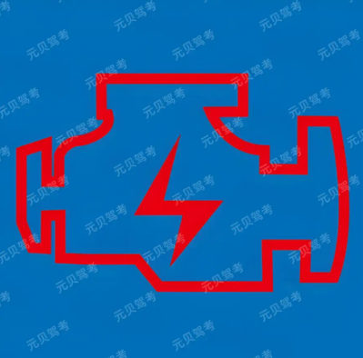
发动机控制系统故障
 

离合器踏板，制动踏板，加速
离合器踏板用于控制发动机与变速器的动力连
接和分离,比如换挡时就需要踩下离合器踏
板。
制动踏板用来减速和停车,当我们需要降低车
速或让车辆停止时就踩这个踏板。
加速踏板则是控制车辆加速,踩下去车辆速度
会增加。
 

变速器操纵杆
 

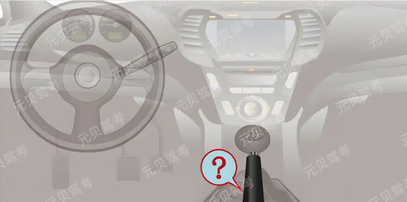
驻车制动器操纵杆
 

圆球状的一般是变速器操纵杆,而杆柄状
的是驻车制动器操纵杆。
变速器操纵杆用于变换车辆的挡位,以适
应不同的行驶速度和路况。
驻车制动器操纵杆则是用于在停车时锁住
车辆,防止车辆滑动。
所以两者的形状和功能不能混淆。
 

图中为点火开关操纵装置。点火开关4个档位
的功能是:LOCK:切断电源,锁定方向盘;
ACC:接通附件电源(比如收音机等附件);
ON:接通除起动机外的全车全部电源;
START:接通起动机电源,起动机起动。
 

 

简单来说，**起动机（Starter Motor)** 就是发动机的“启动马达”。它的作用是利用蓄电池的电能，产生机械动力，强行带动发动机的曲轴转动，从而让发动机进入工作状态。

### 为什么需要起动机？

内燃机（如汽油机或柴油机）和电动机不同，它不能自己从静止状态直接启动。发动机要运转起来，必须先经历“吸气、压缩、做功、排气”的循环。
在没有起动机的时代，人们需要用手摇柄在车头使劲摇动曲轴（就像老电影里那样）；而现在，这个繁重的体力活就交给了**起动机**。

---

### 起动机的工作过程

当你将点火开关拧到 **START** 档位时，全车会发生以下动作：

1. **转化能量**：起动机把电瓶里的**电能**转化为**机械能**。
2. **强制驱动**：起动机上的一个小齿轮会向前弹出，啮合在发动机后端巨大的 **飞轮（Flywheel）** 上。
3. **带动旋转**：起动机高速旋转，通过飞轮带动发动机的曲轴转动。
4. **自行运转**：一旦发动机完成了最初的几次往复运动并点火成功（产生动力），它就能自己转动了。此时，起动机的小齿轮会迅速缩回，功成身退。

---

### 使用起动机的小贴士

* **不要长时间启动**：由于起动机工作时电流非常大（通常有几百安培），长时间转动会使蓄电池过度放电或烧坏马达。通常建议每次启动不要超过 **5秒**。
* **松手即回档**：点火开关的 START 档通常有弹簧。一旦发动机启动声音响起（证明点火成功），你应该立即松手，钥匙会自动弹回 **ON** 档。如果发动机已经在运转，你再次拧到 START 档，你会听到一种非常刺耳的“嘎嘎”金属摩擦声，这会严重损坏起动机齿轮。

 

了解了起动机的作用后，我们再来看看点火开关最前面的这两个基础档位。它们虽然不直接发动引擎，但对**车辆防盗**和**日常便利**至关重要。

---

### 1. LOCK 档（锁死/断电）

这是你拔出钥匙或停好车后的初始状态。

* **功能：切断电源 + 物理锁定。**
* **断电：** 除了极少数必要电路（如防盗报警、时钟、危险警告灯、室内小灯）外，全车几乎所有电器都处于断电状态。
* **锁死：** 这是它叫“LOCK”的核心原因。当你拔出钥匙并轻微转动方向盘，转向柱里的锁舌会弹出并扣住转向柱，**锁定方向盘**。

* **用途：**
* **防盗：** 如果有人想在没钥匙的情况下强行推走车或短接启动，因为方向盘是锁死的，车子无法控制方向，增加了盗窃难度。
* **拔钥匙：** 在绝大多数传统钥匙车型上，**只有在 LOCK 位才能插入或拔出钥匙**。

> **小贴士**：有时候你会发现钥匙拧不动，这通常是因为方向盘受力卡住了锁舌。此时只需**左手轻晃方向盘，右手同时拧钥匙**即可解锁。

---

### 2. ACC 档（附件/辅助电源）

“ACC”是英文 **Accessory**（附件）的缩写。

* **功能：有选择性地通电。**
* 它会接通一部分低功耗的电子设备，例如：**收音机/多媒体系统、点烟器（车充）、电动后视镜、雨刮器**等。
* **注意**：它**不会**给燃油泵、点火线圈或空调压缩机通电，这意味着引擎此时无法工作。

* **用途：**
* **省油省电：** 当你停在路边等人，想听听广播或给手机充电，但又不想怠速运行引擎浪费汽油时，就切到这个档位。
* **保护电瓶：** 相比直接切到 **ON** 档（全车通电），ACC 档消耗的电流更小，能减缓电瓶亏电的速度。

---

### 两者的关键区别

| 特性 | LOCK | ACC |
| --- | --- | --- |
| **主要目的** | 车辆防盗与安全停放 | 在引擎关闭时使用电子设备 |
| **方向盘状态** | 可锁定 | 解锁状态 |
| **钥匙状态** | 可拔出/插入 | 不可拔出 |
| **典型用电器** | 基本全关（除防盗、小灯） | 收音机、车充、雨刮 |

**安全提醒：** 尽量不要在 ACC 档长时间使用大功率电器（如大音量听歌或使用大功率车载冰箱），因为此时发电机不工作，全靠电瓶“硬撑”，时间太长可能导致电瓶没电，最后无法点火。

 

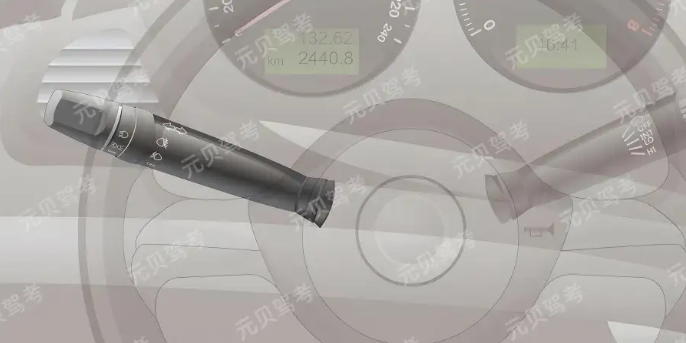
灯光-信号组合开关操作装置用于控制车辆的
灯光和信号系统。这个装置通常位于方向盘下
方的转向柱上。通过操作它,可以打开或关闭
车辆的大灯、小灯、转向灯、雾灯等灯光设
备,以及发出相应的信号,如转向信号。
 

单选 湿滑路面制动过程中,发现车辆偏离方向,以下做法正确的是?(C)

A连续轻踩轻放制动踏板

B用力踩制动踏板

C不要踩制动踏板

D任意踩制动踏板
这是一个非常经典的驾考题目，很多考生都会在 A 和 C 之间纠正。

简单来说：**A 是为了“预防”锁死，而 C 是为了“救命”（纠正已经发生的侧滑）。**

以下是为什么在这种情况下不能选 A 的详细原因：

### 1. 问题的核心：车辆已经“偏离方向”

题目中有一个关键的前提：**“发现车辆偏离方向”**。这说明侧滑或物理上的“锁死”已经发生了。

* **A 选项（连续踩放）：** 这在以前没有 ABS（防抱死系统）的时代，是用来**预防**车轮锁死的技巧（人工模拟 ABS）。但在车辆已经发生侧滑、失去方向控制时，继续施加任何制动压力（即便很轻）都会干扰车轮恢复转动。
* **C 选项（不要踩制动）：** 当车辆偏离方向时，当务之急是**让车轮恢复转动**。只有当车轮在转动（滚动摩擦）而不是滑动（滑动摩擦）时，轮胎才能产生足够的横向抓地力，你打方向盘才会有用。

---

### 2. 物理原理：滚动摩擦 vs 滑动摩擦

* **锁死状态：** 如果你踩着刹车，车轮不转，轮胎与地面就像两块冰在摩擦，这时候你无论怎么转动方向盘，车都会由于惯性向原来的方向滑行，完全失去控制。
* **松开制动：** 彻底松开刹车后，车轮在路面的带动下开始重新滚动。**滚动的车轮才能产生导向力**。只有这时候，你通过转动方向盘给出的指令，轮胎才能“执行”，从而把车头拉回到正确的路径上。

---

### 3. 驾考逻辑：分清“制动中”和“侧滑时”

在驾考（科目一/科目四）的逻辑里，处理这类问题有很强的优先级：

| 情况 | 正确做法 | 目的 |
| --- | --- | --- |
| **预防**在湿滑路面锁死 | 连续轻踩（或交给 ABS） | 减速的同时保持操控性 |
| **已经**发生偏离/侧滑 | **停止制动** | 释放车轮，找回抓地力以修正方向 |

> **提示：** > 现在的汽车基本都标配了 **ABS 系统**。在实际驾驶中，如果遇到紧急情况，正确的做法是**全力踩死刹车不松开**，ABS 会以每秒几十次的频率帮你完成 A 选项动作。但如果是考试题目，它考察的是最基础的物理自救原则。

---

### 总结

选 C 是因为：在已经偏离方向的紧急时刻，**“恢复转向控制”比“减速”更重要**。踩刹车（哪怕是轻踩）都会阻碍车轮找回抓地力的过程。

你想了解一下在发生这种侧滑时，方向盘应该往哪个方向打吗？（这是另一个高频考点）
 

既然你正在准备驾考，这个关于“侧滑时如何打方向”的考点一定要死记硬背住，因为它是科目一和科目四里最容易混淆的“大坑”。

驾考中关于侧滑修正的“终极口诀”只有四个字：**前反后同**。

---

### 1. 后轮侧滑：同向打（最常考）

**情况：** 比如你在转弯时，车的后屁股突然向**右**摆了（甩尾）。
**操作：** 你的方向盘也要向**右**打。

* **口诀记忆：** 后轮向哪偏，方向盘就往哪打。
* **物理逻辑：** 这样做的目的是为了让前轮的方向和车屁股滑行的方向保持一致，从而抵消侧滑产生的旋转力，让车身重新回正。

### 2. 前轮侧滑：反向打

**情况：** 比如你向左转弯，但车头不听使唤，反而向**右**前方滑出去（推头）。
**操作：** 此时你要向**左**打方向（即你原本想去的那个方向的反方向，或者是相对于侧滑方向的反方向）。

* **口诀记忆：** 前轮滑了，反着来。
* **实际操作（重点）：** 现实中前轮侧滑时，正确的做法其实是先**回正方向**，等抓地力恢复了再转弯。但在考试题目里，记住“前反”两个字。

---

### 💡 快速记忆口诀

为了防止考试时紧张记混，你只需要记住这一句话：

> **“前反后同，不踩刹车。”**

* **前**轮侧滑：**反**向打方向。
* **后**轮侧滑：**同**向打方向。
* **不管什么时候：** 绝对不能踩死刹车（也就是你刚才问的那道题的逻辑）。

---

### 总结表格（应试必备）

| 侧滑部位 | 现象描述 | 修正方向 |
| --- | --- | --- |
| **后轮** (常见) | 屁股向右甩 | **向右**打方向 (同向) |
| **前轮** | 车头不入弯，向外偏 | **向左/回正** (反向) |
| **共同点** | **禁止**踩制动踏板 | **禁止**急打方向 |

 

单选
驾驶机动车下陡坡时,以下做法正确的是?(D)

A空挡、熄火

B熄火但不准空挡

C空挡但不准熄火

D不准空挡或熄火
 

驾驶机动车下陡坡时,不准空挡或熄火。如果
空挡滑行,会使发动机失去对车辆的制动作
用,仅靠刹车系统制动,容易导致刹车过热失
效,增加事故风险。同时熄火也会使车辆失去
动力控制和转向助力等,在紧急情况下难以操
控车辆。
 

 

发动机控制系统异常或故障
 

发动机机油液位低（机油量不足）。
这个**不是**发动机机油压力过低。(但是有的题目说是机油压力过低)

虽然它看起来也像一个油壶，但它代表的是**发动机机油液位低**（机油量不足）。

为了让你彻底分清，我们把这两个图标放在一起对比一下，这在科目一考试和实际开车中都非常重要：

### 1. 颜色不同（这是最直观的区别）

* **红色图标：** 代表“**紧急警告**”。就像人体血压瞬间没了，必须立即停车熄火，否则发动机会直接报废。
* **黄色图标（你这张图）：** 代表“**提醒/注意**”。就像肚子饿了但还能走两步，它告诉你机油快没了，请尽快找地方添加机油，但通常不需要你像遇到红灯那样立即在路中间停车。

### 2. 形状不同（设计者的心思）

* **老式油壶（像神灯那个）：** 它的设计源自旧时代的点滴润滑，强调的是“**润滑动作**”，所以用来表示**压力（Pressure）**。
* **现代油桶（你图里这个）：** 它画的是我们现在在超市或修理厂见到的那种**塑料机油桶**。这个形状是为了让你联想到“**一桶油**”，所以它代表的是**油量（Level）**。

### 3. 如何记忆？

你可以这样想：

* **红色的“神灯”：** 压力报警，**要命的**，必须停车。
* **黄色的“油桶”：** 油量不够，**要钱的**（该买油加了），还能开一段。

**考试小贴士：**
在科目一的考题里，只要题目问的是“**压力过低**”，对应的图片一定是那个**红色**的像神灯一样的图标。如果看到**黄色**的图标，通常选项里会提到“**检查**”或“**液位**”。

你这道题是从哪个练习册或者APP里看到的？通常这种黄色的灯在老款车的仪表盘上不常见，现在的车传感器多了，分工才变得这么细。
 

动力蓄电池高温报警
 

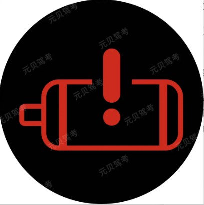
电动汽车驱动电机故障
 

电动汽车系统故障
在电动汽车的仪表盘语境下，**“系统故障”**（图中显示为一个汽车轮廓内含感叹号）是一个**综合性的严重故障警告**。

简单来说，它的含义和处理建议可以分为以下几个维度：

### 1. “系统故障”具体指什么？

这个图标并不是指某一个具体的螺丝松了，而是指车辆的**核心电子控制系统**监测到了严重异常。在电动车中，这通常涉及“三电”系统（电池、电机、电控）之间的协同工作出现了问题。

可能涉及的部件包括：

* **整车控制器 (VCU)：** 汽车的“大脑”出现了计算或控制逻辑错误。
* **高压系统：** 高压电路上存在漏电、短路或绝缘性能下降。
* **通信故障：** 车辆内部各个控制单元（比如电池管理系统和电机控制器）之间的“通话”中断了（CAN总线故障）。

### 2. 为什么选 B 而不是其他选项？

在科目一或科目四的考试中，区分这些图标有特定的技巧：

* **系统故障（本图）：** 图标是**一辆车+感叹号**。它代表的是“整车级别”的问题，所以叫“系统故障”。
* **驱动电机故障：** 图标通常是一个**电动机/齿轮的形状+感叹号**。
* **动力蓄电池故障：** 图标通常是一个**电池符号+感叹号**。
* **低荷电状态：** 图标通常是**黄色或红色的电池符号**，或者带插头的电池，表示没电了，而不是出故障。

### 3. 看到这个灯亮了该怎么办？

* **红色警告：** 在汽车仪表盘中，**红色**代表最高级别的警告。
* **立即停车：** 如果在驾驶时该灯亮起，说明车辆随时可能失去动力或发生高压危险。应在确保安全的情况下立即停车、熄火，并联系厂家救援，**不建议继续行驶**。

---

**一句话总结：**
“系统故障”灯就像是电脑的“蓝屏”或者手机的“系统固件损坏”，它告诉你不只是某个零件坏了，而是整个运行逻辑出了大问题。

 

电动汽车电机过热警告
 

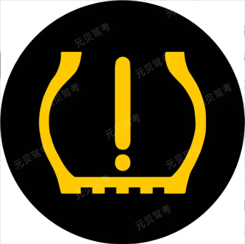
胎压故障警告
 

电动汽车充电系统故障
 

电动汽车动力蓄电池故障
 

AEB 自动紧急制动	主动刹车，防止追尾或撞人。
 

制动系统故障警告灯
图片中所示的指示灯(图标为括号内带圆圈和
感叹号)是制动系统故障警告灯。该灯亮起
时,表示制动系统存在严重故障(如刹车油不
足、刹车片磨损过度或制动系统失效),不可
轻踩制动尝试后继续行车,必须立即停车检
查,否则极易引发交通事故。
 

图中所示的符号是车门锁住开锁的控制装置开
关 -- 上方为“车门轮廓”(代表车门),下
方为“钥匙齿状结构”(代表锁具),组合表
示“控制车门的锁定与解锁”。

