在科目一考试中，“246 351”是一套针对**停车距离**和**能见度限速**的常用记忆口诀。

这组数字实际上是把复杂的交通法规简化成了几个关键量化指标。以下是详细的拆解和含义：

---

## 1. “351”：停车距离口诀

这组数字主要用于记忆“不得停车”的距离规定。

* **3（30米）：** 指的是**“站”**类地点。
* 公交站、加油站、消防栓、急救站、消防队门前等，这些地方的前后**30米**内不得停车。

* **5（50米）：** 指的是**“口”**或**危险路段**。
* 路口、转弯处、窄路、桥梁、隧道、陡坡、铁道口等，这些地方的前后**50米**内不得停车。

* **1（150米）：** 指的是**高速公路事故警告**。
* 在高速公路上车辆发生故障或事故，警告标志（三角牌）应当设置在故障车方向**150米**以外。

> **记忆锦囊：** 记住 **“口五站三”**。凡是带“站”的选30米，凡是带“口”或比较险要的路段选50米。

---

## 2. “261”：能见度与限速（高速公路）

这通常对应高速公路上遇到恶劣天气（雾、雨、雪等）时的**能见度、限速、车距**规定，标准口诀通常被称为“261、145、520”。

* **2（261）：** 能见度小于 **200米**，车速不得超过 **60公里/小时**，车距保持 **100米** 以上。
* **4（145）：** 能见度小于 **100米**，车速不得超过 **40公里/小时**，车距保持 **50米** 以上。
* **6（520）：** 能见度小于 **50米**，车速不得超过 **20公里/小时**，并尽快**从最近的出口驶离**高速公路。

> **注意：** 这里的数字可能因为不同的口诀编排略有差异（比如有的学生把 200m-60km-100m 简称为“261”），但核心考核点始终是这三组对应的数值。

---

## 3. 其他常见的速度口诀（补充）

除了“351 261”，科目一还有一个关于**普通道路限速**的口诀非常实用：

| 道路类型 | 城内（有/无中心线） | 城外/公路（有/无中心线） |
| --- | --- | --- |
| **无中心线** | **30** 公里/小时 | **40** 公里/小时 |
| **有中心线（单行道）** | **50** 公里/小时 | **70** 公里/小时 |

**速记口诀：** “城三公四，城五公七”（城市道路无线30、公路无线40；城市道路有线50、公路有线70）。

---

### 您现在准备到哪个阶段了？

如果是刚开始刷题，这类口诀能帮你直接秒杀掉约 15% 的题目。如果你需要，我可以为你整理一份**“科目一高频易错题避坑指南”**，或者帮你分析一下**吊销/撤销/扣留证件**的区别。

 

 

 

这道题的正确答案是 **B. ACC**。

在汽车术语中，**ACC** 代表的是 **Adaptive Cruise Control**，中文翻译为**自适应巡航控制系统**。

为了帮你更好地记忆和区分这些常见的汽车缩写，我整理了选项中各个缩写的具体含义：

| 缩写 | 全称 | 中文含义 | 主要功能 |
| --- | --- | --- | --- |
| **ACC** | **Adaptive Cruise Control** | **自适应巡航控制** | 自动调节车速，与前车保持安全距离。 |
| **EBD** | Electronic Brakeforce Distribution | 电子制动力分配 | 自动调节各个车轮的制动力，提高制动效能。 |
| **ABS** | Anti-lock Braking System | 防抱死制动系统 | 防止紧急制动时车轮抱死，保持车辆转向能力。 |
| **BSD** | Blind Spot Detection | 盲点监测系统 | 监测车辆侧后方盲区，通过后视镜等提醒驾驶员。 |

---

### 重点了解 ACC (自适应巡航)

ACC 是传统定速巡航的“升级版”。它通过安装在车前的雷达或摄像头：

1. **感应前车：** 实时监测前方车辆的距离和速度。
2. **自动跟车：** 如果前方没车，按设定速度行驶；如果前方有车，会自动减速跟车。
3. **保持距离：** 始终与前车保持驾驶员设定的安全时间间隔。

这在长途高速驾驶时能显著减轻驾驶疲劳。

你需要我为你总结更多关于驾照考试或车辆电子系统的常见缩写吗？
 

 

 

### 1. **LDW (Lane Departure Warning) - 正确答案**

* **含义：** **车道偏离预警系统**。
* **功能：** 当车辆在未开启转向灯的情况下偏离原行驶车道时，系统通过声音、视觉或震动（如方向盘震动）来提醒驾驶员。

### 2. **TSR (Traffic Sign Recognition)**

* **含义：** **交通标志识别系统**。
* **功能：** 识别路边的限速、禁止超车等交通标志，并将其显示在仪表盘或抬头显示（HUD）上，防止驾驶员漏看标志。

### 3. **TMC (Traffic Message Channel)**

* **含义：** **交通信息频道**。
* **功能：** 这是一种用于实时传送交通和路况信息（如拥堵、事故）的技术，通常与车载导航系统配合使用。

### 4. **ALC (Adaptive Light Control / Auto Lane Change)**

* **含义：** **主动转向大灯** 或 **自动辅助变道**。
* **功能：**
* 在灯光领域：指灯光会根据方向盘转角自动调整照射角度。
* 在自动驾驶领域：指驾驶员拨动转向灯杆后，车辆在确保安全的情况下自动完成变道。

---

### 💡 记忆小技巧

* **LDW** 中的 **W** 代表 **Warning（报警/预警）**。
* **TSR** 中的 **S** 代表 **Sign（标志）**。
* 如果您以后遇到 **LKA** (Lane Keeping Assist)，那它是比 LDW 更进一步的“车道保持辅助”，它不仅会预警，还会**主动微调**方向盘把车拉回车道。

需要我为您总结更多常见的驾考或汽车辅助系统缩写（如 ABS, ESP, ACC 等）吗？
 

 

 

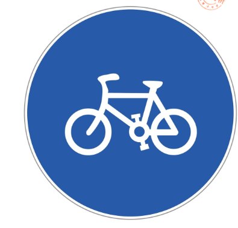
### 1. 圆形标志：非机动车行驶

* **形状**：圆形，蓝底白图案。
* **含义**：指示非机动车可以沿此路段行驶，主要用于引导行驶方向。
* **关键区别**：这个标志**并不代表**该路段是专门的非机动车道，该路段可能存在机动车与非机动车**混行**的情况。
 

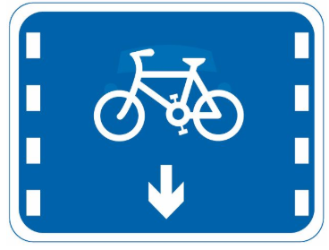
### 2. 方形标志：非机动车车道

* **形状**：方形（矩形），蓝底白图案，标志中除了自行车还有**车道线**和**箭头**的图形。
* **含义**：表示该路段是**专门**为非机动车设置的独立车道，**机动车不得驶入**。
* **作用**：明确划分了道路的使用权限，为非机动车提供相对独立和安全的行驶空间。

---

### 回到你最初的那道判断题

原来的题目是：**“这个标志（圆形蓝色自行车）的含义是提醒车辆驾驶人前方是非机动车道。”**

结合你给出的这两张新图，这道题之所以选“错误”，原因其实更丰富了：

1. **功能描述不对**：圆形蓝色标志是“指示标志”，而题干用的“**提醒……前方是**”属于“警告标志（黄色三角）”的描述语。
2. **定义不匹配**：你提供的截图明确指出，圆形标志叫“非机动车**行驶**”，且不代表是专门的“车道”；而方形标志才叫“非机动车**车道**”。

**总结一下：**

* **圆**：告诉你非机动车可以走这里（可能混行）。
* **方**：这里是专属非机动车的路（机动车禁入）。
* **黄三角**：提醒司机注意前方有非机动车（警告）。

你找出的这两张对比图非常专业，建议在复习时重点关注标志里是否有那两条**白色的车道虚线**。

如果要继续练习，你想看更多关于“指示标志”和“警告标志”的对比吗？
 

 

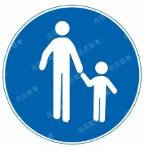
步行:前方道路只供步行,任何车辆不准进
入。
 

人行横道:表示该处为人行横道,机动车驾驶
人应注意观察行人,遇行人已进入人行横道时
应停车让行人通过。
 

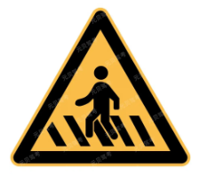
注意行人:警告前方道路设有人行横道线,应
减速慢行,注意行人。
 

注意儿童:警告前方是儿童频繁出入的地点,
应减速慢行,注意儿童。

 

 

 

好，下面给你一份**「科目一交通标志速记表（最易混淆版）」**。
我按**考试出题思路**来整理，背这一套，命中率很高 👌

---

# 🚦 科目一交通标志速记表（必背）

## 一、先记这句「总口诀」（90% 题靠它）

> **圆形看能不能**
> **方形看是什么路**
> **三角形看前方危险**
> **八角形只管停车**

---

## 二、形状 + 颜色 = 出题核心

### 🔵 蓝色圆形（指示标志）

👉 **“可以 / 必须”做什么**

| 标志      | 含义      | 易错点        |
| ------- | ------- | ---------- |
| 自行车     | 非机动车行驶  | ❌ 不等于非机动车道 |
| 直行 / 左转 | 按指示方向行驶 | 不是“前方”     |
| 行人      | 行人通行    | 不是人行横道     |

📌 **口诀**：

> 蓝圆＝**当下路段允许你这么走**

---

### 🔴 红色圆形（禁令标志）

👉 **“不能 / 禁止”**

| 标志   | 含义     |
| ---- | ------ |
| 禁止通行 | 所有车都不行 |
| 禁止驶入 | 不能进去   |
| 限速   | 不能超过   |

📌 **口诀**：

> 红圆＝**一律不许**

---

### 🟦 蓝色方形（指路 / 车道标志）

👉 **“这是什么路 / 哪条车道”**

| 标志     | 含义     | 关键     |
| ------ | ------ | ------ |
| 非机动车车道 | 专供非机动车 | 🚗 不能进 |
| 人行横道   | 行人过街位置 |        |
| 停车场    | 这里能停车  |        |

📌 **口诀**：

> 蓝方＝**道路属性已确定**

---

### ⚠️ 黄色三角形（警告标志）

👉 **“前方有情况”**

| 标志      | 含义        |
| ------- | --------- |
| 注意行人    | 前方可能有人    |
| 注意非机动车  | 前方可能有非机动车 |
| 急弯 / 陡坡 | 前方危险      |

📌 **口诀**：

> 黄三＝**前方可能发生**

---

### 🛑 八角形（唯一）

👉 **停车让行**

| 标志   | 含义   |
| ---- | ---- |
| STOP | 必须停车 |

📌 **记住**：

> 八角＝**不用看字，也得停**

---

## 三、考试最爱挖坑对照表（必看）

### ❌ 最常错 1

**蓝色圆形自行车 ≠ 非机动车道**

✔ 正确区分：

* 🔵圆形：非机动车 **可以走**
* 🟦方形：这是 **非机动车道**

---

### ❌ 最常错 2

**“前方”≠“当前”**

| 说法   | 正确标志       |
| ---- | ---------- |
| 前方有  | ⚠️ 黄色三角    |
| 此路段是 | 🔵 / 🟦 蓝色 |

---

### ❌ 最常错 3

**看图别被文字骗**

考试规律：

> **文字是干扰项，形状和颜色才是答案**

---

## 四、3 秒判断流程（考场用）

1️⃣ 先看 **形状**
2️⃣ 再看 **颜色**
3️⃣ 最后才看 **图案**

👉 **不看文字，先定对错**

---

## 五、送你一条「压轴神口诀」

> **圆形管行为**
> **方形管归属**
> **三角管预警**
> **八角必停车**

---

如果你愿意，我还能给你做：

* ✅ **只考“判断题”的速杀版**
* ✅ **100%易错题专练**
* ✅ **和你刚才那题一模一样的“对比图背法”**

 

这是交通事故管理警告标志,用以警告前方路
段正在进行道路交通事故管理,车辆驾驶人应
减速慢行、停车等候或绕道行驶。该标志为粉
红色底或荧光粉红色底、黑文字。作为临时性
标志设在进行交通事故管理的路段前适当位
置。
 

 

### 高速公路分道限速标准（单位：km/h）

| 车道总数 | 第一车道（最左侧） | 第二车道 | 第三车道 | 第四车道（最右侧） |
| --- | --- | --- | --- | --- |
| **二车道** | 100 - 120 | 60 - 100 | / | / |
| **三车道** | 110 - 120 | 90 - 110 | 60 - 90 | / |
| **四车道** | 110 - 120 | 90 - 110 | 90 - 110 | 60 - 90 |

---

### 需要注意的几个细节：

1. **标志牌优先原则**：
上述数值是法律规定的“保底”标准。如果在实际行驶中，路边或龙门架上的**限速标志牌**标注了不同的数值（例如因施工限速 80 或特定路段最高 110），必须以标志牌为准。
2. **车型限制**：
* **最左侧车道**：通常只允许小型客车行驶。
* **大型车辆**：如大货车、大客车，通常被限制在右侧车道行驶，且其最高限速往往不得超过 100km/h（具体看车身标识和路段要求）。

3. **特殊天气**：
如果遇到雾、雨、雪、沙尘、冰雹等低能见度气象条件，法定的限速会进一步降低（如能见度小于 200 米时，时速不得超过 60km/h）。
4. **关于四车道的中间两道**：
正如你所写，四车道的第二和第三车道通常都维持在 90-110km/h 这个区间，这主要是为了保证中间车道的车流速度相对平均，减少频繁变道带来的风险。

 

 

根据《道路交通标志和标线》标准,免费停车
位的标线通常为蓝色虚线,表示该停车位免费
且限时停放(具体时间以辅助标志为准)。其
他颜色含义如下:
白色标线:收费停车位或专用停车位。
黄色标线:专属停车位(如消防车、警车等)
或禁止停放车辆。
红色标线:一般为禁停区域。

 

图案是电动自行车,是电动自行车行驶
标志,表示该道路仅供电动自行车通行。

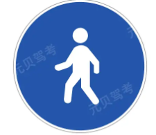
图案是行人,是行人标志,表示该段道
路仅供行人步行,任何车辆不准进入。

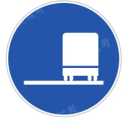
图案是货车,是靠右侧车道行驶标志,
表示车辆除必要的超车行为外应靠右侧车道行
驶。

图案是行人与自行车,是非机动车与行
人共享空间通行标志,表示该道路仅供非机动
车与行人通行,机动车不准进入。

 

 

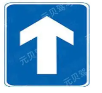
显示一个箭头向上,表示该道路为单向
通行,即单行路标志。
###  长方形（左图）：单行路

* **含义：** 表示整条道路都是**单向行驶**的。
* **理解：** 它告诉你这条路的“属性”。进了这条路，所有车都只能朝一个方向走，没有对向来车。
* **特征：** 箭头比较宽大，充满整个长方形。
 
 

直行,表明一切车辆在该路段应保持直
线行驶,不得转弯。
###  圆形（右图）：只准直行

* **含义：** 表示在该路口或路段**只能直行**，不能左转或右转。
* **理解：** 它是一个“指令”。主要出现在路口，限制你的行驶方向。虽然你只能直行，但对面可能有车开过来（双向车道）。
* **特征：** 箭头比较细长，放在圆圈中间。
 

显示一个箭头向上,旁边有虚线,表示
直行车道标志,指示车辆在此车道只能直行。

显示一个蓝色背景上的白色飞机图案,
表示路口优先通行标志,指示主要道路上的车
辆享有优先通行权。

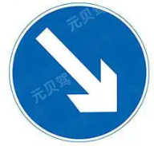
显示一个向右的箭头,表示分隔带右侧
行驶标志,指示车辆应在分隔设施的右侧行
驶。

以上交通标志表示除小客车和货车外,其他车
辆可以直行。
 

单选 行人参与道路交通的主要特点是什么?(C)

A行动迟缓

B喜欢聚集、围观

C行走随意性大,方向多变

D以上都是
 

单选 夜间在照明不良的路段行驶,应如何使用灯光?(C)

A只开启远光灯

B只开启前照灯

C开启前照灯、示廓灯和后位灯

D只开启后位灯
 

这道题选 C 而不选 A（只开启远光灯），主要有两个核心原因：**法规要求的完整性**和**安全驾驶的避嫌性**。

简单来说，开车不仅要让自己**“看得见”**，还要让别人**“看见你”**。

### 1. 法律规定的“标配”

根据《中华人民共和国道路交通安全法实施条例》第五十八条：

> 机动车在夜间没有路灯、照明不良……情况下行驶时，应当开启**前照灯、示廓灯和后位灯**。

* **前照灯（前大灯）：** 负责照亮前方路面。它包含近光灯和远光灯。
* **示廓灯（示宽灯）：** 勾勒车辆轮廓，让侧面和侧后方的车辆看清你车的大小。
* **后位灯（尾灯）：** 让后车能看清你的位置，防止追尾。

**为什么 A 不对？**
选项 A 强调的是“**只**开启”。如果你“只”开了远光灯而没开示廓灯和后位灯，虽然你前面看得清了，但侧方和后方的车可能看不清你，极易引发事故。

---

### 2. 远光灯不能“一直开”

虽然在照明不良的路段建议使用远光灯以获得更好的视距，但远光灯在很多情况下是**禁止使用**的：

* **会车时：** 距对向来车 150 米以内必须切换为近光灯，否则会导致对方司机“瞬间致盲”。
* **跟车时：** 离前车近距离行驶时不能开远光，否则会通过前车的后视镜晃花对方司机的眼睛。
* **特殊路口：** 经过急弯、坡路、人行横道等，需要**交替使用**远近光灯示意。

**总结：** 远光灯是前照灯的一种模式，但在行驶中需要根据路况不断切换。题目中的“开启前照灯”已经包含了可以开启远光灯的意思，但必须配合示廓灯和后位灯一起使用。

 

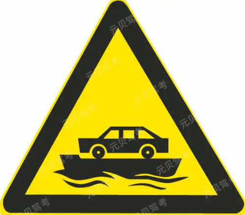
图中标志为渡口标志,其核心元素是“汽车
+船+波浪”,提醒前方是车辆渡口,应谨慎
驾驶。
 

如图所示,校车在最右侧车道停靠上下学生
时,以下哪辆车可以通行?(1)

根据《道路交通安全法》和校车通行规则,校
车在最右侧车道(3车道)停靠上下学生时:
校车所在车道(3)及相邻左侧车道(2)的
车辆必须停车等待;其他车道(1)的车辆可
以正常通行。
图中3车道:校车所在车道(必须停车);2
车道:相邻车道(必须停车);1车道:非相
邻车道(可以通行)。所以能通行的是1。

 

单选 行车中超越同向行驶的自行车时,应怎样做?(B)

A让自行车先行

B注意观察动态,减速慢行,留有足够的安全
距离

C连续鸣喇叭提醒其让路

D持续鸣喇叭并加速超越

这是一个非常典型的驾照考试（科目一或科目四）题目。你的直觉没错，在普通超车（比如超越前方汽车）时，确实需要果断加速以缩短并行时间。

但在超越**自行车或行人**时，逻辑会完全不同。以下是为什么选 **B（减速慢行）** 而不是加速的原因：

### 1. 自行车的不确定性（防御性驾驶）

自行车属于“非机动车”，稳定性远不如汽车。

* **晃动风险：** 骑行者可能因为避让路面水坑、石子或者体力不支而突然左右晃动。
* **突然转向：** 自行车没有后视镜，骑行者可能在没有预警的情况下突然左转或掉头。
* **减速是为了留出反应时间：** 如果你高速飞驰而过，一旦对方倒地或晃动，你根本没有反应时间去制动。

### 2. 保持安全距离的物理因素

* **风压影响：** 当汽车高速从自行车旁经过时，产生的气流（风压）可能会导致自行车失去平衡，甚至将骑行者“吸”向汽车或将其带倒。
* **空间局限：** 自行车通常在路边行驶，空间较窄。减速慢行可以让你更精准地观察并控制与自行车之间的**横向间距**。

### 3. 考试逻辑：安全高于效率

在中国的交通法规考试中，有一个极其核心的逻辑：**“只要涉及非机动车、行人、学校、人行横道，选‘减速、观察、避让’永远是对的。”**

* **加速超车（选项 D）：** 被视为危险驾驶行为。
* **连续鸣喇叭（选项 C）：** 可能会惊吓到骑行者，导致其操作失误摔倒。

---

### 总结

* **超汽车：** 观察后加速，快进快出。
* **超自行车/行人：** **减速、预留大间距、观察动态**。

**考试小窍门：** 在做题时，凡是看到选项里有“加速”、“开启远光灯”、“持续鸣喇叭”、“强行”等词汇，基本都是干扰项；而看到“减速”、“停车避让”、“观察”、“安全距离”，大概率就是正确答案。

如果你还在备考，需要我帮你总结更多这类容易混淆的“考点逻辑”吗？
 

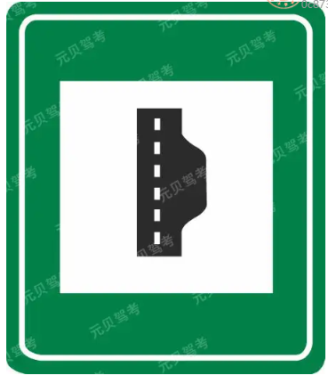
高速公路紧急停车带
 
 

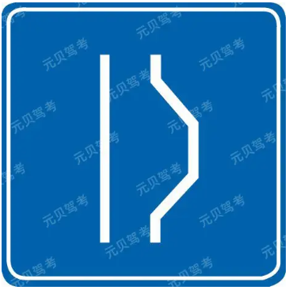
错车道
这张图片中的蓝色标志正式名称叫做 **“错车道”**。它的功能确实和你提到的“避让对向来车”相关，但为了你在考试中精准区分，我们来梳理一下它的具体属性：

### 1. 标志辨析：错车道 (Passing Bay)

* **颜色背景**：**蓝色**。这表示该标志用于**普通道路**（如乡村公路、单车道山路等），而非高速公路。
* **图形特征**：标志中间的白色道路图形**没有虚线**。
* **功能定位**：专门设置在**单车道道路**上，供两辆对向行驶的车辆交会时，其中一辆车临时停靠以**避让对向来车**。

### 2. 它与“高速公路紧急停车带”的区别

虽然形状相似，但有两个核心区别可以帮你秒杀题目：

| 特征 | 错车道 (当前图片) | 高速公路紧急停车带 (上题图片) |
| --- | --- | --- |
| **底色** | **蓝色** (普通道路) | **绿色** (高速/快速路) |
| **中间虚线** | **没有虚线** | **有白色虚线** (代表高速车道线) |
| **主要用途** | 供对向来车 **“避让/错车”** | 供故障车辆 **“紧急停靠”** |

---
 
 

路口黄灯持续闪烁,提示车辆、行人通行时要
注意减速或停车瞭望,确认安全后通过。
【拓展知识】
黄灯的法律含义是警示,只闪黄灯表示此路口
交通信号暂时解除,过往车辆经过此路口的时
候需要提前减速观察周围情况决定停不停车,
这种信号灯往往设置在车流不大的路口或是夜
间等车流平峰时段。

 

 

解析说走右边，可是我记得一个题目说走中间，行人和非机动车走两边
 

这是一个非常经典的易错点，你的记忆其实是**非常准确**的。

简单来说：题目中的说法是错误的，主要错在**“左侧”**这两个字。在中国，车辆是靠右行驶的，绝不存在靠左通行的道理。

针对你提到的“走中间”还是“走右边”的疑惑，我们可以根据《中华人民共和国道路交通安全法》来详细拆解：

### 1. 你的记忆是对的：法律规定“走中间”

根据《道路交通安全法》第36条规定：

> “没有划分机动车道、非机动车道和人行道的，**机动车在道路中间通行**，非机动车和行人在道路两侧通行。”

**为什么要走中间？**
因为在这种没有标线的窄路上，路两边通常会有行人或骑自行车的人。机动车走在中间，可以与两侧的非机动车和行人保持安全间距，防止发生刮擦。

### 2. 为什么解析会提到“靠右”？

这里存在两种理解角度，导致你看到的解析可能会说“靠右”：

* **原则上的靠右：** 中国是右侧通行国家。虽然法规说“走中间”，但当你**遇到对面来车（会车）**时，你必须减速并向**右**避让，把道路中心线左侧的空间让给对方。所以解析可能会强调“靠右”作为一种通用准则。
* **道路条件的区别：** * 如果是“没有划分机动车道/非机动车道”的窄路：**走中间**。
* 如果是“有道路但只有单向车道”或“较宽但没划线”的道路：通常默认遵循**靠右行驶**。

---

### 总结归纳

为了应付考试，你只需要记住这三句话：

1. **看到“左侧通行”：** 必错。（中国没有左侧通行）
2. **没有划分机动车/非机动车道：** 机动车走**中间**，其他人走**两旁**。
3. **遇到会车：** 必须**靠右**让行。

**所以这道题判定“错误”的原因很简单：它说要走“左侧”，这在我国交通规则里是绝对错误的。**

需要我帮你再找几道类似的易混淆题目练习一下吗？
 

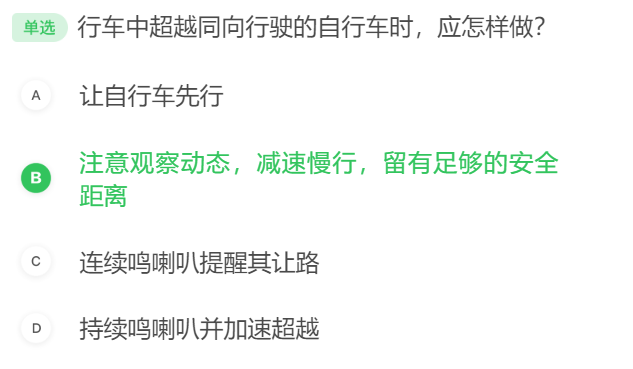
超车不是要加速吗，为什么这里要减速
 

这是一个非常典型的驾照考试（科目一或科目四）题目。你的直觉没错，在普通超车（比如超越前方汽车）时，确实需要果断加速以缩短并行时间。

但在超越**自行车或行人**时，逻辑会完全不同。以下是为什么选 **B（减速慢行）** 而不是加速的原因：

### 1. 自行车的不确定性（防御性驾驶）

自行车属于“非机动车”，稳定性远不如汽车。

* **晃动风险：** 骑行者可能因为避让路面水坑、石子或者体力不支而突然左右晃动。
* **突然转向：** 自行车没有后视镜，骑行者可能在没有预警的情况下突然左转或掉头。
* **减速是为了留出反应时间：** 如果你高速飞驰而过，一旦对方倒地或晃动，你根本没有反应时间去制动。

### 2. 保持安全距离的物理因素

* **风压影响：** 当汽车高速从自行车旁经过时，产生的气流（风压）可能会导致自行车失去平衡，甚至将骑行者“吸”向汽车或将其带倒。
* **空间局限：** 自行车通常在路边行驶，空间较窄。减速慢行可以让你更精准地观察并控制与自行车之间的**横向间距**。

### 3. 考试逻辑：安全高于效率

在中国的交通法规考试中，有一个极其核心的逻辑：**“只要涉及非机动车、行人、学校、人行横道，选‘减速、观察、避让’永远是对的。”**

* **加速超车（选项 D）：** 被视为危险驾驶行为。
* **连续鸣喇叭（选项 C）：** 可能会惊吓到骑行者，导致其操作失误摔倒。

---

### 总结

* **超汽车：** 观察后加速，快进快出。
* **超自行车/行人：** **减速、预留大间距、观察动态**。

**考试小窍门：** 在做题时，凡是看到选项里有“加速”、“开启远光灯”、“持续鸣喇叭”、“强行”等词汇，基本都是干扰项；而看到“减速”、“停车避让”、“观察”、“安全距离”，大概率就是正确答案。
 

 

根据《刑法》的规定,交通肇事后的量刑需区分以下情形:
1,无逃逸情节:处3年以下有期徒刑;
2,致人死亡且逃逸(亡且逃):处3年以上7年以下有期徒刑;
3,因逃逸致人死亡(逃致亡):处7年以上有期徒刑。
 

 

驾驶机动车在道路上追逐竞驶,情节恶劣,会受到什么处罚?(A)

处拘役,并处罚金

处管制,并处罚金

处1年以上徒刑

处6个月徒刑
 

在我国刑法中，**拘役**和**管制**都是主刑的种类，但它们在对人身自由的限制程度、执行方式以及期限上有着本质的区别。

简单来说：**拘役是“要关起来”的短期刑罚，而管制是“不关起来”的社会矫正。**

以下是两者的详细对比：

### 1. 对人身自由的限制程度

* **拘役：** 属于**剥夺自由刑**。犯罪分子需要被关押在特定的监管场所（通常是看守所），失去人身自由。
* **管制：** 属于**限制自由刑**。犯罪分子不被关押，依然留在原工作单位或居住地，但其言行受到一定的监督和限制（如离开居住地需报批）。

### 2. 期限

* **拘役：** 期限较短，为 **1个月以上6个月以下**。数罪并罚时，最高不能超过1年。
* **管制：** 期限较长，为 **3个月以上2年以下**。数罪并罚时，最高不能超过3年。

### 3. 执行机关与方式

* **拘役：** 由**公安机关**就近执行（通常在看守所）。执行期间，受刑人每月可以回家一至两天；参加劳动的，可以酌量发给报酬。
* **管制：** 依法实行**社区矫正**。被判管制的犯罪分子在劳动中应当**同工同酬**（这是与拘役的重要区别之一）。

### 4. 刑期折抵（判决前的羁押时间）

* **拘役：** 羁押一日折抵刑期**一日**（1:1）。
* **管制：** 羁押一日折抵刑期**二日**（1:2）。这是因为管制本身不关押，为了公平，判决前的关押时间会“加倍”折抵。

### 核心区别对比表

| 比较项目 | 拘役 | 管制 |
| --- | --- | --- |
| **性质** | 剥夺自由（要关押） | 限制自由（不关押） |
| **期限** | 1个月 - 6个月 | 3个月 - 2年 |
| **执行场所** | 看守所/拘役所 | 社区/原居住地 |
| **劳动报酬** | 酌量发给报酬 | 同工同酬 |
| **探亲待遇** | 每月可回家1-2天 | 一直在社会上，无需探亲 |

---

**温馨提示：**
无论是拘役还是管制，一旦被判处，都会留下**刑事犯罪记录（案底）**，这与行政拘留（属于治安处罚，非刑事犯罪）是有本质区别的。

您是想了解某个具体案例的适用，还是在进行法律知识的学习？我们可以深入探讨这两者在实际判决中的考量因素。
 

单选 醉酒驾驶机动车在道路上行驶会受到什么处罚?(B)

A处2年以下徒刑

B处拘役,并处罚金

C处2年以上徒刑

D处管制,并处罚金

那驾驶证会被吊销吗
这道题的正确答案是 **B**。

根据《中华人民共和国刑法》第一百三十三条之一的规定，在道路上醉酒驾驶机动车的，构成**危险驾驶罪**，处以**拘役，并处罚金**。

### 详细解答

* **刑事处罚（题目选项）：**
* **正确选项：B（处拘役，并处罚金）**。
* “拘役”的期限通常为 1 个月以上 6 个月以下。
* 醉酒驾驶（血液酒精含量 ）属于刑事犯罪，即使没有造成交通事故，也会面临刑事处罚。

* **驾驶证处理（你的追问）：**
* **会被吊销。**
* 根据《道路交通安全法》第九十一条规定，醉酒驾驶机动车的，由公安机关交通管理部门约束至酒醒，**吊销机动车驾驶证**。
* **五年内不得重新取得**机动车驾驶证（如果是营运车辆，则十年内不得重新取得，且重新取得后不得驾驶营运车辆）。
* 如果饮酒或醉酒驾驶导致发生重大交通事故并构成犯罪，则**终生不得重新取得**驾驶证。

---

**提醒：**
法律对酒驾、醉驾采取“零容忍”态度。除了罚金和失去驾照，犯罪记录（案底）还会影响个人政审、子女参军或报考公务员等，务必谨记“喝酒不开车，开车不喝酒”。

如果你需要了解具体血液酒精含量的判定标准或不同车型的详细扣分细则，可以随时告诉我。
 

《刑法》第一百三十三条之一,【危险驾驶
罪】在道路上驾驶机动车,有下列情形之一
的,处拘役,并处罚金:
(一)追逐竞驶,情节恶劣的;
(二)醉酒驾驶机动车的;
(三)从事校车业务或者旅客运输,严重超过
额定乘员载客,或者严重超过规定时速行驶
的;
(四)违反危险化学品安全管理规定运输危险
化学品,危及公共安全的。
机动车所有人、管理人对前款第三项、第四项
行为负有直接责任的,依照前款的规定处罚。
 

单送
新规题
以下哪种行为处十日以下拘留,并处
一千元以上二千元以下罚款,吊销机
动车驾驶证?

A醉酒驾驶机动车的

B故意遮挡机动车号牌的

C使用其他车辆保险标志的

D因饮酒后驾驶机动车被处罚,再次饮酒后驾
驶机动车的
 

这道题的正确答案是 **D**。

根据《中华人民共和国道路交通安全法》第九十一条规定，针对不同程度的酒驾行为，处罚标准有严格区分。

### 题目解析

* **选项 A：醉酒驾驶机动车的**
* **后果：** 由公安机关交通管理部门约束至酒醒，**吊销**机动车驾驶证，依法追究**刑事责任**；五年内不得重新取得机动车驾驶证。
* **区别：** 醉驾涉及刑事处罚（危险驾驶罪），不仅仅是行政拘留。

* **选项 B：故意遮挡机动车号牌的**
* **后果：** 通常处警告或者二十元以上二百元以下罚款，并扣 9 分（新规）。不涉及拘留或吊销驾照。

* **选项 C：使用其他车辆保险标志的**
* **后果：** 由公安机关交通管理部门予以收缴，扣留该机动车，处二百元以上二千元以下罚款。

* **选项 D：因饮酒后驾驶机动车被处罚，再次饮酒后驾驶机动车的（正确项）**
* **法律规定：** 处**十日以下拘留**，并处**一千元以上二千元以下罚款**，**吊销**机动车驾驶证。

---

### 重点区分：饮酒 vs 再次饮酒 vs 醉酒

为了方便记忆，你可以参考下表：

| 行为类型 | 罚款金额 | 证件处理 | 行政处罚 | 刑事责任 |
| --- | --- | --- | --- | --- |
| **初次饮酒驾驶** | 1000-2000元 | 记12分，暂扣6个月 | 无 | 无 |
| **再次饮酒驾驶** | **1000-2000元** | **吊销驾照** | **10日以下拘留** | 无 |
| **醉酒驾驶** | / | 吊销，5年内禁考 | 约束至酒醒 | **依法追究刑责** |

> **注意：** 这里的“饮酒后”是指血液中酒精含量大于等于 20mg/100ml，小于 80mg/100ml；“醉酒后”是指大于等于 80mg/100ml。

 

 

单选
交通肇事致一人以上重伤,负事故全部或者主
要责任,并具有下列哪种行为的,构成交通肇
事罪?(C)

A未及时报警

B未抢救受伤人员

C严重超载驾驶的

D未带驾驶证
根据《关于审理交通肇事刑事案件具体应用法
律若干问题的解释》:交通肇事致一人以上重
伤,负事故全部或者主要责任,并具有下列情
形之一的,以交通肇事罪定罪处罚:
(一)酒后、吸食毒品后驾驶机动车辆的;
(二)无驾驶资格驾驶机动车辆的;
(三)明知是安全装置不全或者安全机件失灵的
机动车辆而驾驶的;
(四)明知是无牌证或者已报废的机动车辆而驾
驶的;
(五)严重超载驾驶的;
(六)为逃避法律追究逃离事故现场的。
 

这道题的正确答案是 **C（严重超载驾驶的）**。

你觉得 B（未抢救受伤人员）看起来很严重，这在道德和常理上是非常正确的，但在法律条文的**罪名认定**上，我们需要看《最高人民法院关于审理交通肇事刑事案件具体应用法律若干问题的解释》。

### 1. 为什么选 C 而不选 B？

根据法律规定，交通肇事致一人以上重伤，负事故全部或者主要责任，**必须具备特定的“恶劣情节”** 才构成犯罪。

* **关于 C（严重超载）：** 法律明文规定，“严重超载驾驶”是触发“一人重伤即入罪”的法定情形之一。
* **关于 B（未抢救受伤人员）：** 在法律术语中，与此相近的概念是“逃逸”。如果肇事后**为了逃避法律追究而逃离现场**，那是构成犯罪的条件。
* 但“未抢救”和“逃逸”在法理上不是一个概念。如果你留在现场报警了，但因为害怕或不知所措没去搬动伤者（未抢救），通常不会直接以此作为“一人重伤”入罪的唯一依据。
* **关键点：** 单纯的“不作为（不抢救）”如果没有伴随“逃避责任的逃逸”，在法律条文中并没有被列入这六种特定的“重伤入罪”情形中。

---

### 2. 法律依据：一人重伤入罪的 6 种情形

当事故只造成**一人重伤**且你负**全部或主要责任**时，只有具备以下任意一种行为，才定“交通肇事罪”：

| 序号 | 法定入罪情形 | 说明 |
| --- | --- | --- |
| 1 | **酒后、药后驾驶** | 饮酒或国家管制的精神药品、麻醉药品 |
| 2 | **无证驾驶** | 无驾驶资格驾驶机动车辆 |
| 3 | **明知安全装置失灵** | 明知车辆安全装置（如刹车）失灵而驾驶 |
| 4 | **明知无牌/报废车** | 明知是无牌证或者已报废的机动车辆 |
| 5 | **严重超载驾驶** | **（本题考点：C选项）** |
| 6 | **为逃避法律追究逃离现场** | 重点在于“逃避追究”和“逃离” |

---

### 3. 总结

* **A（未及时报警）和 D（未带驾驶证）：** 属于行政违法或一般违规，不直接导致交通肇事罪的刑事起诉。注意，“未带驾驶证”不等于“无证驾驶”。
* **B（未抢救受伤人员）：** 虽然行为恶劣，但在法律考题中，它不是法定的“重伤转刑事”的触发开关。

> **法律小贴士：** 在考试中，交通肇事罪的考点通常集中在“重伤人数”、“死亡人数”以及“是否有逃逸情节”。记住这 **6 种特殊情形**是应对此类单选题的关键。

你想了解一下如果发生了死亡事故，法律又是如何判定刑事责任的吗？
 

驾驶人的血液中酒精含量在80毫克/100毫升
(含)以上属于醉酒驾驶;驾驶人血液中的酒
精含量大于或者等于20毫克/100毫升,小于
80毫克/100毫升时,属于酒后驾驶。
 

危险驾驶罪:追逐竞驶情节恶劣;醉驾。
根据《刑法》第一百三十三条的规定:危险驾驶罪是指
在道路上驾驶机动车追逐竞驶,情节恶劣的;
醉酒驾驶机动车的;
从事校车业务或者旅客运输,严重超过定额乘员载客,或者严重超过规定时速行驶的;
违反危险化学品安全管理规定运输危险化学品,危害公共安全的行为。

而闯红灯、无证驾驶、疲劳驾驶虽然都属于交
通违法行为,且具有一定危险性,但它们并不
直接构成危险驾驶罪。
 

 

在我国法律中，“无证驾驶”和“危险驾驶罪”是两个不同的法律概念。简单来说，**无证驾驶通常属于“行政违法”，而危险驾驶罪属于“刑事犯罪”**。

之所以无证驾驶不直接等同于危险驾驶罪，主要有以下几个原因：

### 1. 罪刑法定原则（核心原因）

我国《刑法》实行**罪刑法定原则**，即“法无明文规定不为罪”。
在《刑法》第一百三十三条之一中，明确列举了构成“危险驾驶罪”的四种情形：

* **追逐竞驶**（飙车），情节恶劣的；
* **醉酒驾驶**机动车的（血液酒精含量  80mg/100ml）；
* **从事校车业务或旅客运输**，严重超员或严重超速的；
* **违反危险化学品安全管理规定**运输危险化学品，危及公共安全的。

**无证驾驶并未被列入这四项之中**。因此，法官不能在法律规定之外自行设立罪名。

### 2. 社会危害性的判定标准不同

* **危险驾驶罪：** 针对的是那些**行为本身就具有极高危险性**、足以直接威胁公共安全的情形（如醉酒后失去控制力、高速飙车）。这些行为即便没有造成交通事故，只要实施了，就构成犯罪。
* **无证驾驶：** 法律上倾向于认为其属于**“行政管理资格”的缺失**。虽然无证驾驶有风险，但并不意味着只要一开车就一定会发生危险（例如，一个驾驶技术纯熟但因过期未换证的人）。因此，它主要由《道路交通安全法》通过罚款、行政拘留等手段进行惩戒。

### 3. 立法上的“入罪控制”

如果将所有无证驾驶都纳入刑法，会导致刑事打击面过大。无证驾驶的情况非常复杂，包括：

* 从未取得驾照的人。
* 驾照被吊销、注销或暂扣期间的人。
* 驾照过期未办理换证的人。
如果全部作为刑事犯罪处理，会耗费巨大的司法资源，也不符合“刑法谦抑性”原则（即能用行政手段解决的，尽量不用刑法）。

---

### 注意：无证驾驶并非“免死金牌”

虽然无证驾驶本身不是“危险驾驶罪”，但它会导致更严重的刑事后果：

1. **触发“交通肇事罪”：**
如果无证驾驶发生了事故，致人重伤或死亡，无证驾驶会成为定罪的重要加重情节。普通人可能需要致人死亡才构成犯罪，但无证驾驶的人往往只要致一人重伤并负主要责任，就可能构成**交通肇事罪**。
2. **作为危险驾驶罪的加重情节：**
如果你**既无证又醉驾**，法院在判决“危险驾驶罪”时，会因为你“无证”而从重处罚，通常不适用缓刑。
3. **其他重罪：**
如果明知无证还疯狂驾驶，在闹市区横冲直撞，可能触犯更严重的**“以危险方法危害公共安全罪”**，最高可判死刑。

### 总结

**无证驾驶**目前由《道路交通安全法》管辖，面临的是**行政拘留（15天以下）和罚款**；而**危险驾驶罪**由《刑法》管辖，面临的是**拘役（1-6个月）和罚金**。

您是否正在处理与此类法律条款相关的具体案例，或是想了解最新的司法解释？
 

根据《刑法》的规定,在法律规定的国家考试
中,组织作弊的行为构成犯罪。具体处罚如下:
一般情节:处三年以下有期徒刑或者拘役,并
处或者单处罚金。
情节严重:处三年以上七年以下有期徒刑,并
处罚金。
 

 

这段顺口溜是驾考**科目一**（理论考试）中为了方便考生记忆“违法行为与罚款金额”对应的关系而总结的口诀。

它的核心逻辑是按**情节严重程度**和**涉及人数**来划分罚款梯队。我们可以把这些行为看作是一个“从轻到重”的逻辑链条：

---

### 1. 罚款等级解析

| 行为类型 | 核心关键词 | 罚款金额 | 记忆逻辑（你的逻辑） | 法律后果 |
| --- | --- | --- | --- | --- |
| **虚假材料** | 提供伪造证件申请 | **500元** | **看物不看人**：只是材料（纸）造假。 | 1年内不得再次申请。 |
| **弄虚作假** | 考试中作弊/不正当手段 | **1000元-2000元** | **个人行为**：一个人在考场里搞小动作。 | 成效作废，1年内不得再次申请。 |
| **贿赂** | 给钱买证/送礼 | **2000元** | **两人获利**：你出钱，对方收钱。 | 撤销驾驶证，3年内不得再次申请。 |
| **组织作弊** | 团伙作案/替考 | **20000元** | **多人/团伙**：性质最恶劣，规模化作恶。 | 属于刑事犯罪（组织考试作弊罪）。 |

---

### 2. 深度理解（帮你建立逻辑连接）

* **500元（虚假材料）：** 这属于“门槛阶段”。你还没开始考试，只是在申请阶段交了假证明（比如假身份证、假体检表）。因为还没对道路安全造成实质性威胁，所以罚款最轻。
* **1000-2000元（弄虚作假/作弊）：** 这属于“实战阶段”。你已经在考试了，或者通过欺骗手段拿到了证。这直接挑战了考试公平，所以罚款翻倍。
* **2000元（贿赂）：** 贿赂涉及到了“权钱交易”，不仅你自己作假，还腐蚀了管理人员。这在法律上定性比普通作弊更严重。
* **20000元（组织作弊）：** 这里的单位变成了“万”。这已经不是简单的交通违章，而是触犯了《刑法》。在科目一题库中，只要看到“组织”二字，直接找金额最大的选项即可。

---

### 3. 考试防坑指南

在实际做题时，除了罚款金额，通常还会考**“禁考时间”**。你可以顺便把这个“1-1-3”逻辑也记下来：

* **1年：** 假材料（申领时）、弄虚作假（考试中）。
* **3年：** 贿赂/不正当手段（已经拿到证后被发现，撤销驾驶证）。

> **💡 建议：**
> 如果你在做模拟题时遇到这类题，先看题目里有没有**“组织”**或**“万”**。如果有，通常选 2 万；如果是**“材料”**，找最小的 500。

 

图片里的这些内容可以看作是科目一处罚题里的**“刑侦/团伙犯罪版”**。

之前的口诀（500、1000、2000）主要针对的是**个人**在考试过程中的违规，而这张图里的内容针对的是**组织者**（也就是俗称的“蛇头”或“中介”）以及**利用这些行为赚钱**的人。

这里的处罚逻辑不再是固定金额，而是**“倍数 + 最高限额”**。我们可以这样通俗地理解：

---

### 1. 详细拆解

#### **① 组织/参与骗取证照（牟利）**

* **意思：** 也就是职业代办假证、或者通过非法手段组织一大群人去“骗取”驾驶证，并且以此**赚钱**。
* **处罚：** 违法所得的 **3倍以上 5倍以下**，最高 **10万元**。
* **记忆点：** 这是最严重的。既然是“骗证”，金额最高，顶格 **10万**。

#### **② 组织审验教育替学**

* **意思：** 驾驶证在审验时需要参加学习（比如记分多了要看视频、上课），“替学”就是找人代课。组织别人干这件事的人，就是被罚的对象。
* **处罚：** 违法所得 **3倍以下**，最高 **2万元**。
* **记忆点：** 只是“代课”，性质比卖分和骗证轻一点，所以上限是 **2万**（对应你之前口诀里“组织作弊”的2万上限）。

#### **③ 组织卖分（买卖分中介）**

* **意思：** 也就是我们常说的“分头”或中介，组织别人卖分、买分来消分。
* **处罚：** 违法所得 **5倍以下**，最高 **10万元**。
* **记忆点：** 国家现在严打买卖分，所以它的上限和骗证一样，都是 **10万**。

---

### 2. 逻辑对比表（帮你秒杀选择题）

为了方便你记忆，你可以对比来看：

| 行为类型 | 涉及对象 | 关键数字（上限） | 处罚逻辑 |
| --- | --- | --- | --- |
| **组织替学** | “代课”中介 | **2万元** | 3倍以下 |
| **组织卖分** | “卖分”中介 | **10万元** | 5倍以下 |
| **组织骗证** | “假证”团伙 | **10万元** | 3-5倍 |

---

### 3. 学习建议

在科目一考试中，遇到这类题目时，你只需要记住三个“关键词”：

1. 只要看到**“组织”**两个字，罚款金额基本都是**万元**起步了。
2. **替学**（看课）最轻，最高 **2万**。
3. **卖分**和**骗证**最重，最高 **10万**。

> **💡 小贴士：**
> 如果题目问的是**“参与”**买卖分的个人（不是组织者），通常是扣证 6 个月 + 罚款 2000 元。一定要看清题目问的是“组织者”还是“个人”。

 

 

#### **科目一违法处罚逻辑对照表**

| 类别 | 处罚金额/上限 | 核心行为关键词 | 记忆逻辑 | 附加后果 |
| --- | --- | --- | --- | --- |
| **个人** | **500元** | **虚假材料** | 还没考，只是“纸”造假 | 1年内不得申请 |
| **个人** | **1000-2000元** | **弄虚作假/作弊** | 正在考试，个人作弊 | 成绩作废，1年内禁考 |
| **个人** | **2000元** | **贿赂/不正当手段** | 已经拿证，买证被抓 | 撤销驾照，3年内禁考 |
| **组织** | **2万元（上限）** | **组织考试作弊** | 团伙作案，性质最恶劣 | 涉及刑法 |
| **组织** | **2万元（上限）** | **组织替学** | 找人代看课、代学习 | 违法所得3倍以下 |
| **组织** | **10万元（上限）** | **组织卖分** | 买卖分中介（蛇头） | 违法所得5倍以下 |
| **组织** | **10万元（上限）** | **组织/参与骗证** | 职业骗领驾照牟利 | 违法所得3-5倍 |

---

**💡 考前复习口诀（建议截图）：**

* **看人头**：一个人干（千元级），一群人干（万元级）。
* **找最小**：看到“材料”选 500。
* **找最大**：看到“组织”或“10万”直接选最高。
* **记时间**：造假禁考 1 年，买证撤销 3 年。
 

根据《刑法》的规定,在法律规定的国家考试
中,组织作弊的行为构成犯罪。具体处罚如
下:
一般情节:处三年以下有期徒刑或者拘役,并
处或者单处罚金。
情节严重:处三年以上七年以下有期徒刑,并
处罚金。
 

 

没问题，确实应该把**有期徒刑的具体量刑时间**加上去，因为在科目一关于“组织作弊”的判断题或选择题里，经常会考到“三年以下”还是“三年以上”。

以下是为您更新后的**最全处罚逻辑表（含罚金、禁考年限及刑期）**：

### 科目一处罚“全维度”对照表（2026版）

| 行为类别 | 关键词 | 罚款金额 | **处罚/禁考/刑期（重点）** | 法律/记忆逻辑 |
| --- | --- | --- | --- | --- |
| **个人申请** | **虚假材料** | **500元** | **1年**内不得再次申请 | 还没考试，只是“纸”造假 |
| **个人考试** | **弄虚作假/作弊** | **1000-2000元** | **1年**内不得再次申请 | 考试中作弊，成绩作废，禁考1年 |
| **非法拿证** | **贿赂/不正当手段** | **2000元** | **3年**内不得再次申请 | **撤销**驾驶证（拿证后被发现） |
| **组织作弊** | **组织/参与作弊** | **2万元（上限）** | **3年以下**有期徒刑/拘役 | **一般情节**（构成刑事犯罪） |
| **组织作弊** | **情节严重者** | **并处罚金** | **3年以上 7年以下**有期徒刑 | **严重情节**（如大规模团伙、高科技作弊） |
| **买卖分** | **组织卖分/中介** | **10万元（上限）** | **5-10日**行政拘留 | 还没到判刑程度，但要关几天 |
| **职业骗证** | **组织骗证** | **10万元（上限）** | 违法所得3-5倍罚款 | 重点罚钱，最高10万 |

---

### 💡 针对“有期徒刑”的考试要点：

1. **“3、3、7”原则：**
* **3年以下**：这是**基础刑期**。只要题目里说“组织作弊构成犯罪的，处三年以下有期徒刑”，就是**对**的。
* **3年-7年**：这是**加重刑期**。只有题目提到“情节严重”时才会出现。

2. **“拘役”与“有期徒刑”：**
* 组织作弊不仅可以判有期徒刑，还可以判**拘役**。如果在选项中看到“处三年以下有期徒刑**或者**拘役”，这就是最标准、最准确的描述。

3. **罚金与刑罚：**
* 刑事犯罪通常是“刑期+罚金”并用。所以题目里说“并处或者单处罚金”也是**正确**的。

---

### 总结你的“闯关口诀”：

> **假材料 1 年（500）；作弊 1 年（1000）；**
> **贿赂买证 3 年（2000）；**
> **组织作弊入刑法，3 年以下要记牢，情节严重 3 到 7！**
 

 

 

没问题！为了方便你复习和查阅，我将之前的零散信息合并成两张 **“全能通”大表**。

这两张表涵盖了 2022 年新规中最核心的考点，一张针对**超速**，一张针对**超员**。建议你保存这两张合并后的表格：

---

**补充注意：**

* **10% 宽限：** 所有车辆超速未达 10% 均不记分。
* **私家车福音：** 私家车在任何路上超速 **20% 以内** 都不记分。
* **最严警告：** 校车、货车在高速上超速 **20%** 就直接扣光 **12 分**。

---

# 2022版交通违法记分速查表

## 表一：【超速】记分全能表
| 车型分类 | 行驶路段 | 20%以下 | 20% ≤ 比例 < 50% | 50% 及以上 |
| :--- | :--- | :--- | :--- | :--- |
| **普通私家车** | 高速/快速路 | 不记分 | **6 分**(重点) | **12 分**(重点) |
| 普通私家车(校车以外机动车) | 普通道路 | 不记分 | **3 分** | **6 分**(重点) |
| **特殊车辆**(校车/货车) | 高速/快速路 | 6分(10%-20%) | **12 分** | **12 分** |
| (校车/货车等) | 普通道路 | 1分(10%-20%) | **6 分** | **9 分** |

> **提示：** 私家车超速未达 20% 不记分；特殊车辆（校车/货车）在高速上超速达 20% 直接扣 12 分。

---

## 【超员】记分修正表 (2022官方版)
| 车辆类型 | 20% ≤ 比例 < 50% | 50% ≤ 比例 < 100% | 100% 及以上 |
| :--- | :--- | :--- | :--- |
| **7座以下**载客汽车 | **3 分** | **6 分**(重点) | **12 分** |
| **7座及以上**载客汽车 | **6 分** (重点) | **9 分**(重点) | **12 分** |

 

| 类型 | 比例≤20% | 20% ≤ < 50% | 50% ≤ < 100% | 100% |
| :--- | :--- | :--- | :--- |:--- |
| 校车,公路客运汽车，旅游客运汽车 | **6 分**(重点) | ** 分** | ** 分** ||
| **7座及以上**载客汽车 | ** 分** (重点) | **6 分** | **9 分** ||
| 其他载客汽车 | ** 分** (重点) | ** 分** | **6 分** |**12分**(重点)|
> **必考题提醒：** 8座面包车坐了10个人（超员25%），记 **6分**！千万别选3分。

> **提示：** “9分挡”是新规特有，专门针对7座以上车辆严重超员的情况。

**补充注意：**

* **9 分挡：** 这是新规特有的，专门给“大一点的车”严重超员（100%以上）准备的。
* **校车/营运客车：** 如果题目问的是**校车、客运车超员**，记分会更重（比如超员20%以上就记12分）(重点），但普通考试最常考的是上面这两类。

---

### 💡 考前冲刺“避坑总结”

如果你觉得表还是多，那就死记这几个**特殊记分值**：

1. **关于“9分”：** 只有两种情况记 9 分：
* **超速：** 特殊车辆在“普通路”超速 50% 以上。
* **超员：** 7座以上车辆超员 100% 以上。

2. **关于“6分”：**
* 私家车在**高速**上超速 20%-50%，一定要记 6 分（也就是你第一张图的题目）。
* 私家车在任何路上超员 50%-100%，记 6 分。

3. **关于“3分”：**
* 看到超员 **20%-50%**，无脑选 **3 分**（只要不是营运车）。
* 私家车在**普通路**超速 20%-50%，记 3 分。

这样合并后，是不是逻辑清晰多了？如果有具体的题目拿不准，随时发给我！
## 💡 考试必背补充（防坑指南）

除了上面的超速表，以下几点是新规中特别容易混淆的“深坑”，建议一并更新到你的笔记里：

### 1. 记分“宽限”政策

* **10% 宽限：** 无论什么车，在任何道路上超速 **未达 10%** 的，都不记分（但可能会处以警告）。
* **私家车 20% 宽限：** 特意留意，普通私家车超速 **未达 20%**，现在是不记分的。这就是为什么表格第一列显示“不记分”。

### 2. “9分”是新规的特色

* 在 2022 版新规中，新增了 **9分** 这一档。
* **记住这个考点：** 只有“特殊车辆”在“普通道路”超速 **50% 以上**，才会记 9 分。私家车没有 9 分这一档。

### 3. “超员”不要和“超速”弄混

* **超员记 3 分的情况：** 7座以下私家车，超员 20% ~ 50%（比如 5 人车坐了 6 人）。
* **超员记 6 分的情况：** 7座以下私家车，超员 50% ~ 100%（比如 5 人车坐了 8 人）。
* **超员记 12 分的情况：** 7座以下私家车，超员 100% 以上（比如 5 人车坐了 10 人）。

---

**总结你那张图片的题：**
关键词是“**高速公路**”+“**20%以上未达50%**”+“**普通机动车**”，对应我表格里的第一栏第二行，所以结果必须是 **6 分**。

如果你觉得这些数字很难背，需要我提供一套快速记忆口诀吗？
 

普路倒掉1逆3  高速倒掉逆12
 

 

《机动车登记规定》第七十八条,有下列情形
之一的,由公安机关交通管理部门处警告或者
二百元以下罚款:
(一)重型、中型载货汽车、专项作业车、挂
车及大型客车的车身或者车厢后部未按照规定
喷涂放大的牌号或者放大的牌号不清晰的;
因此,题干中罚款金额表述错误。
 

 

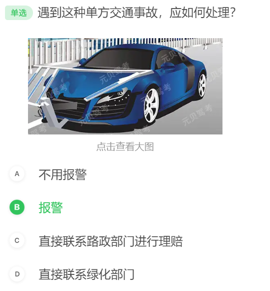
这个问题在驾照考试中确实容易让大家产生困惑。看起来 C（路政）和 D（绿化）是直接负责赔偿的部门，但在法律流程和实际操作中，**“报警”才是所有后续步骤的前提。**

以下是为什么 C 和 D 不可以作为首选答案的几个核心逻辑：

### 1. 法律强制要求

根据《中华人民共和国道路交通安全法》，在发生交通事故（包括撞毁路灯、护栏等公共设施的单方事故）时，驾驶人应当**立即报警并保护现场**。

* **警察的角色：** 只有交警有权出具《道路交通事故责任认定书》。
* **权责划分：** 路政或绿化部门是公共设施的“业主”，他们负责核定受损价值，但没有权力判定事故责任和出具法律文书。

### 2. 保险理赔的必要条件

如果你想让保险公司赔付受损的车辆和护栏费用，**交警的责任认定书是必不可少的。**

* 如果你直接找路政部门私下赔钱（即选项 C），保险公司通常会因为缺乏“警方证明”而拒绝理赔，这笔钱就得你个人全额承担。
* **流程顺序：** 报警 (122) → 交警出具认定书 → 联系保险公司 → 赔偿路政/绿化部门。

### 3. 规避“肇事逃逸”的风险

这是最关键的一点。如果你没有报警，直接联系路政或自行离开：

* 在法律上，这极有可能被定性为**肇事逃逸**。
* 即使你只是撞了护栏，只要没有通过警方登记备案就擅自变动现场，一旦被监控拍到，性质就变了，不仅保险不赔，还会面临扣分甚至拘留。

---

### 选项对比分析

| 选项 | 行为性质 | 结果 |
| --- | --- | --- |
| **B. 报警** | **法定义务** | 保护现场，获取责任认定书，确保保险公司后续赔付。 |
| **C. 联系路政** | 越过法律流程 | 缺乏官方认定，可能导致保险拒赔，且有逃逸风险。 |
| **D. 联系绿化** | 越过法律流程 | 同上。且图示中主要是护栏，通常归路政管，D 甚至对口部门都不一定准。 |

> **💡 小贴士：**
> 在考题中，只要涉及到**财产损失**（哪怕是路边的树或护栏），“报警”永远是最高优先级的标准答案。

---

这类关于“单方事故”的题目还有几种变体（比如在深山里撞了树怎么办），你想让我把相关的知识点一次性帮你梳理一下吗？
 

前雾灯
 

后雾灯
 

远光灯
 

近光灯
 

制动系统出现故障
 

驻车制动没松
 

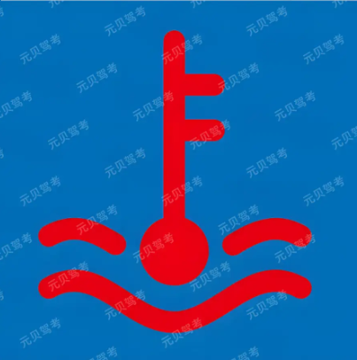
温度计图标-水温指示灯,该灯常亮,表示
发动机温度过高,发动机内冷却液的温度超过
规定值,需要立即暂停行驶;
 

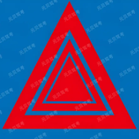
危险报警闪光灯(双闪):与转向信号灯共用一套灯
具,当汽车发生故障停车或遇到紧急情况需要
处理时使用,发出交替的闪光信号,用于警告
后方车辆和行人。
 

前后位置灯:又称示廓灯、小灯,用于夜间和
特殊天气行驶时,标示汽车的宽度,提醒其他
车辆注意。
 

充电电路故障或发电机不向蓄电池充电
就是一个简单的长方形电池，中间有“+”“-”号，没有重影。
代表对象：所有汽车都有的普通 12V 蓄电池（小电瓶）。
 

电动汽车低荷电状态警告
电池图标下面有多层重影（看起来像好几块电池叠在一起）。
代表对象：混合动力车或纯电动车的动力电池组（就是车底盘下面那一块巨大的高压电池）。
在驾考（尤其是涉及新能源汽车的题目）中，这两个选项确实非常容易混淆。不选 **C（动力蓄电池故障）** 而选 **A（低荷电状态警告）**，主要是因为图标细节上的“**程度差别**”。

以下是区分这两个选项的三个核心关键点：

### 1. 颜色等级（最直观的区分）

在汽车仪表盘的标准语境中，指示灯的颜色代表了问题的严重性：

* **黄色/橙色（图中的颜色）**：代表**警告、提醒或状态改变**。这对应“低荷电状态”（即电量低了，该充电了），属于一种提醒。
* **红色**：代表**严重故障或危险**。如果这个图标亮起红色，通常才会被定义为“故障（Failure/Fault）”。

### 2. 是否带有“感叹号”

这是驾考题库中最核心的视觉陷阱：

* **动力蓄电池故障（C选项）**：在标准的驾考题库中，代表“故障”的图标通常会在电池图形中间或者旁边加一个**感叹号（!）**，或者直接显示为红色。
* **低荷电状态警告（A选项）**：通常只是一个纯粹的电池叠影图标（表示动力电池组），中间只有正负号，没有感叹号。它表达的是“电池里没多少电了”，而不是“电池坏了”。

### 3. 词义理解：什么是“低荷电状态”？

“荷电状态”（State of Charge, SOC）是一个专业术语，简单理解就是**剩余电量百分比**。

* **低荷电状态** = 电量低。
* **动力蓄电池故障** = 电池包电路、温度或电芯出现了坏损。

---

### 💡 总结对比表

| 特征 | 低荷电状态警告 (正确答案 A) | 动力蓄电池故障 (选项 C) |
| --- | --- | --- |
| **图标形态** | 电池叠影（多层线） | 电池叠影 + **感叹号** |
| **指示颜色** | 通常为**黄色/橙色** | 通常为**红色** |
| **含义内容** | 提醒：电量即将耗尽，请及时充电 | 警告：电池系统损坏，需立即维修 |
| **严重程度** | 低（属于正常使用中的状态） | 高（属于非正常损坏状态） |

**简单记法：**
看到“叠影电池”先找有没有**感叹号**。**没感叹号就是电不够（低荷电），有感叹号就是电池坏（故障）。**

需要我再帮你找找新能源汽车特有的“驱动功率限制”（乌龟灯）或者“断电指示灯”来对比一下吗？
 
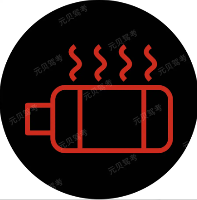
电动汽车电机过热警告
 

胎压故障警告
 

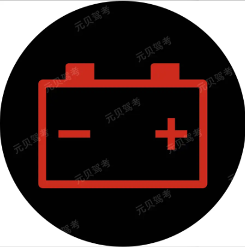
电动汽车充电系统故障
 

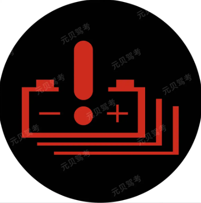
电动汽车动力蓄电池故障
 
 

简单来说，这个图标之所以选 **B（故障状态）** 而不选 **C（工作状态）**，主要基于以下汽车设计的逻辑：

### 1. 仪表盘灯光的“警告”属性

在汽车设计中，仪表盘上的图标如果**持续亮起**（尤其是黄色或红色），通常意味着系统检测到了**异常或故障**，是在提醒驾驶员注意。

* **正常工作状态：** 如果安全气囊系统正常，它应该在车辆启动自检后**熄灭**。此时系统在后台“待命”，不需要亮灯提醒你它在工作。
* **故障状态：** 只有当系统检测到气囊可能无法正常弹出，或者传感器损坏时，这个灯才会**持续亮起**，提示你需要维修。

### 2. 如何区分“工作”与“故障”

你可以这样记忆：

* **工作状态（正常）：** 就像家里的灯，关着的时候是常态。
* **故障状态（警告）：** 就像报警器，只有出问题了才会响（亮灯）。

如果这个灯显示的是“工作状态”，那意味着你的气囊正处于“正在弹出”或“已经弹出”的瞬间，这在行驶过程中显然是不合理的。

---

### 💡 考点小贴士：图标特征

观察这个图标：

* 一个圆球（气囊）正对着一个坐着的小人。
* 这个图标代表 **SRS（辅助保护系统/安全气囊系统）**。
* **口诀：** 只要灯常亮，系统必有样（样：指故障）。

如果你在备考过程中还遇到其他类似的图标（比如 ABS、水温、机油压力），需要我帮你总结一下它们的**颜色含义**（红色 vs 黄色）吗？
 

 

好的，既然你正在备考**科目一**，掌握仪表盘灯光的“颜色逻辑”是最高效的通关秘籍。你可以把这些灯看作**交通信号灯**：

### 🚦 仪表盘灯光颜色“三部曲”

| 颜色 | 含义 | 危险程度 | 你的动作 |
| --- | --- | --- | --- |
| **红色** | **危险/警告** | ⭐⭐⭐⭐⭐ | **必须立即停车**检查，继续行驶可能有生命危险或严重损车。 |
| **黄色** | **故障/提醒** | ⭐⭐⭐ | 系统有故障或异常，**需尽快检修**，但通常能坚持开到修理店。 |
| **绿/蓝/白** | **状态/提示** | ⭐ | 只是告诉你**某个功能正在开启**（如转向灯、远光灯）。 |

---

### 1. 红色灯：绝对不能硬着头皮开

如果你在考试中看到红色的图标，题目问“是否可以继续行驶”，答案通常是“不可以”。

* **水温报警灯**（像个温度计插在水里）：发动机太烫了，再开就开锅报废了。
* **机油压力灯**（像个滴油的小茶壶）：发动机没润滑了，强行开会“拉缸”。
* **制动系统灯**（圆圈里面一个感叹号）：可能是手刹没放，也可能是刹车油没了。
* **充电电路灯**（像个小电池）：发电机不发电了，车子很快就会因为没电而熄火。

### 2. 黄色灯：系统出毛病了，得去修

这类灯亮起通常意味着“功能失效”，比如你刚才问的**安全气囊灯**。

* **ABS灯**（圆圈里写着ABS）：防抱死系统坏了。此时刹车还能用，但紧急制动时轮胎会抱死。
* **发动机故障灯**（像个黄色的小潜水艇/发动机）：发动机排气或传感器有故障。
* **胎压报警灯**（像个带锯齿的罐头里有个感叹号）：轮胎漏气或压力不稳。

### 3. 绿/蓝/白灯：不用担心，只是告知

* **远光灯**（蓝色，线条是直的）：提醒你别晃到对面车。
* **近光灯/示廓灯**（绿色）：提醒你灯开着呢。
* **定速巡航**（绿色）：告诉你系统接管油门了。

---

### 💡 考试避坑小口诀

> **红灯停（危险），黄灯看（故障），绿灯行（正常）。**

在科目一的题目里，只要看到**“故障”**二字，通常对应的就是**红色或黄色**的图标。如果题目问“该灯亮起表示功能正常工作”，那 99% 都是错的（除了转向灯、远光灯等基本功能灯）。

**科目一还有很多长得很像的“双胞胎”图标（比如：前雾灯 vs 后雾灯，内循环 vs 外循环），需要我帮你把这些易混淆的对比图总结一下吗？**
 

这个图标是**车灯总开关**（也叫灯光总开关）。

在实际开车中，它的作用是**控制全车外部灯光的开启与关闭**。你可以把它理解成家里灯的“总闸”或者控制面板。

### 它的具体作用：

1. **集成控制**：它通常是一个旋钮（位于方向盘左侧仪表台上）或者在灯光拨杆上。通过转动它，你可以切换不同的灯光模式：
* **OFF档**：关闭所有外部灯光。
* **自动（AUTO）档**：车辆根据环境亮度自动开灯。
* **示廓灯档**：开启前后小灯（示宽灯），用于黄昏或低可见度时提醒他人车辆宽度。
* **近光灯档**：开启主要照明灯。

2. **安全基础**：只有先打开了这个“总开关”，你才能进一步操作远光灯、雾灯等（有些车的雾灯开关也集成在这个旋钮上）。

---

### 考试中如何区分其他灯光图标？

为了帮你通过科目一，这里有几个极易混淆的图标对比：

| 图标特征 | 代表含义 | 记忆窍门 |
| --- | --- | --- |
| **一个圆圈发光（如你图所示）** | **车灯总开关** | 像一个发光的灯泡，代表整个照明系统。 |
| **光线向下斜射（绿色）** | **近光灯** | 光线是“向下”照地的，所以是近光。 |
| **光线水平直射（蓝色）** | **远光灯** | 光线是“水平”射向远方的，所以是远光。 |
| **光线被波浪线挡住** | **雾灯** | 波浪线代表雾气，光线穿过雾气。 |

**温馨提示：**
在科目一考试中，只要看到这种**四个方向都有光线射出的完整圆灯泡**，直接选“总开关”准没错。

冷风暖气风扇
 

前风窗玻璃刮水器
 

 
前风窗玻璃刮水器及洗涤器
 

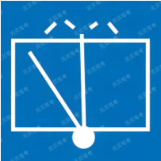
后风窗玻璃刮水器及洗涤器
 

图片中这个图标是 **中控门锁开关**（也叫车门锁住与开锁开关）。

在科目一考试中，看到这个图标你可以这样理解和记忆：

### 1. 它是干什么用的？

它的作用是**控制全车车门的锁住（Lock）和开启（Unlock）**。

* **锁住：** 按下后，从外面打不开车门，保障行车安全，防止误开门。
* **开启：** 按下后，全车车门解锁，方便乘客下车。

### 2. 图标含义解析

* **钥匙符号：** 它是最核心的提示，代表“锁”和“钥匙”，意味着它管理的是“门锁”功能。
* **梯形边框：** 这里的梯形模拟的是汽车车门（或侧窗）的轮廓，钥匙在里面表示对门锁的操作。

冷却液不足

发动机控制系统故障
 

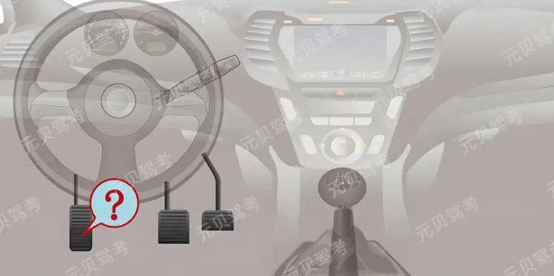
离合器踏板，制动踏板，加速
离合器踏板用于控制发动机与变速器的动力连
接和分离,比如换挡时就需要踩下离合器踏
板。
制动踏板用来减速和停车,当我们需要降低车
速或让车辆停止时就踩这个踏板。
加速踏板则是控制车辆加速,踩下去车辆速度
会增加。
 
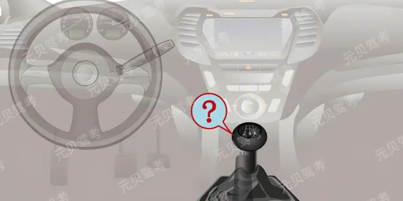
变速器操纵杆
 

驻车制动器操纵杆
 

圆球状的一般是变速器操纵杆,而杆柄状
的是驻车制动器操纵杆。
变速器操纵杆用于变换车辆的挡位,以适
应不同的行驶速度和路况。
驻车制动器操纵杆则是用于在停车时锁住
车辆,防止车辆滑动。
所以两者的形状和功能不能混淆。
 

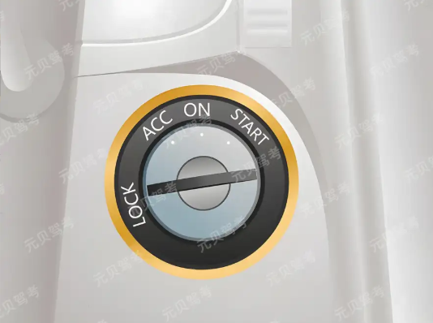
图中为点火开关操纵装置。点火开关4个档位
的功能是:LOCK:切断电源,锁定方向盘;
ACC:接通附件电源(比如收音机等附件);
ON:接通除起动机外的全车全部电源;
START:接通起动机电源,起动机起动。
 

 

简单来说，**起动机（Starter Motor)** 就是发动机的“启动马达”。它的作用是利用蓄电池的电能，产生机械动力，强行带动发动机的曲轴转动，从而让发动机进入工作状态。

### 为什么需要起动机？

内燃机（如汽油机或柴油机）和电动机不同，它不能自己从静止状态直接启动。发动机要运转起来，必须先经历“吸气、压缩、做功、排气”的循环。
在没有起动机的时代，人们需要用手摇柄在车头使劲摇动曲轴（就像老电影里那样）；而现在，这个繁重的体力活就交给了**起动机**。

---

### 起动机的工作过程

当你将点火开关拧到 **START** 档位时，全车会发生以下动作：

1. **转化能量**：起动机把电瓶里的**电能**转化为**机械能**。
2. **强制驱动**：起动机上的一个小齿轮会向前弹出，啮合在发动机后端巨大的 **飞轮（Flywheel）** 上。
3. **带动旋转**：起动机高速旋转，通过飞轮带动发动机的曲轴转动。
4. **自行运转**：一旦发动机完成了最初的几次往复运动并点火成功（产生动力），它就能自己转动了。此时，起动机的小齿轮会迅速缩回，功成身退。

---

### 使用起动机的小贴士

* **不要长时间启动**：由于起动机工作时电流非常大（通常有几百安培），长时间转动会使蓄电池过度放电或烧坏马达。通常建议每次启动不要超过 **5秒**。
* **松手即回档**：点火开关的 START 档通常有弹簧。一旦发动机启动声音响起（证明点火成功），你应该立即松手，钥匙会自动弹回 **ON** 档。如果发动机已经在运转，你再次拧到 START 档，你会听到一种非常刺耳的“嘎嘎”金属摩擦声，这会严重损坏起动机齿轮。

 

了解了起动机的作用后，我们再来看看点火开关最前面的这两个基础档位。它们虽然不直接发动引擎，但对**车辆防盗**和**日常便利**至关重要。

---

### 1. LOCK 档（锁死/断电）

这是你拔出钥匙或停好车后的初始状态。

* **功能：切断电源 + 物理锁定。**
* **断电：** 除了极少数必要电路（如防盗报警、时钟、危险警告灯、室内小灯）外，全车几乎所有电器都处于断电状态。
* **锁死：** 这是它叫“LOCK”的核心原因。当你拔出钥匙并轻微转动方向盘，转向柱里的锁舌会弹出并扣住转向柱，**锁定方向盘**。

* **用途：**
* **防盗：** 如果有人想在没钥匙的情况下强行推走车或短接启动，因为方向盘是锁死的，车子无法控制方向，增加了盗窃难度。
* **拔钥匙：** 在绝大多数传统钥匙车型上，**只有在 LOCK 位才能插入或拔出钥匙**。

> **小贴士**：有时候你会发现钥匙拧不动，这通常是因为方向盘受力卡住了锁舌。此时只需**左手轻晃方向盘，右手同时拧钥匙**即可解锁。

---

### 2. ACC 档（附件/辅助电源）

“ACC”是英文 **Accessory**（附件）的缩写。

* **功能：有选择性地通电。**
* 它会接通一部分低功耗的电子设备，例如：**收音机/多媒体系统、点烟器（车充）、电动后视镜、雨刮器**等。
* **注意**：它**不会**给燃油泵、点火线圈或空调压缩机通电，这意味着引擎此时无法工作。

* **用途：**
* **省油省电：** 当你停在路边等人，想听听广播或给手机充电，但又不想怠速运行引擎浪费汽油时，就切到这个档位。
* **保护电瓶：** 相比直接切到 **ON** 档（全车通电），ACC 档消耗的电流更小，能减缓电瓶亏电的速度。

---

### 两者的关键区别

| 特性 | LOCK | ACC |
| --- | --- | --- |
| **主要目的** | 车辆防盗与安全停放 | 在引擎关闭时使用电子设备 |
| **方向盘状态** | 可锁定 | 解锁状态 |
| **钥匙状态** | 可拔出/插入 | 不可拔出 |
| **典型用电器** | 基本全关（除防盗、小灯） | 收音机、车充、雨刮 |

**安全提醒：** 尽量不要在 ACC 档长时间使用大功率电器（如大音量听歌或使用大功率车载冰箱），因为此时发电机不工作，全靠电瓶“硬撑”，时间太长可能导致电瓶没电，最后无法点火。

 

灯光-信号组合开关操作装置用于控制车辆的
灯光和信号系统。这个装置通常位于方向盘下
方的转向柱上。通过操作它,可以打开或关闭
车辆的大灯、小灯、转向灯、雾灯等灯光设
备,以及发出相应的信号,如转向信号。
 

单选 湿滑路面制动过程中,发现车辆偏离方向,以下做法正确的是?(C)

A连续轻踩轻放制动踏板

B用力踩制动踏板

C不要踩制动踏板

D任意踩制动踏板
这是一个非常经典的驾考题目，很多考生都会在 A 和 C 之间纠正。

简单来说：**A 是为了“预防”锁死，而 C 是为了“救命”（纠正已经发生的侧滑）。**

以下是为什么在这种情况下不能选 A 的详细原因：

### 1. 问题的核心：车辆已经“偏离方向”

题目中有一个关键的前提：**“发现车辆偏离方向”**。这说明侧滑或物理上的“锁死”已经发生了。

* **A 选项（连续踩放）：** 这在以前没有 ABS（防抱死系统）的时代，是用来**预防**车轮锁死的技巧（人工模拟 ABS）。但在车辆已经发生侧滑、失去方向控制时，继续施加任何制动压力（即便很轻）都会干扰车轮恢复转动。
* **C 选项（不要踩制动）：** 当车辆偏离方向时，当务之急是**让车轮恢复转动**。只有当车轮在转动（滚动摩擦）而不是滑动（滑动摩擦）时，轮胎才能产生足够的横向抓地力，你打方向盘才会有用。

---

### 2. 物理原理：滚动摩擦 vs 滑动摩擦

* **锁死状态：** 如果你踩着刹车，车轮不转，轮胎与地面就像两块冰在摩擦，这时候你无论怎么转动方向盘，车都会由于惯性向原来的方向滑行，完全失去控制。
* **松开制动：** 彻底松开刹车后，车轮在路面的带动下开始重新滚动。**滚动的车轮才能产生导向力**。只有这时候，你通过转动方向盘给出的指令，轮胎才能“执行”，从而把车头拉回到正确的路径上。

---

### 3. 驾考逻辑：分清“制动中”和“侧滑时”

在驾考（科目一/科目四）的逻辑里，处理这类问题有很强的优先级：

| 情况 | 正确做法 | 目的 |
| --- | --- | --- |
| **预防**在湿滑路面锁死 | 连续轻踩（或交给 ABS） | 减速的同时保持操控性 |
| **已经**发生偏离/侧滑 | **停止制动** | 释放车轮，找回抓地力以修正方向 |

> **提示：** > 现在的汽车基本都标配了 **ABS 系统**。在实际驾驶中，如果遇到紧急情况，正确的做法是**全力踩死刹车不松开**，ABS 会以每秒几十次的频率帮你完成 A 选项动作。但如果是考试题目，它考察的是最基础的物理自救原则。

---

### 总结

选 C 是因为：在已经偏离方向的紧急时刻，**“恢复转向控制”比“减速”更重要**。踩刹车（哪怕是轻踩）都会阻碍车轮找回抓地力的过程。

你想了解一下在发生这种侧滑时，方向盘应该往哪个方向打吗？（这是另一个高频考点）
 

既然你正在准备驾考，这个关于“侧滑时如何打方向”的考点一定要死记硬背住，因为它是科目一和科目四里最容易混淆的“大坑”。

驾考中关于侧滑修正的“终极口诀”只有四个字：**前反后同**。

---

### 1. 后轮侧滑：同向打（最常考）

**情况：** 比如你在转弯时，车的后屁股突然向**右**摆了（甩尾）。
**操作：** 你的方向盘也要向**右**打。

* **口诀记忆：** 后轮向哪偏，方向盘就往哪打。
* **物理逻辑：** 这样做的目的是为了让前轮的方向和车屁股滑行的方向保持一致，从而抵消侧滑产生的旋转力，让车身重新回正。

### 2. 前轮侧滑：反向打

**情况：** 比如你向左转弯，但车头不听使唤，反而向**右**前方滑出去（推头）。
**操作：** 此时你要向**左**打方向（即你原本想去的那个方向的反方向，或者是相对于侧滑方向的反方向）。

* **口诀记忆：** 前轮滑了，反着来。
* **实际操作（重点）：** 现实中前轮侧滑时，正确的做法其实是先**回正方向**，等抓地力恢复了再转弯。但在考试题目里，记住“前反”两个字。

---

### 💡 快速记忆口诀

为了防止考试时紧张记混，你只需要记住这一句话：

> **“前反后同，不踩刹车。”**

* **前**轮侧滑：**反**向打方向。
* **后**轮侧滑：**同**向打方向。
* **不管什么时候：** 绝对不能踩死刹车（也就是你刚才问的那道题的逻辑）。

---

### 总结表格（应试必备）

| 侧滑部位 | 现象描述 | 修正方向 |
| --- | --- | --- |
| **后轮** (常见) | 屁股向右甩 | **向右**打方向 (同向) |
| **前轮** | 车头不入弯，向外偏 | **向左/回正** (反向) |
| **共同点** | **禁止**踩制动踏板 | **禁止**急打方向 |

 

单选
驾驶机动车下陡坡时,以下做法正确的是?(D)

A空挡、熄火

B熄火但不准空挡

C空挡但不准熄火

D不准空挡或熄火
 

驾驶机动车下陡坡时,不准空挡或熄火。如果
空挡滑行,会使发动机失去对车辆的制动作
用,仅靠刹车系统制动,容易导致刹车过热失
效,增加事故风险。同时熄火也会使车辆失去
动力控制和转向助力等,在紧急情况下难以操
控车辆。
 

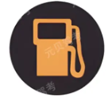
 

发动机控制系统异常或故障
 

发动机机油液位低（机油量不足）。
这个**不是**发动机机油压力过低。(但是有的题目说是机油压力过低)

虽然它看起来也像一个油壶，但它代表的是**发动机机油液位低**（机油量不足）。

为了让你彻底分清，我们把这两个图标放在一起对比一下，这在科目一考试和实际开车中都非常重要：

### 1. 颜色不同（这是最直观的区别）

* **红色图标：** 代表“**紧急警告**”。就像人体血压瞬间没了，必须立即停车熄火，否则发动机会直接报废。
* **黄色图标（你这张图）：** 代表“**提醒/注意**”。就像肚子饿了但还能走两步，它告诉你机油快没了，请尽快找地方添加机油，但通常不需要你像遇到红灯那样立即在路中间停车。

### 2. 形状不同（设计者的心思）

* **老式油壶（像神灯那个）：** 它的设计源自旧时代的点滴润滑，强调的是“**润滑动作**”，所以用来表示**压力（Pressure）**。
* **现代油桶（你图里这个）：** 它画的是我们现在在超市或修理厂见到的那种**塑料机油桶**。这个形状是为了让你联想到“**一桶油**”，所以它代表的是**油量（Level）**。

### 3. 如何记忆？

你可以这样想：

* **红色的“神灯”：** 压力报警，**要命的**，必须停车。
* **黄色的“油桶”：** 油量不够，**要钱的**（该买油加了），还能开一段。

**考试小贴士：**
在科目一的考题里，只要题目问的是“**压力过低**”，对应的图片一定是那个**红色**的像神灯一样的图标。如果看到**黄色**的图标，通常选项里会提到“**检查**”或“**液位**”。

你这道题是从哪个练习册或者APP里看到的？通常这种黄色的灯在老款车的仪表盘上不常见，现在的车传感器多了，分工才变得这么细。
 

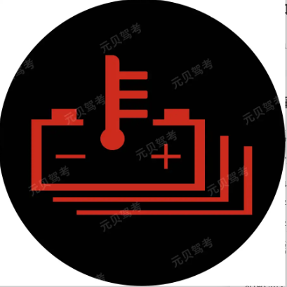
动力蓄电池高温报警
 

电动汽车驱动电机故障
 

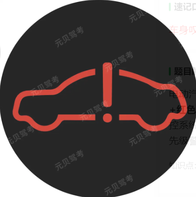
电动汽车系统故障
在电动汽车的仪表盘语境下，**“系统故障”**（图中显示为一个汽车轮廓内含感叹号）是一个**综合性的严重故障警告**。

简单来说，它的含义和处理建议可以分为以下几个维度：

### 1. “系统故障”具体指什么？

这个图标并不是指某一个具体的螺丝松了，而是指车辆的**核心电子控制系统**监测到了严重异常。在电动车中，这通常涉及“三电”系统（电池、电机、电控）之间的协同工作出现了问题。

可能涉及的部件包括：

* **整车控制器 (VCU)：** 汽车的“大脑”出现了计算或控制逻辑错误。
* **高压系统：** 高压电路上存在漏电、短路或绝缘性能下降。
* **通信故障：** 车辆内部各个控制单元（比如电池管理系统和电机控制器）之间的“通话”中断了（CAN总线故障）。

### 2. 为什么选 B 而不是其他选项？

在科目一或科目四的考试中，区分这些图标有特定的技巧：

* **系统故障（本图）：** 图标是**一辆车+感叹号**。它代表的是“整车级别”的问题，所以叫“系统故障”。
* **驱动电机故障：** 图标通常是一个**电动机/齿轮的形状+感叹号**。
* **动力蓄电池故障：** 图标通常是一个**电池符号+感叹号**。
* **低荷电状态：** 图标通常是**黄色或红色的电池符号**，或者带插头的电池，表示没电了，而不是出故障。

### 3. 看到这个灯亮了该怎么办？

* **红色警告：** 在汽车仪表盘中，**红色**代表最高级别的警告。
* **立即停车：** 如果在驾驶时该灯亮起，说明车辆随时可能失去动力或发生高压危险。应在确保安全的情况下立即停车、熄火，并联系厂家救援，**不建议继续行驶**。

---

**一句话总结：**
“系统故障”灯就像是电脑的“蓝屏”或者手机的“系统固件损坏”，它告诉你不只是某个零件坏了，而是整个运行逻辑出了大问题。

 

AEB 自动紧急制动	主动刹车，防止追尾或撞人。
 

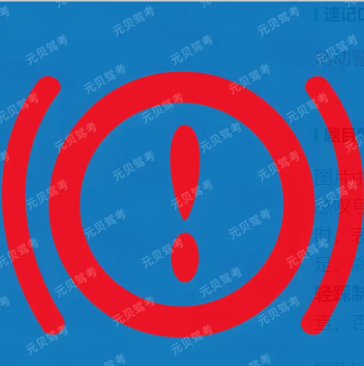
制动系统故障警告灯
图片中所示的指示灯(图标为括号内带圆圈和
感叹号)是制动系统故障警告灯。该灯亮起
时,表示制动系统存在严重故障(如刹车油不
足、刹车片磨损过度或制动系统失效),不可
轻踩制动尝试后继续行车,必须立即停车检
查,否则极易引发交通事故。
 

图中所示的符号是车门锁住开锁的控制装置开
关 -- 上方为“车门轮廓”(代表车门),下
方为“钥匙齿状结构”(代表锁具),组合表
示“控制车门的锁定与解锁”。

 

 

汽车主要由四个部分组合而成,分别是发动
机、底盘、车身和(A)

A电气设备

B座椅

C车壳

D仪表
 

电气设备包括车辆的照明系统、点火系统、启动系统、充电系统、仪表和各种电子控制装置等,是汽车的重要组成部分,负责提供车辆运行所需的电力和控制车辆的各种电子功能。
 
 

在驾驶机动车前,调整安全头枕的高度是为了在发生碰撞时能够更好地保护驾驶员的 **颈部和头部** 。正确的调整方法是将头枕的中心位置调整到与驾驶人的**头部后脑勺水平一致**,而不是正对颈椎。这样的调整可以在发生碰撞时,头枕能够为头部提供适当的支撑,**减少颈部受伤的风险**。
 

这是一个非常棒的问题！你的观察很敏锐：在**单纯的急刹车**（没有发生碰撞）时，惯性的确会让你身体前倾，这时候起主要保护作用的是**安全带**。

但是，安全头枕（正式名称叫“头部限制装置”）的设计初衷，主要是为了应对另一种更隐蔽、对颈椎伤害更大的致命威胁：**追尾碰撞**以及碰撞后的**二次反弹**。

---

### 1. 为什么“向后仰”比“向前倾”更危险？

当你的车被后车追尾时，物理过程是这样的：

1. **躯干被推向前：** 后车撞击你的车，座椅会瞬间把你的躯干（背部）向前推。
2. **头部滞后（惯性）：** 你的头部因为惯性会留在原地。由于脖子是软的，头部相对于躯干会**剧烈向后甩**。
3. **挥鞭样损伤（Whiplash）：** 这种头部先向后猛折、再受力向前弹回的过程，就像挥动鞭子一样。你的颈椎会在极短的时间内呈“S型”弯曲，造成韧带撕裂、椎间盘突出甚至颈椎断裂。

**头枕的作用：** 就是在头部后仰的那一瞬间，稳稳地“接住”你的后脑勺，让头和躯干同步向前移动，从而消除这种致命的速差。

---

### 2. 急刹车时，头枕就没用了吗？

虽然急刹车第一反应是前倾，但头枕在两个时刻依然在保护你：

* **反弹阶段：** 当你被安全带勒住并猛然拉回座椅时，身体会产生一个强力向后的反弹。如果没有头枕支撑，你的后脑勺会重重撞在座椅框架上，或者造成颈部再次过度后伸。
* **连续碰撞：** 在现实事故中，急刹车往往伴随着被后车追尾。这时候，前倾和后仰是交替发生的，头枕是最后的安全防线。

---

### 3. 为什么一定要对准“后脑勺”，而不是“颈部”？

很多人习惯把头枕降得很低，把它当成“颈枕”来垫脖子，这其实是**极其危险**的：

* **杠杆效应：** 如果头枕太低，正好顶在颈部，发生碰撞时，你的头会以头枕为支点，像“翻板”一样向后折。这反而加剧了对颈椎的折断力。
* **正确位置：** 头枕的中心应与你的**耳朵上沿**或**后脑勺中心**平齐。这样受力才最均衡，能最有效地吸收冲击力。

> **小贴士：** > 调整好高度后，还要注意**头枕与后脑勺的距离**。这个间距越小越好（最好不要超过 4 厘米，约两指宽）。距离越近，头部后仰的加速度就越小，受到的保护就越好。

---

**你想了解一下如何通过调整“座椅靠背角度”来进一步配合头枕的保护效果吗？**
 

单选

本市考题

当车辆不慎落水且车门无法打开时,
最佳破窗时机是?(D)

A车辆开始下沉时

B车辆完全沉入水中时

C车内水位到达腰部时

D车内水位接近车顶时
 

其他选项分析如下:
1、开始下沉:水压大,破窗困难,且可能因
慌乱浪费体力。
2、完全沉入水中:车辆已沉底,逃生时间极
短,易因缺氧或水压导致失败。
3、水位到腰部:水压仍较高,破窗后水流快
速涌入,可能造成逃生困难。
 

单选

本市考题

当车辆落入水中,以下逃生方式错误
的是什么?

A第一时间解开安全带

B如果车辆发生侧翻,从靠近水面的车窗砸窗
逃生

C用坚硬物敲碎前挡风玻璃

D在车外与车内水位相同的情况下,打开车门
逃生
 

这个问题是科目一/科目四中关于落水逃生的经典题目。首先我们要明确，这道题问的是**“逃生方式错误的是什么”**。

这道题的正确答案应该是 **C（用坚硬物敲碎前挡风玻璃）**。

下面我为你详细解析一下为什么选项 B 是正确的做法，以及为什么你的理解产生了一点小偏差。

---

### 1. 为什么选项 B 是正确的逃生行为？

> **选项 B：** 如果车辆发生侧翻，从靠近水面的车窗砸窗逃生。

你的疑问是：“靠近水面不是水更深吗？”

这里其实是一个词语理解的问题：

* **“水面”指的是水的顶部（空气与水的交界处）。**
* **靠近水面** = 离空气更近，也就是**水较浅**的一侧。
* **远离水面** = 沉得更深的那一侧。

**物理原理：**
当车侧翻时，处于下方（深水处）的车窗承受着巨大的水压。如果你尝试砸开下方的窗户，由于内外压力差极大，玻璃极难砸碎；就算砸碎了，洪水会瞬间涌入，把你冲回车内，甚至造成伤害。
**相反，靠近水面（上方）的车窗压力最小，最容易砸碎，也最方便你爬出车外浮上水面。**

---

### 2. 为什么 C 是错误的逃生方式？（本题答案）

> **选项 C：** 用坚硬物敲碎前挡风玻璃。

这是逃生的大忌，原因有二：

1. **太厚太韧：** 前挡风玻璃是**夹层玻璃**，中间有胶层，具有极强的韧性。即使用安全锤用力敲击，它也只会裂开而不会破碎，你很难通过它逃生。
2. **浪费时间：** 落水逃生的黄金时间只有几十秒，应该选择侧窗（钢化玻璃，一敲即碎成小块）。

---

### 3. 补充：落水逃生的正确步骤

为了方便你记忆，可以参考这个**“打、开、砸、从”**四字口诀：

| 步骤 | 动作 | 重点说明 |
| --- | --- | --- |
| **第一步：打** | **解开安全带** | 并在落水瞬间**打开车门锁**（防止电路失效锁死）。 |
| **第二步：开** | **尝试开车窗** | 在电路失效前，先尝试通过电动升降开启侧窗。 |
| **第三步：砸** | **砸碎侧车窗** | 如果窗户打不开，用锤子砸向侧窗的**四个角落**。 |
| **第四步：从** | **从窗户逃生** | 如果窗户打不开且车门打不开，等车内进水到水位一致时，推门逃生（选项 D 的情况）。 |

---

### 总结

你之前的疑惑可能是在想“靠近水底”，但题目里说的是“靠近水面”。记住，**哪边离空气近，就从哪边跑！**

你想再深入了解一下，如果侧窗也砸不动，在车内水位和车外一样时，为什么反而能推开门吗？
 

单选

本市考题

《江西省非机动车管理办法》规定,
电动自行车、残疾人机动轮椅车在非
机动车道内行驶时,最高时速不得超
过多少公里?(C)

A25

B20

C15

D30
 
单选

本市考题

大雨天在高速公路行车时,怎样避免
发生“水滑”现象?(C)

A安装防滑装置

B提高车速行驶

C降低车速行驶

D断续使用制动
为什么不选A
 

这道题选 **C（降低车速行驶）** 而不选 **A（安装防滑装置）**，主要是因为“水滑现象”的成因和防滑装置的作用原理完全是两回事。

### 1. 什么是“水滑”现象？

所谓“水滑”（Hydroplaning），是指雨天高速行车时，轮胎与路面之间形成了一层**薄薄的水膜**。

* **物理原理**：当车速过快，轮胎排水槽来不及把路面的积水排开，水压就会把轮胎“托起”，使轮胎完全脱离地面。
* **后果**：由于轮胎不接触路面，摩擦力几乎消失，这时候方向盘会变轻，踩刹车或转弯都会失效，车辆像在水上漂一样。

---

### 2. 为什么 A（安装防滑装置）不对？

“防滑装置”通常指的是**防滑链**。我们来看看它为什么解决不了水滑问题：

* **适用场景不同**：防滑链主要是为了在**冰雪路面**上增加抓地力。它通过硬金属链条压入冰雪中，起到类似“牙齿”的咬合作用。
* **无法排除水膜**：水滑现象的核心问题是“水排不出去”。防滑链并不能帮助轮胎更快地排水，反而因为加装了链条，改变了轮胎原本设计的排水纹路，甚至可能加剧水膜的形成。
* **高速限制**：防滑链绝对不能在高速公路上高速行驶（通常限制在 40km/h 以下），否则会损坏轮胎、悬挂，甚至发生断裂引发事故。而题目背景是在“高速公路”行车。

---

### 3. 为什么 C 是唯一正确的选择？

**速度**是产生水滑现象的决定性因素。

* **给排水预留时间**：降低车速后，轮胎的排水纹路有充足的时间将路面的积水挤压并排向两侧。
* **保持物理接触**：只要排水速度大于积水积聚的速度，轮胎就能穿透水膜接触路面，保证抓地力。

---

### 补充：D 为什么也不对？

* **断续制动**（点刹）是在车辆没有 ABS（防抱死系统）的情况下防止车轮抱死的。
* 但在发生“水滑”的瞬间，轮胎已经失去抓地力了。此时**猛踩刹车（无论是连续还是断续）都可能导致车辆侧滑或甩尾**。最正确的操作是：**握稳方向盘，逐渐松开油门降速**，等抓地力恢复。

**总结一句话：**
防滑链是用来“啃”冰雪的，而降低车速才是为了给轮胎“排”水的。

针对科目一关于车辆性能的考题，您是否需要我为您总结一份常见物理现象（如水滑、离心力、制动距离）的易错点对比表？
 

单选

本市考题

发动机着火后怎么处置?

A迅速关闭发动机

B用水进行灭火

C开启发动机罩灭火

D站在下风处灭火
 

为什么不选B
这道题的正确答案是 **A**。

关于你问的“为什么不选 B（用水进行灭火）”，主要有以下两个核心原因：

### 1. 油火不能用水灭

发动机舱内布满了**燃油管路**和**机油**。

* **油比水轻：** 如果发生燃油泄漏引发火灾，水不仅灭不了油火，反而会让燃烧的油浮在水面上随水流散，导致火势迅速蔓延，形成所谓的“流淌火”。
* **无法覆盖：** 灭火的原理之一是隔绝氧气，水对油火起不到覆盖隔绝的作用。

### 2. 电路短路风险

现代汽车发动机舱内有大量的**电子元件、电线束和蓄电池**。

* **导电性：** 普通的水是导电的。用水灭火极易造成更严重的电路短路，甚至引发二次火灾或损坏更昂贵的精密零部件。

---

### 其他选项分析

* **A 为正确项：** 迅速关闭发动机可以**切断油路和电路**。如果发动机还在运转，燃油泵可能会继续供油，电路也可能持续产生火花，关掉发动机是止损的第一步。
* **C 错误（开启发动机罩灭火）：** 这是科目一中非常经典的“陷阱”。发动机着火时，舱内氧气相对较少。如果你猛地**完全打开**引擎盖，大量新鲜空气（氧气）会瞬间涌入，引起“爆燃”，火焰会直接扑向你的面部，非常危险。正确的做法是仅撬开一个小缝，向内喷射灭火剂。
* **D 错误（站在下风处）：** 灭火一定要站在**上风处**。站在下风处会被浓烟、热浪和火焰包围，不仅看不清火源，还极易导致吸入性损伤或被烧伤。

---

**💡 小贴士：**
在实际操作中，如果发现发动机舱冒烟，应立即靠边停车、熄火，然后拿着灭火器，**对着引擎盖缝隙**先喷射一阵，确认火势控制住后再慢慢打开引擎盖彻底灭火。

如果你在准备科目一，这类题目通常考查的是“防扩散”和“自我保护”的意识。想了解一下针对不同类型的火灾（如电路起火 vs 燃油起火）该如何选择灭火器吗？
 

单选

本市考题

高速行驶的车辆,在转向失控的情况
下使用紧急制动,很容易造成什么后
果?

A侧滑

B翻车

C车厢前移

D爆胎
为什么不选A
 

这道题的正确答案通常是 **B（翻车）**。

你之所以疑惑为什么不选 A（侧滑），是因为在实际驾驶中，紧急制动确实会引起侧滑。但在科目一或科目四的考试逻辑中，这几个选项是有**程度区别**和**特定场景**之分的。

以下是详细的解析：

### 1. 核心矛盾：高速 + 转向失控

* **高速行驶**意味着车辆具有巨大的惯性（动能）。
* **转向失控**意味着车辆目前的行驶方向可能已经偏离中心，或者处于极度不稳定的状态。

### 2. 为什么 B（翻车）比 A（侧滑）更“准确”？

* **侧滑 (A)**：侧滑通常发生在制动力不均或路面湿滑时，它是车辆失去了侧向抓地力。虽然紧急制动会引发侧滑，但在高速且已经失控的情况下，侧滑往往只是一个**中间过程**。
* **翻车 (B)**：当车辆在高速下转向失控，车身往往已经产生了剧烈的横向摆动。此时如果你**紧急制动（猛踩死刹车）**，车辆重心会瞬间前移，巨大的惯性力会作用在已经不稳的车身上。如果此时轮胎因为侧滑撞到路肩、陷入软土，或者仅仅是因为横向惯性过大，车辆会由于重心偏移直接发生**翻车**。

> **考试逻辑：** 在交通法规考试中，这类题目通常强调的是**最严重的后果**。在“高速”和“失控”双重 buff 叠加下，翻车是最具灾难性的定性结果。

### 3. 正确的操作应该是什么？

为了避免翻车，当转向失控时，正确的做法是：

1. **分次制动**：也就是“点刹”（断续踩踏制动踏板）。
2. **利用发动机制动**：逐级减挡（降低牵引力）。
3. **控制方向**：在条件允许下，轻微修正方向，尽量让车平稳减速停下。
**绝对严禁：** 在高速失控时一脚踩死刹车（紧急制动）。

---

### 总结

* **侧滑**：是抓地力不足的表现（常见于雨雪天、急转弯）。
* **翻车**：是高速下平衡瞬间被打破、惯性力失衡的表现（这道题强调的情景）。

简单记法：**高速失控猛刹车，惯性太大必翻车。**

你最近在准备科目一考试吗？如果还有其他容易混淆的题目（比如“水滑现象”或者“制动失效”），可以发给我，我帮你梳理逻辑。
 

在高速行驶中，如果制动（刹车）突然失灵，**选项 D “迅速拉紧驻车制动器操纵杆”** 是一个非常危险的错误动作。

以下是为什么不能选 D 的详细原因，以及正确做法的逻辑：

---

### 1. 为什么不选 D（迅速拉紧驻车制动器）？

* **导致后轮抱死（侧滑与翻车）：** 驻车制动（手刹）通常只作用于**后轮**。在高速行驶时突然拉死手刹，后轮会瞬间失去转动能力并发生抱死。
* **失去方向控制：** 一旦后轮抱死，车辆极易发生剧烈的**侧滑、甩尾甚至掉头**。在高速状态下，这种失控往往会导致车辆撞向护栏或发生**翻车**事故。
* **机械损坏：** 瞬间产生的巨大摩擦力和惯性可能会导致手刹拉线崩断，使最后的制动机会也彻底丧失。

> **注意：** 驻车制动器在紧急情况下可以辅助减速，但必须是**“缓缓拉起”**（逐渐受力），绝不能“迅速拉紧”。

---

### 2. 为什么选 B 是正确的？

正确选项 **B（抢挂低速挡，使用驻车制动）** 采用了“发动机制动”配合“辅助制动”的原则：

* **抢挂低速挡（发动机制动）：** 这是最核心的自救手段。通过强制将变速箱切入低级别挡位（如 3 挡、2 挡、1 挡），利用发动机的内部牵引阻力来迫使车速降下来。
* **合理使用驻车制动：** 当车速通过发动机制动降到较低范围内时，再结合**缓慢、间歇性**地拉动手刹，最终让车辆安全停下。

---

### 3. 其他选项分析

* **A. 连续踩踏制动脚踏板：** 这通常是制动失灵后的**第一反应**，尝试通过增加压力来恢复微弱的制动力。但这只能作为尝试，不能作为主要的减速手段，因为它无法保证能让高速车辆停下。
* **C. 迅速踏下离合器踏板：** 这是**极其错误**的。踏下离合器意味着切断了发动机与车轮的动力连接，车辆会进入“空挡滑行”状态，完全失去了发动机制动的约束，车速反而可能因为惯性在短时间内变得更快。

---

### 总结：高速制动失灵救命口诀

1. **控制方向：** 握紧方向盘，稳住重心。
2. **减速自救：** 开启双闪，不断尝试踩刹车（A），同时**抢挂低速挡**（B）。
3. **辅助制动：** 车速下降后，**缓拉手刹**。
4. **避险车道：** 如果前方有“紧急避险车道”（通常在长下坡路段），果断驶入。

你想了解更多关于科目一中关于“紧急避险”（如爆胎、转向失控等）的题目解析吗？
 

单选

本市考题

高速行驶中制动突然失灵,驾驶人要
如何制动?

A连续踩踏制动踏板

B抢挂低速挡,使用驻车制动

C迅速踏下离合器踏板

D迅速拉紧驻车制动器操纵杆
为什么不选D
 

在高速行驶中，如果制动（刹车）突然失灵，**选项 D “迅速拉紧驻车制动器操纵杆”** 是一个非常危险的错误动作。

以下是为什么不能选 D 的详细原因，以及正确做法的逻辑：

---

### 1. 为什么不选 D（迅速拉紧驻车制动器）？

* **导致后轮抱死（侧滑与翻车）：** 驻车制动（手刹）通常只作用于**后轮**。在高速行驶时突然拉死手刹，后轮会瞬间失去转动能力并发生抱死。
* **失去方向控制：** 一旦后轮抱死，车辆极易发生剧烈的**侧滑、甩尾甚至掉头**。在高速状态下，这种失控往往会导致车辆撞向护栏或发生**翻车**事故。
* **机械损坏：** 瞬间产生的巨大摩擦力和惯性可能会导致手刹拉线崩断，使最后的制动机会也彻底丧失。

> **注意：** 驻车制动器在紧急情况下可以辅助减速，但必须是**“缓缓拉起”**（逐渐受力），绝不能“迅速拉紧”。

---

### 2. 为什么选 B 是正确的？

正确选项 **B（抢挂低速挡，使用驻车制动）** 采用了“发动机制动”配合“辅助制动”的原则：

* **抢挂低速挡（发动机制动）：** 这是最核心的自救手段。通过强制将变速箱切入低级别挡位（如 3 挡、2 挡、1 挡），利用发动机的内部牵引阻力来迫使车速降下来。
* **合理使用驻车制动：** 当车速通过发动机制动降到较低范围内时，再结合**缓慢、间歇性**地拉动手刹，最终让车辆安全停下。

---

### 3. 其他选项分析

* **A. 连续踩踏制动脚踏板：** 这通常是制动失灵后的**第一反应**，尝试通过增加压力来恢复微弱的制动力。但这只能作为尝试，不能作为主要的减速手段，因为它无法保证能让高速车辆停下。
* **C. 迅速踏下离合器踏板：** 这是**极其错误**的。踏下离合器意味着切断了发动机与车轮的动力连接，车辆会进入“空挡滑行”状态，完全失去了发动机制动的约束，车速反而可能因为惯性在短时间内变得更快。

---

### 总结：高速制动失灵救命口诀

1. **控制方向：** 握紧方向盘，稳住重心。
2. **减速自救：** 开启双闪，不断尝试踩刹车（A），同时**抢挂低速挡**（B）。
3. **辅助制动：** 车速下降后，**缓拉手刹**。
4. **避险车道：** 如果前方有“紧急避险车道”（通常在长下坡路段），果断驶入。

你想了解更多关于科目一中关于“紧急避险”（如爆胎、转向失控等）的题目解析吗？

 

单选

本市考题

根据江西省实施《中华人民共和国道
路交通安全法》办法规定,公路客运
车辆驾驶人二十四小时内累计驾驶时
间不得超过(B)

小时。

A6

B8

C10

D12
 

单选

本市考题

行车中发动机突然熄火怎样处置?

A紧急制动停车

B缓慢减速停车

C挂空挡滑行

D关闭点火开关
 

这道题的正确答案是 **B**。

### 正确答案：B (缓慢减速停车)

---

### 💡 深度解析

当行驶中发动机突然熄火时，车辆会失去动力，更重要的是，**转向助力**和**刹车助力**通常会随之减弱或消失。此时的操作核心是：**保持冷静、控制方向、安全避让**。

#### 为什么选 B？

* **保持控制：** 发动机熄火后，虽然方向盘会变沉，但依然可以转向。缓慢减速可以给你留出足够的时间将车引导至路边安全地带（如应急车道）。
* **利用惯性：** 车辆熄火后还有很大的惯性，利用这段动能平稳靠边是最安全的做法。

---

### ❌ 为什么不选其他选项？

* **为什么不选 A (紧急制动停车)？**
* **后车追尾：** 高速行驶中突然急刹，后方车辆往往反应不及，极易造成追尾事故。
* **侧滑失控：** 如果熄火伴随着某些机械故障，急刹车可能导致车辆侧滑甚至翻车。
* **刹车助力丧失：** 熄火后，真空助力器的残余压力通常只够支撑 1-2 次有效制动。如果你一脚踩死（紧急制动），万一没停稳，后面就很难再踩下去了。

* **为什么不选 C (挂空挡滑行)？**
* **失去牵引力控制：** 挂空挡会使车辆完全失去发动机的牵引阻力，在下坡或复杂路面下更难控制车速，且违反安全驾驶原则。

* **为什么不选 D (关闭点火开关)？**
* **致命错误：** 许多车辆在关闭点火开关并拔出钥匙后，**方向盘锁死装置**会启动。如果在行驶中锁死了方向盘，车辆将完全无法转向，后果不堪设想。

---

### 🛠️ 建议操作步骤

1. **握稳方向盘：** 感受方向盘变沉，用力把控方向。
2. **开启双闪：** 立即开启危险报警闪光灯，提示后车。
3. **观察后视镜：** 确认右侧车道安全。
4. **轻踩刹车：** 缓慢减速，顺势转向滑行至路边或应急车道。
5. **停车放牌：** 停车后拉紧手刹，并在车后按规定距离摆放三角警告牌。

---
 

单选

本市考题

行车中发现右侧轮胎漏气时怎样处
置?B

A迅速制动减速

B慢慢制动减速

C迅速向左转向

D采取紧急制动
在科目一或科目四的考试中，**A（迅速制动）**和**D（紧急制动）**其实是“同类项”，它们在处理这类故障时都是**错误**的，区别主要在于**动作的剧烈程度**。

以下是它们的具体区别以及为什么不能选的原因：

### 1. 概念上的细微区别

* **D：采取紧急制动（最剧烈）**
这是指**一脚踩死刹车**。在高速或轮胎有故障的情况下，这会导致车轮瞬间抱死（即使有ABS，在爆胎/漏气时也会导致受力极度不均），极易造成车辆侧滑、甩尾甚至翻车。
* **A：迅速制动减速（较剧烈）**
这是指**快速地用力踩刹车**。虽然动作可能比“紧急制动”稍轻一点，但其核心也是“快”和“猛”。在轮胎漏气（特别是高速行驶）时，这样猛踩刹车同样会打破车辆的平衡。

### 2. 为什么在“轮胎漏气”时它们都是错的？

当你发现右侧轮胎漏气时，车辆已经开始向右“跑偏”了。

* **物理失控：** 如果此时你**迅速**或**紧急**制动，由于右胎压力小、摩擦力与左胎不一致，猛烈的减速力会瞬间放大这种不平衡，导致车辆向一侧严重偏转，后果通常是**翻车**或**撞向护栏**。
* **正确做法：** 必须选**B（慢慢制动减速）**。你需要紧握方向盘控制好方向，利用发动机牵阻作用（收油门）并**轻踩**刹车，让车平稳地降速并停到路边。

---

### 💡 考试避坑小口诀

在题目中看到以下关键词，通常都是**错误**选项：

> **“迅速”、“急”、“紧急”、“猛打方向”**

看到以下关键词，通常才是**正确**做法：

> **“慢慢”、“平稳”、“逐渐”、“轻踩”**

**总结：** 无论是A还是D，只要动作带了“快、猛、急”，在处理轮胎问题、雨雪路面或转向失控时，统统不能选。

 

单选

本市考题

机动车喷涂、粘贴标识或车身广告影
响安全驾驶的,可以(D)

A限令车主改正、不受处罚

B处50元罚款

C处100元罚款

D处200元罚款
 

单选

本市考题

机动车在单位院内、居民居住区内,
最高时速为(B)

A10公里

B20公里

C30公里

D40公里

 

单选

本市考题

机动车在高速公路上超车,车速为每
小时100公里时,最小横向间距为多
少?(D)

A0.8米

B1.0米

C1.2米

D1.5米
 

单选

本市考题

驾驶机动车在高速公路上以每小时
100公里的速度行驶,与前车的安全
距离是多少?(D)

A50米

B60米

C80米

D100米
 

单选

本市考题

罚

A

B

c

D

江西省实施《中华人民共和国道路交
通安全法》办法规定,货运机动车违
反规定载客的,可以处(B)
款。

A2000元以上5000元以下罚款

B1000元以上2000元以下罚款

C500元以上1000元以下罚款

D1000元以上5000元以下罚款
 

江西省实施《中华人民共和国道路交通安全
法》办法规定:第九十九条有下列行为之一
的,处五百元以上一千元以下罚款:
(一)非法安装警报器、标志灯具的;
(二)强迫机动车驾驶人违反道路交通安全法
律、法规和机动车安全驾驶要求驾驶机动车,
造成交通事故,尚不构成犯罪的;
(三)违反交通管制的规定强行通行,不听劝阻
的;
(四)驾驶拼装或者已达到报废标准的机动车上
道路行驶的。
 

根据《江西省实施(中华人民共和国道路交通
安全法)办法》第七十七条规定,乘车人有下
列行为之一的,处三十元罚款:
(一)机动车行驶中跳车的;
(二)在高速公路上不按规定使用安全带的。
 

理解你的困惑。在紧急情况下，人的直觉反应可能是“逃离”，觉得跳离危险的车辆更安全。

但从**物理定律**和**交通法规**的角度来看，法规之所以设定这个罚款，主要基于以下三个核心逻辑：

### 1. 物理层面的“避险错觉”

很多人受影视剧影响，认为跳车是一项逃生技能。但现实中，**跳车往往是更危险的选择**：

* **惯性杀伤力：** 当车辆以较高速度行驶时，你跳下车那一刻的瞬间速度和车速是一样的。人体直接撞击地面（柏油或水泥路面）会产生巨大的冲击力，极易造成颅脑损伤、断肢甚至死亡。
* **车辆保护罩：** 现代汽车有吸能结构、安全气囊和防滚架，构成了一个相对安全的“保护舱”。在大多数碰撞事故中，留在车内系好安全带的生存率，远高于肉体直接着地的生存率。

### 2. 防止“二次事故”

如果你在行驶中跳车，不仅自己面临危险，还会对公共安全造成威胁：

* **后车避让：** 你跳到路面上，后方车辆可能因为紧急避让而发生侧翻、追尾或直接碾压到跳车者。
* **干扰驾驶：** 乘车人突然跳车会给驾驶员带来极大的心理和操作干扰，导致驾驶员在惊慌下乱打方向，引发更大的交通事故。

### 3. 法律上的“紧急避险”并不冲突

法规规定“跳车罚款”是针对一般情况下的**不安全行为**。如果你确实遇到了极端的生命威胁（比如车辆即将坠入悬崖、车内突发火灾且无法停车等），法律上有一个原则叫：

> **紧急避险 (Emergency Necessity)**
> 如果你是为了使本人或他人的人身利益免受**正在发生的危险**，在不得已的情况下采取跳车行为，且跳车所造成的损害（被罚款或轻微擦伤）小于如果不跳车可能造成的损害（失去生命），那么在法律上是可以主张**免除处罚**的。

---

**总结一下：**
罚款 30 元金额虽然不高，但它更像是一种**警示教育**：告诉乘客在车辆行驶过程中，乱开门、乱跳车是极度危险的违章行为。除非是真的到了生死关头，否则**系好安全带、紧握扶手、低头护住关键部位**才是最科学的避险方式。

 

单选

本市考题

轮胎气压过低时,高速行驶可能导致
什么结果?

A侧滑

B翻车

C车厢前移

D爆胎
为什么会爆胎，不是胎压高会爆胎吗
 

这是一道非常经典且容易出错的驾驶理论题。正确答案是 **D（爆胎）**。

很多人的直觉认为“充气太足（胎压高）”才会爆胎，就像气球吹大了一样。但实际上，在高速行驶中，**胎压过低引起的爆胎比例反而更高，且更危险。**

以下是详细的原因分析：

### 为什么胎压低反而会爆胎？

主要原因在于**“驻波现象”（Standing Wave）**和**热量堆积**：

1. **剧烈的形变（像折铁丝一样）：** 胎压过低时，轮胎变得软塌塌的。在高速转动中，由于压力不够，轮胎与地面接触的部分会发生严重的挤压形变。离开地面后，轮胎还没来得及恢复原状，就又转到了地面再次被挤压。
> **打个比方：** 这就像你反复快速地弯折一根铁丝，弯折的地方会迅速发烫，最后断掉。

2. **驻波现象（Standing Wave）：** 当车速达到一定临界值（通常在高速行驶时），轮胎的形变会形成一种波浪状的驻波。这种现象会导致轮胎内部的**帘布层（钢丝和纤维）**剧烈摩擦，产生惊人的热量。
3. **结构失效：** 这种高温会使轮胎内部的橡胶变软、强度下降，并导致帘布层与橡胶脱离（剥离）。最终，轮胎的结构支撑不住，发生突然的、毁灭性的爆裂。

---

### 胎压“高”和“低”导致爆胎的区别

| 胎压状态 | 主要风险原因 | 爆胎诱因 |
| --- | --- | --- |
| **胎压过低** | **摩擦生热 + 驻波现象** | 高速行驶中，轮胎结构因高温疲劳而“散架”。 |
| **胎压过高** | **抗冲击能力下降** | 遇到路面尖锐物体或剧烈颠簸时，像充饱的气球一样“炸开”。 |

### 💡 总结

在城市低速行驶时，胎压低可能只是费油、毁胎；但在**高速公路**上，胎压过低是极度危险的，它是诱发高速爆胎的首要原因。

---

**想了解一下如何通过肉眼或简单工具快速判断胎压是否在安全范围内吗？**
 

单选

本市考题

抢救昏迷失去知觉的伤员需注意什
么?(D)

A马上实施心肺复苏

B使劲掐伤员人中

C连续拍打伤员面部

D抢救前先检查呼吸
正确答案是：**D**

**解析：**

在抢救昏迷失去知觉的伤员时，首要任务是判断伤员的生命体征。

1. **为什么选 D（抢救前先检查呼吸）：** 只有确认伤员没有呼吸或呼吸不正常（如仅有喘息）时，才需要进行心肺复苏。如果不检查呼吸就直接操作，可能会对仍有自主呼吸的伤员造成不必要的伤害。
2. **为什么不选 A：** 心肺复苏（CPR）不能盲目实施。如果伤员仍有心跳和呼吸，直接进行胸外按压可能会导致肋骨骨折或损伤内脏。
3. **为什么不选 B 和 C：** 掐人中或拍打面部并不是现代急救医学推荐的有效唤醒或抢救方式。对于昏迷伤员，这些行为不但无法缓解病情，还可能延误真正的抢救时机。

**正确急救步骤通常为：**

* 确认环境安全。
* 判断伤员意识（拍肩大声呼唤）。
* **检查呼吸（观察胸廓起伏）。**
* 呼叫急救电话（120）。
* 根据呼吸情况决定是否进行心肺复苏或保持呼吸道通畅（侧卧位）。
 

根据《江西省实施(中华人民共和国道路交通
安全法)办法》第九十八条规定,擅自改变机
动车外形、外廓尺寸、座椅、品牌标识等已登
记的有关技术数据的,由公安机关交通管理部
门责令恢复原状,并处三百元以上五百元以下
罚款。
 

这句口诀是考取驾照（科目一、科目四）时非常重要的一个知识点，它总结了**因违法违规被处罚后，多长时间内不得重新申请机动车驾驶证**的期限。

以下是详细的含义拆解：

### 1. 核心含义速查表

| 口诀 | 含义 | 禁止申请期限 |
| --- | --- | --- |
| **假一** | 申领驾照期间**提供虚假材料**或**考试作弊** | **1年** |
| **吊二** | 驾驶证被**依法吊销**（如严重超速、驾照借给无证人开等） | **2年** |
| **撤三** | 以欺骗、贿赂等不正当手段**已取得**驾照，被撤销的 | **3年** |
| **醉五** | **醉酒驾驶**机动车（含吊销驾照处罚） | **5年** |
| **逃终身** | 造成重大交通事故后**逃逸**，构成犯罪的 | **终身** |

---

### 2. 详细解读

* **假一（提供虚假材料）：**
指你在**申请驾照的过程中(还没拿到手)**，如果被发现材料造假或者考试作弊，那么你这一年的“考照资格”就没了，需要等一年后才能再次报名。
* **吊二（吊销）：**
当你的驾驶证因为违反交通法被“吊销”时（比如把车交给没领证的人开、超速50%以上等），通常情况下是两年内不能再考。
* **撤三（撤销）：**
“撤”比“假”更严重一些，是指你已经通过不正当手段（如贿赂、买证）把**证拿到手了**，后来被发现并撤销。这种情况需要等待三年。
* **醉五（醉驾）：**
醉酒驾驶机动车（血液酒精含量 ）是被吊销驾照并罚款的，且五年内不得重新取得。
> **注意：** 如果是**醉酒**驾驶**营运**机动车（如开出租、货车），这个期限会延长到 **10年**。营运更严格，**饮酒**后驾驶营运机动车依法被吊销机动车驾驶证，得过**5年**才能申请驾驶证;

* **逃终身（肇事逃逸）：**
如果在发生重大交通事故（造成人员伤亡或重大财产损失）后逃逸，不仅要承担刑事责任，还会被吊销驾照且**终生禁驾**。此外，**醉酒驾驶引发重大交通事故**构成犯罪的，也是终生禁驾。

---

### 💡 易混淆点提醒

* **“吊二”和“撤三”的区别：** * **吊销**通常是因为你拿证后“开车不规矩”导致的处罚。
* **撤销**是因为你拿证的过程“不合法”（程序正义问题）。

* **“醉五”和“醉十”：** 普通的喝醉了开车是5年，但如果是开**营运车辆**（靠开车赚钱的），处罚翻倍，变10年。

您是在准备科目一的考试吗？如果需要，我可以帮您梳理更多类似的考题口诀（如：罚款金额、速度规定等）。
 

单选

本市考题

同方向有3条车道的高速公路上,大
中型客货车在没有限速的标志标线的
情况下行驶时,以下哪种做法是正确
的?

A车速达到110公里/小时以上时,在最左侧车
道行驶

B车速达到100公里/小时以上时,在最左侧车
道行驶

C车速达到80公里/小时以上时,在中间侧车道
行驶

D车速达到60公里/小时以上时,在最右侧车道
行驶
 

这道题的正确答案是 **D**。

在准备科目一考试时，这类关于“车道与车速”的题目非常常见，掌握背后的逻辑后就不需要死记硬背了。

---

### 💡 核心逻辑解析

这道题考察的是《道路交通安全法实施条例》中关于**多车道高速公路行驶**的规定。我们可以通过“排除法”和“分道限速原理”来理解：

#### 1. 为什么 A 和 B 是错的？（大型车禁入左侧车道）

在同方向有3条及以上车道的高速公路上，**最左侧车道**是“快车道”或“超车道”。

* **法规规定：** 大、中型客货车（如大货车、大客车）**禁止**在最左侧车道行驶。
* **逻辑：** 最左侧车道通常规定最低时速为 110 公里/小时，而大货车等车辆受限于自身性能和安全规定，通常无法长期维持该速度，且它们体积大、盲区多，进入快车道极易造成拥堵或严重事故。

#### 2. 为什么 C 是错的？（中间车道的最低限速）

高速公路对不同车道有不同的**最低限速**要求：

* **左侧车道：** 最低时速 110 公里。
* **中间车道：** 最低时速 **90 公里**。
* **右侧车道：** 最低时速 **60 公里**。

> **结论：** 选项 C 说车速达到 80 公里时在中间车道行驶，这**低于**中间车道 90 公里的最低限速要求，因此是错误的。

#### 3. 为什么 D 是正确的？

* **速度匹配：** 高速公路的最低时速限制是 60 公里。
* **位置正确：** 对于大、中型客货车，**最右侧车道**是它们的“本位车道”。在没有特殊限速标志的情况下，只要车速达到 60 公里/小时，在最右侧车道行驶就是合法且正确的。

---

### 📖 知识点速记总结

为了方便你应对类似的题目，可以记住这个 **“三车道速记口诀”**：

* **左一：** 110-120，大车不能去。
* **中间：** 90-110，大车可借道（或限时行驶，具体看标志）。
* **右一：** 60-90，大车本位道。

> **特别提醒：** 如果题目变成“同方向有 **2 条**车道”，左侧车道的最低限速则变为 **100 公里/小时**。

---

你最近在刷题过程中，对于这类“车道限速”的数字记忆是否觉得容易混淆？如果有需要，我可以帮你梳理一份专门针对**高速限速数字**的对比表。
 

火柴,,属于易燃固体;
而烟花、电石、炸药,属于易爆品。
 

单选

本市考题

下坡路行车中制动突然失效后,不可
采用的办法是什么?

A拉紧驻车制动器操纵杆或越二级挡位减挡

B用车身靠向路旁的岩石或树林碰擦

C利用道路边专设的避险车道停车

D将车辆向上坡道方向行驶
 

这道题的正确答案是 **A**。

在下坡路段制动失灵是非常危险的情况，科目一/科目四的考点主要考察的是**“如何科学减速”**以及**“紧急避险”**。

### 为什么 A 是“不可采用”的办法？

选项 A 中包含两个主要的错误操作：

1. **越二级挡位减挡：**
* **原因：** 在高速行驶（尤其是制动失灵下坡）时，如果尝试从高挡位直接跳过两个挡位（比如 5 挡直接切 2 挡），同步器很难起作用，挡位极大概率**挂不进去**。
* **正确做法：** 应该是“抢挂低速挡”，即有节奏地一级一级往下减，或者在车速稍降时减挡，利用发动机制动。

2. **拉紧驻车制动器操纵杆：**
* **原因：** 这里强调的是“拉紧”（通常暗示用力过猛或直接拉死）。在高速行驶时突然拉死手刹，会导致后轮抱死，车辆极易发生**侧滑、甩尾甚至翻车**。
* **正确做法：** 应当**“间歇性”**地使用驻车制动器，即拉一下、放一下，慢慢通过摩擦力减速。

---

### 为什么其他选项是正确的避险手段？

* **B. 用车身靠向路旁的岩石或树林碰擦：**
这是在万不得已情况下的**毁车保人**手段。利用车身侧面与障碍物摩擦产生阻力，强制降低车速。
* **C. 利用道路边专设的避险车道停车：**
这是最科学、最安全的做法。避险车道通常铺有厚沙或碎石，能迅速吸收车辆动能。
* **D. 将车辆向上坡道方向行驶：**
利用重力自然减速，这也是一种非常有效的物理减速方式。

---

### 💡 总结：下坡制动失灵怎么办？

1. **控制方向：** 先稳住方向盘。
2. **发动机制动：** 逐级减挡（抢挡）。
3. **寻找避险：** 优先找避险车道或上坡路。
4. **最后手段：** 摩擦护栏或路边岩石。

这道题你是在模拟考中遇到的吗？如果还有其他关于科目一“紧急避险”类的题目（比如爆胎、侧滑），可以随时发给我，我来帮你分析逻辑。
 

抢挂低速挡”，即有节奏地一级一级往下减，或者在车速稍降时减挡，利用发动机制动。有节奏地一级一级往下减为什么用抢字呢
 

“抢挂低速挡”中的**“抢”**字，生动地描述了在刹车失灵这种极端紧急情况下，驾驶员必须表现出的**紧迫性**、**果断性**和与物理规律**“争分夺秒”**的状态。

虽然操作上要求“有节奏地一级一级往下减”，但这和“抢”字并不矛盾。我们可以从以下三个维度来理解这个“抢”字的深意：

### 1. 抢时间：与车速赛跑

当下坡路刹车失灵时，车辆在重力作用下会迅速**加速**。

* **物理窗口期：** 每耽误一秒，车速就会更高。车速越高，发动机制动的效果就越弱，且挂入低挡位的难度就越大（同步器更难工作）。
* **“抢”：** 意味着你必须在车辆还没有失控到无法操作之前，抓紧每一秒钟完成减挡动作。

### 2. 抢时机：捕捉齿轮啮合的瞬间

在正常驾驶中，我们换挡是等转速匹配了再温柔地推入。但在紧急避险时，发动机转速和车轮转速是极度不匹配的。

* **技术挑战：** 你需要通过**两脚离合**或**大脚轰油门**（空油）的方式，强行提升发动机转速，以便让挡位能“卡”进低挡。
* **“抢”：** 这种操作不是“等”出来的，而是靠驾驶员主动出击，利用技术手段**强行捕捉**那一个能够啮合的时机。

### 3. 抢动力：变被动为主动

正常的制动是靠刹车片摩擦；而“抢挡”是靠改变传动比，利用发动机的压缩行程产生的阻力来牵制车轮。

* **心理状态：** 这里的“抢”也代表了驾驶员在绝境中**化被动为主动**的求生反应。不是听任车辆飞驰，而是通过强制干预，把车辆的动能“抢”回来，转化为发动机的热能消耗掉。

---

### 为什么强调“有节奏”而不是“乱抢”？

如果在时速 100 公里时强行想“抢”进 1 挡，变速箱会因为巨大的转速差而发生剧烈碰撞甚至报废，导致挡位根本挂不进去，甚至直接导致驱动轮抱死甩尾。

因此，“抢”是指**心态要快、动作要果断**；而“有节奏”是指**方法要科学**（5 挡→4 挡→3 挡），这样才能保证每一级减挡都能成功。

### 紧急避险操作流程图

| 步骤 | 动作核心 | 目的 |
| --- | --- | --- |
| **第一步：稳** | 握紧方向盘 | 寻找逃生路线，避免碰撞 |
| **第二步：抢** | 逐级减挡（抢挂低速挡） | 利用发动机制动强制降速 |
| **第三步：磨** | 间歇性拉手刹/摩擦障碍物 | 辅助降速，最后停稳 |
| **第四步：避** | 驶入避险车道 | 寻找最终的安全停靠点 |

 

单选

本市考题

夜间会车,应当在对方来车150
米以外,将远光灯变为近光灯,同时
减速选择交叉地段。

A50

B100

C150

D200
 

单选

本市考题

已经安全技术检验合格的机动车,超
过多久未办理注册登记的,应当重新
进行安全技术检验?(C)

A三个月

B六个月

C一年

D二年
 

**饮酒**后驾驶**营运**机动车的,处**十五日**拘留,并处**5000元**罚款,吊销机动车驾驶证,**5年**内不得重新取得机动车驾驶证。
 

单选

本市考题

雨天机动车在高速公路行驶发生“水
滑”现象时怎样处置?(B)

A急踏制动踏板减速

B缓抬加速踏板减速

C迅速转向进行调整

D提速增大车轮排水量
 

这道题的正确答案是 **B：缓抬加速踏板减速**。

### 为什么选择 B？

当车辆发生“水滑”现象时，轮胎与路面之间被一层水膜隔开，导致轮胎完全失去抓地力。此时，车辆处于半失控状态，处理的核心原则是**“保持平稳，避免受力突变”**。

* **缓抬加速踏板（正确）：** 通过这种平缓的方式降低车速，不给车轮施加额外的突然冲击力，有助于轮胎在重力作用下重新排水并接触路面，从而恢复抓地力。
* **急踏制动踏板（错误）：** 急刹车会导致车轮瞬间抱死。在轮胎与地面间存在水膜的情况下，抱死的车轮在重新接触地面时极易引发严重的甩尾或侧翻。
* **迅速转向（错误）：** 由于此时轮胎没有抓地力，转向是无效的。如果此时猛打方向，等轮胎一旦恢复抓地力，车头会因为指向突然改变而导致车辆瞬间失控。
* **提速（错误）：** “水滑”现象本身就是因为车速过快，轮胎来不及排水导致的。提速只会加剧这种现象，极其危险。

---

### 什么是“水滑”现象？

**“水滑” (Hydroplaning)** 是指机动车在积水路面上高速行驶时，轮胎与路面之间形成一层水膜。当这层水膜产生的升力足以支撑车重时，轮胎就会完全脱离路面浮在水上。此时，车辆的转向和制动系统会几乎完全失灵，就像在冰面上滑行一样。

### 雨天驾驶安全建议

1. **主动减速：** 这是预防“水滑”最有效的手段。雨天行驶应比平时降低 20%-30% 的车速。
2. **增大车距：** 雨天路面摩擦力减小，刹车距离会显著变长，必须预留更多的反应空间。
3. **注意胎压和磨损：** 胎压过低或轮胎花纹磨损严重（排水槽变浅）都会大大增加发生水滑的几率。
4. **避开积水：** 尽量沿着前车的车辙行驶，前车的轮胎已经排水，路面相对较干。

---

如果你正在准备科目一或科目四的考试，需要我为你总结其他类似的**易错场景题**（如雾天、爆胎、侧滑等）的处理方法吗？
 

单选

本市考题

在车速较高可能与前方机动车发生碰
撞时,驾驶人采取什么措施?(A)

A先制动减速,后转向避让

B急转方向向左避让

C急打方向,向右避让

D先转向避让,后制动减速
 

注意是车速较高的情况下,因此若是直接转向,很有可能发生侧翻。
所以应该先减速后转向避让。
 

单选

本市考题

在高速公路驾驶机动车意外碰撞护栏
时采取什么保护措施?

A适量修正方向盘

B迅速向反方向转向

C迅速采取紧急制动

D迅速向碰撞一侧转向
 

这道题的正解是：**A**。

### 题目解析：在高速公路碰撞护栏时的保护措施

当机动车在高速行驶中意外碰撞护栏时，首要目标是**防止车辆失控翻车**或**发生二次事故**。

* **为什么选 A（适量修正方向盘）：**
碰撞发生时，车辆会产生巨大的冲击力和偏转。此时应**握稳方向盘**，通过小幅度的转向（适量修正）来维持车辆的平稳，尽量让车身贴着护栏减速停下，而不是剧烈改变行驶轨迹。
* **为什么不选 B（迅速向反方向转向）：**
这是最危险的操作。在高速状态下猛打反向盘，极易导致车辆由于重心剧烈偏移而发生**侧翻**，或者冲向路中间与其他车辆碰撞。
* **为什么不选 C（迅速采取紧急制动）：**
在车辆已经发生碰撞、重心不稳的情况下紧急刹车，很容易导致侧滑或翻车。正确的做法是先控制方向，再分次踩刹车减速。
* **为什么不选 D（迅速向碰撞一侧转向）：**
这会加重碰撞程度，导致车辆更深地卷入护栏或损坏。

---

### 💡 考点总结

在处理高速公路紧急情况（如爆胎、碰撞、侧滑）时，科目一/科目四的解题逻辑通常遵循：

1. **稳住方向**（不要猛打方向）。
2. **缓慢减速**（不要紧急制动）。
3. **避免二次事故**。

 

单选

本市考题

转向失控后,若车辆偏离直线行驶方
向,应怎样使车辆尽快减速停车?(D)

A轻踏制动踏板

B拉紧驻车制动器操纵杆

C迅速降挡减速

D果断地连续踩踏、放松制动踏板
这道题是驾驶员理论考试（科目一或科目四）中非常经典的**紧急避险**题目。

在“转向失控”这种极端危险的情况下，不选 **C（迅速降挡减速）**，主要有以下几个核心原因：

### 1. 时间效率：降挡太慢，跟不上紧急情况

* **瞬时性：** 转向失控通常发生在瞬间，车辆可能正在高速冲向路边、护栏或悬崖。
* **操作复杂：** 迅速降挡（发动机制动）需要踩离合、换挡、松离合，甚至要一级一级往下挂才能产生明显的牵引力阻碍。在短短几秒钟的救命时间内，这种操作太慢了，**无法实现题目要求的“尽快”减速停车。**

### 2. 制动力度：发动机制动功率有限

* **力度不足：** 降挡减速主要依靠发动机的牵引阻力，这种力比较“柔和”，适合长下坡防止刹车过热。
* **目的不符：** 在失控紧急状态下，你需要的是强大的制动力来强行把车留住，单纯靠降挡的阻力很难在短距离内把车完全停下来。

### 3. 稳定性考量：防止驱动轮抱死或失稳

* 如果在高速行驶中“迅速”强行挂入低速挡（比如 5 挡直接切 2 挡），可能会导致驱动轮瞬间转速差过大，产生猛烈的顿挫甚至导致驱动轮横滑，在转向已经失控的情况下，这会增加翻车的风险。

---

### 为什么选 D（果断地连续踩踏、放松制动踏板）？

选项 D 其实描述的是**人工模拟 ABS（防抱死系统）**的操作。

* **为什么要“连续踩踏、放松”？**
如果一脚刹车踩死（抱死），在转向失控的情况下，车辆会顺着惯性方向发生剧烈的侧滑或甩尾，甚至翻车。
* **点刹的作用：**
通过“踩一下、松一下”的循环，既能提供较强的制动力使车辆**尽快减速**，又能防止轮胎完全抱死失去侧向附着力，尽量保持车辆在偏离过程中的相对平稳。

> **注意：** 现在的汽车基本都标配了 **ABS 系统**，在现实驾驶中直接踩死即可。但在理论考试中，为了考查对物理特性的理解，这类题目依然保留了“点刹（连续踩踏）”这一标准操作答案。

---
 

### 总结归纳

| 选项 | 评价 | 结论 |
| --- | --- | --- |
| **A. 轻踏制动** | 力度太小，无法“尽快”停车 | 错误 |
| **B. 拉紧驻车制动（手刹）** | 高速拉手刹极易导致后轮抱死造成翻车 | 危险 |
| **C. 迅速降挡** | **操作太慢，制动力不够，不适用于紧急避险** | **错误** |
| **D. 连续踩踏制动** | 兼顾制动力与稳定性，是最有效的紧急停顿方式 | **正确** |

**建议：** 在做这类题时，只要看到“转向失控”且要求“尽快减速”，首选**点刹（连续踩踏制动踏板）**，同时要记住严禁“紧急制动（一脚踩死）”或“拉紧驻车制动器”。
 

多选

本市考题

高速行驶中出现转向失控时,驾驶人
要如何处置?(BCD)

A紧急制动

B抢挂低速挡

C合理使用行车制动和驻车制动,避免紧急制
动

D开启危险报警闪光灯
 

这两个题目确实容易让人混淆，但核心逻辑是一致的：**在转向失控的情况下，一切操作的目标都是“稳步减速”并“避免翻车”。**

关于你纠结的“要不要挂低速挡”，答案是：**要挂，但它只是减速手段之一。**

下面我为你详细拆解这两个题目的逻辑差异，帮你理清思路。

---

### 1. 为什么两道题的侧重点不同？

这两道题的解题关键在于**问题的问法**：

* **第一题（图片题）：** 问的是“如何**处置**”。这是一个综合性的操作方案。
* 所以答案包含了：**挂低速挡**（利用发动机制动）、**合理使用制动**（避免抱死翻车）、**开双闪**（提醒后车）。这三者都是正确的处置步骤。

* **第二题（文字题）：** 问的是“怎样使车辆**尽快减速停车**”。它更侧重于**具体的刹车动作**。
* 在转向失控且车辆已经偏离方向时，最有效的减速动作是“**果断地连续踩踏、放松制动踏板**”（即人工模拟 ABS 点刹）。
* 虽然“迅速降挡”也能减速，但在车辆已经偏离、情况极度紧急时，双手的重心应更多放在稳住方向（即便失控也要尝试修正）和通过脚感控制车速上。

---

### 2. 转向失控时的标准操作流程

为了方便你记忆，你可以把转向失控的处置总结为以下三个关键词：

#### 关键词一：减速（核心）

* **抢挂低速挡：** 也就是你疑问的地方。利用引擎的牵引力减速（发动机制动）是非常安全的，因为它不会导致车轮抱死。
* **点刹（间歇性制动）：** 也就是“连续踩下、放松”。这样做是为了防止车轮在失控状态下完全抱死，导致车辆侧翻或甩尾。

#### 关键词二：警告

* **开启危险报警闪光灯：** 转向失控的车辆非常危险，必须第一时间提醒周围车辆避让。

#### 关键词三：禁忌（绝对不能做）

* **严禁紧急制动（一脚踩死）：** 高速行驶中转向失控，如果猛踩刹车，车辆极易发生剧烈侧翻。

---

### 3. 总结：到底要不要挂低速挡？

**在实际操作和综合题中，挂低速挡是正确的。**

之所以在第二题中不选 C（迅速降挡），是因为在“偏离直线方向”的极端紧急时刻，**“点刹”**是比“降挡”更直接、反应更快的减速指令。

> **考试小技巧：**
> * 如果题目问的是**综合处置措施**（多选题），选：降挡 + 合理制动 + 警告。
> * 如果题目问的是**具体怎么踩刹车**（单选题），选：连续踩踏、放松（点刹）。
> 
> 

---

### 归纳表格：不同场景下的减速方式

| 场景 | 最优减速手段 | 理由 |
| --- | --- | --- |
| **转向失控（综合）** | 挂低速挡 + 点刹 | 多管齐下，最为稳妥 |
| **转向失控（已偏离）** | 连续踩踏、放松（点刹） | 反应最快，防止侧翻 |
| **下长坡制动失效** | 抢挂低速挡 + 摩擦障碍物 | 依靠发动机和物理摩擦 |

希望这个解释能帮你解决困惑！如果你在刷题过程中还遇到其他看起来“矛盾”的题目，可以发给我，我帮你分析背后的考点。

你想让我帮你整理一份关于“高速紧急情况（爆胎、失控、刹车失灵）”的易混淆考点对比表吗？
 

单选

本市考题

准许机动车掉头的地方是(D)

A桥梁

B铁路道口

C隧道

D环岛
 

这是一个非常经典的驾照考试题目。你观察得很敏锐，环岛（Roundabout）的车流确实比普通直道复杂，但从**交通安全法**和**工程设计**的角度来看，环岛反而是最适合、最安全的“掉头”地点。

我们可以从以下几个维度来理解为什么选 **D**：

### 1. 法律层面的“排除法”

根据《中华人民共和国道路交通安全法实施条例》第四十九条规定：

> 机动车在有禁止掉头或者禁止左转弯标志、标线的地点以及**铁路道口、桥梁、陡坡、隧道或者容易发生危险的路段**，不得掉头。

* **选项 A、B、C（桥、铁道、隧道）：** 都是法律明确禁止掉头的地点。因为这些地方通常空间狭窄、视线受阻，一旦掉头失败极易造成交通瘫痪或严重事故。
* **选项 D（环岛）：** 不在禁止之列，它是专门设计的交通枢纽。

---

### 2. 环岛掉头的本质：它其实不是“掉头”

你觉得复杂是因为你把它想象成了那种“原地打满方向盘”的掉头。但在环岛里：

* **动作分解：** 所谓的“掉头”，在环岛里实际上是**“进入环岛 -> 绕行 -> 离开环岛”**。
* **单向行驶：** 环岛内的车流是单向旋转的（在中国是逆时针）。你只需要跟着车流走，直到绕过最后一个出口转出来。
* **无冲突点：** 在普通路口掉头，你需要跨越对向车道，容易和直行车相撞。在环岛里，你始终是顺着车流行驶，不存在横穿对向车流的情况。

---

### 3. 为什么环岛更安全？

虽然车流多，但环岛有两个设计优点：

* **强制减速：** 车辆进入环岛必须减速，低速状态下即便发生剐蹭，后果也比高速路段掉头轻微得多。
* **秩序化：** 只要遵循“内侧绕行、外侧出岛”和“岛外让岛内”的原则，环岛的运行是非常高效的。

### 总结

在考试中，你要记住一个口诀：**“桥梁、隧道、陡坡、铁路道口”不能调。** 看到这类题目，只要出现了这几个词，一定是错误选项。而环岛则是交规中鼓励大家去完成方向转换的安全场所。

 

江西省非机动车管理办法第十七条  驾驶非机动车在道路上行驶期间，遵守下列规定：

（一）有非机动车道的，在非机动车道内行驶；没有非机动车道的，靠车行道的右侧行驶；

（二）电动自行车、残疾人机动轮椅车在非机动车道内行驶时,不得超过国家规定的最高时速；(**15公里每小时**)

（三）保持非机动车的制动器等安全设施性能状况良好；

（四）遇前方行人横过道路或者通过人行横道时，减速行驶或者停车让行；

（五）未满12周岁的未成年人不得在道路上驾驶非机动车；未满16周岁的未成年人不得在道路上驾驶电动自行车、残疾人机动轮椅车和畜力车；

（六）非下肢残疾的人不得在道路上驾驶残疾人机动轮椅车；

（七）自行车、电动自行车限载一名12周岁以下未成年人；搭载学龄前儿童的，应当使用安全座椅；

（八）16周岁以上的未成年人驾驶电动自行车不得载人。
 

含酒精的防冻液着火时,可立即用水浇泼着火部位.
可以降低酒精浓度 
 

多选

本市考题

机动车发生侧滑时要如何调整方向?(BC)

A前轮侧滑,向侧滑方向转动转向盘

B前轮侧滑,向侧滑相反方向转动转向盘

C后轮侧滑,向侧滑方向转动转向盘

D后轮侧滑,向侧滑相反方向转动转向盘
 

这是一个非常经典的驾考难题，直觉上确实让人觉得“往悬崖那边打方向不是找死吗？”。但从物理学和车辆控制的角度来看，**后轮侧滑时“向侧滑方向打方向”是唯一能救命的操作**。

我来为你拆解一下这个逻辑，帮你克服心理障碍：

### 1. 为什么后轮侧滑要“向侧滑方向”打？

想象一下：你正在向左转弯，结果**后轮向右侧（悬崖方向）甩了出去**。

* 此时，车头其实是斜向左边（内侧）的，整辆车在原地像圆规一样打转。
* 如果你**向左（悬崖反方向）**打死方向盘：这会加剧车头的旋转力矩，让车子转得更快，直接原地转圈掉下悬崖。
* 如果你**向右（向侧滑/悬崖方向）**打方向：你的前轮会指向车尾甩出的方向。这样操作的目的是**抵消旋转力矩，让前轮的指向和车身滑动的方向保持一致**。

> **结果：** 这样做能通过前轮的引导，把侧横滑的力量变成向前的惯性，让车身摆正，从而停止“旋转”。

### 2. 记住这个口诀

为了应付考试，你可以记一个简单的口诀：

* **前反后同**
* **前**轮侧滑：向**反**方向打（因为前轮没抓地力了，要往你想去的路面打）。
* **后**轮侧滑：向**同**方向打（为了摆正车身，防止原地自旋）。

---

### 3. 实际操作中的核心细节

除了打方向盘，在现实中遇到这种情况（尤其是在冰雪路面）：

1. **绝对不能踩刹车：** 侧滑时踩刹车会使轮胎完全失去侧向抓地力，导致车辆彻底失控。
2. **松开油门：** 让发动机牵引力自然减弱。
3. **快打快回：** 方向盘转过去纠正后，一旦感觉到车身开始回正，要**立刻回正方向盘**，否则车会向反方向再次甩尾。

### 总结你的疑问

是的，如果后轮向悬崖侧滑，你确实需要**短暂地**将方向盘向悬崖方向转动。这听起来违背直觉，但它是为了利用前轮的指向来“拉住”快要失控旋转的车尾。

 

你说得非常对！这就是理解这两个动作逻辑的**关键“钥匙”**。

在绝大多数家用车中，确实只有前轮能左右转向（通过方向盘控制），而后轮是固定在车轴上的，只能前后滚动。

正是因为后轮“不能动”，所以当它打滑时，处理方法才和能动的前轮完全不同：

### 1. 后轮侧滑：因为后轮是“死的”，所以前轮要“去迁就它”

想象车子是一把巨大的**圆规**：

* **前轮**是那个有针尖的、能转动的支点。
* **后轮**是那支画圆的铅笔。

当后轮向右（悬崖方向）甩出去时，车子实际上是在绕着前轮这个“支点”在原地打转。

* 如果你不理会，车屁股会一直甩到前面去，车子就会原地转圈掉下悬崖。
* **解决方法：** 因为后轮没法自己摆正，你只能动用能转的前轮。你把前轮也往右（侧滑方向）打，是为了**让前轮的指向和后轮甩出的方向保持一致**。
* **物理效果：** 这样操作把“圆规转圈”的力变成了“整体斜着向右滑动”的力。只要不转圈了，你就有机会通过松油门恢复抓地力。

### 2. 前轮侧滑：因为前轮是“活的”，所以你要“把它拉回来”

前轮侧滑（推头）时，情况正好相反：你想左转，但前轮因为转向角度太大、速度太快，已经失去了抓地力，像两块冰砖一样在地上**横向摩擦（Scrubbing）**。

* **解决方法：** 你需要向侧滑的“相反方向”打（即：往中间回正）。
* **物理效果：** 这一动作为的是**减小转向的角度**。当轮胎的指向变得不那么极端、逐渐对准车子前进的方向时，轮胎就会从“滑动”状态变回“滚动（Rolling）”状态。
* **结论：** 只要轮胎一滚动，抓地力就回来了。

---

### 总结

你的观察非常深刻：

* **前轮侧滑：** 它是**操纵轮**在闹情绪，所以你要“顺着它的脾气”减小角度，让它重新工作。
* **后轮侧滑：** 它是**固定轮**失控了，操纵轮（前轮）必须赶紧去“救场”，通过改变方向来消除整车的自旋。

**记住这个规律：** 只要后轮是固定的，**“后轮侧滑向同向打”**就是唯一的物理自救手段。

顺便提一下，虽然现在有些高级车有“后轮转向系统”，但在紧急侧滑时，电脑的介入逻辑其实也是模拟这个物理过程。

 

多选

本市考题

驾驶机动车遇有漫水路时,要采取正确做法是什么?(ABC)

A停车察明水情

B确认安全,低速通过

C机动车涉水后,间断轻踏制动踏板

D机动车涉水后,连续轻踏制动踏板
过水路不是不可以减速吗，不然可能会熄火。为什么选ABC
 

这是一个非常经典的驾考题目，你的疑问主要在于对“低速”和“熄火”之间关系的理解。

简单来说，**涉水不能“快”是为了防止水进入进气口，而涉水不能“慢到停下”是为了防止排气管倒灌或扭矩不足。**

以下是为什么选择 **ABC** 的详细解析：

---

### 1. 为什么 A 是正确的？（停车察明水情）

在不清楚水深的情况下盲目冲进去是非常危险的。

* **判断标准：** 一般来说，如果水深超过**轮胎的一半**或者超过**排气管高度**，强行通过极易导致车辆熄火或发动机进水。
* **路况风险：** 漫水路下方可能存在路基被冲毁、坑洼或障碍物。先停下来观察前车通过情况或水流速度是安全前提。

### 2. 为什么 B 是正确的？（低速通过）

你担心的“熄火”是有道理的，但解决方法不是“高速”，而是**“低挡位、稳油门”**。

* **防止激起浪花：** 速度过快会使车头激起巨大的浪花。如果水被推入引擎盖下的**进气口**，发动机会瞬间由于“水锤效应”报废。
* **保持排气压力：** 正确做法是挂入 **1挡或L挡（低速挡）**，保持较高的转速并**稳住油门**。这样即使车速慢，排气压力也足以挡住水进入排气管，同时低挡位能提供足够的扭矩克服水的阻力。
* **中途切记不能换挡、不能松油门、更不能停车。**

### 3. 为什么 C 是正确的？（间断轻踏制动踏板）

这是为了**恢复制动性能**。

* **原理：** 涉水后，刹车片和刹车盘之间会有一层水膜。这层水膜起到了润滑作用，会导致刹车失灵或制动力严重下降。
* **操作：** 出水后，一边低速行驶，一边**间断地、轻轻地**踩刹车。通过摩擦产生的热量使水分蒸发，让刹车系统重新变干、恢复抓地力。

### 4. 为什么 D 是错误的？

* **连续 vs 间断：** 题目中的“间断”是指踩一下、松一下，这样可以更好地通过摩擦排走水分并观察制动力恢复情况。
* **连续踩死：** 如果在刚出水时连续踩死刹车，可能导致车辆在制动还没完全恢复时出现意想不到的侧滑，或者让还没干的刹车片过度受压。在实际考试标准中，“间断轻踏”是教科书式的标准动作。

---

### 💡 总结技巧

在漫水路行驶，记住六个字：**“一看、二稳、三干”**。

1. **看：** 观察深度（选项A）。
2. **稳：** 低挡、稳油门、慢速（选项B）。
3. **干：** 出水后摩擦干刹车（选项C）。

针对这道题，你只需要记住：**“高速”是涉水的大忌**，因为水花溅入进气口比排气管进水要致命得多。

 

正确做法是挂入 1挡或L挡（低速挡），保持较高的转速并稳住油门。那高速挡是转速低吗
 

是的，你的理解非常准确！在**车速相同**的前提下，挡位越高，发动机的转速(角速度)确实越低。

我们可以通过下面这个逻辑来彻底理解挡位、转速和动力的关系：

### 1. 挡位与转速的“反比”关系

变速箱的作用就像自行车的变速齿轮。

* **低速挡（如1挡）：** 发动机转得很快，但轮子转得慢。这就像你骑自行车用大飞轮，虽然脚蹬得飞快，但车速不快，优点是**力气大（扭矩高）**，爬坡或过水很有劲。
* **高速挡（如5挡/6挡）：** 发动机转得慢，但轮子转得快。这就像你骑车用小飞轮，脚蹬一下车子走很远，优点是**省油、安静**，但缺点是**没劲（扭矩低）**。

---

### 2. 为什么涉水一定要“低挡”+“高转速”？

你之前担心的“熄火”，其实主要有两个原因，而“低挡高转速”正好能解决它们：

| 风险点 | 解决原理 | 为什么不能用高速挡？ |
| --- | --- | --- |
| **阻力过大** | 水的阻力比空气大得多。1挡提供的**扭矩（力气）**最大，能保证车辆顶着水流前进。 | 高速挡力气小，水一冲阻力增大，发动机带不动就直接憋灭火了。 |
| **排气管进水** | 只要发动机转速高，排出的废气压力就大，水就进不来。 | 高速挡转速低，废气压力小。如果这时你收油门，水很容易倒灌进排气管导致熄火。 |

---

### 3. 不同挡位在相同车速（如 20km/h）下的对比

假设你现在要以 20km/h 的速度过水：

* **挂1挡：** 转速可能在 **3000转**。此时废气猛烈排出，动力十足，水流阻力完全不是问题。
* **挂3挡：** 转速可能只有 **1000转**。此时发动机处于“待机”边缘，废气压力小，水流阻力稍微一抖，车就容易熄火。

### 💡 核心结论

* **高速挡转速低：** 是为了省油，适合在平整高速路上巡航。
* **低速挡转速高：** 是为了“卖力气”，适合起步、爬坡、脱困和**涉水**。

**所以考题要求“低速通过”是指：** 挂着1挡，稳住油门，让车保持一个缓慢但非常有劲的状态（也就是低车速、高转速），而不是让你挂着高挡位慢悠悠地过。

 

|  | 低档位 | 高档位 |
| --- | --- | --- |
|  | 发动机 车轮 | 发动机 车轮 |
|  |  $\circ$ $\bigcirc$ |$\bigcirc$ $\circ$  |
| **发动机转速** (角速度) | 高 | 低 |
| 扭矩 | 高 | 低 |
| 传动比 | 大 | 小 |
| 制动效果 | 强 | 弱 |

传动比是指：主动轮转几圈，从动轮才转一圈
低速挡（大传动比）： 就像用一个“大杠杆”去撬动发动机，发动机的一点点阻力在轮端都会被放大很多倍。所以你挂 2 挡松油门，车会有明显的“顿挫”或强烈的减速感。

高速挡（小传动比）： 就像用一个“小杠杆”去撬动发动机，阻力被稀释了。发动机的转速通常也较低，产生的阻力本身就小，传到车轮上的制动力微乎其微。
 

多选

本市考题

驾驶伪造机动车号牌行驶的车辆上路
行驶,有可能受到公安交通管理部门
以下哪种处罚?(ABCD)

A处两千元以上五千元以下罚款

B收缴伪造机动车号牌,扣留该机动车

C处十五日以下拘留

D构成犯罪的,依法追究刑事责任
 

中华人民共和国道路交通安全法写了公路客运车辆载客超过额定乘员的，处二百元以上五百元以下罚款；超过额定乘员百分之二十或者违反规定载货的，处五百元以上二千元以下罚款。
江西省实施《中华人民共和国道路交通安全法》办法写了公路客运车辆载客超过额定乘员百分之二十以下的，处二百元以上四百元以下罚款。两个不一样，听谁的
 

这是一个非常专业且敏锐的观察。你提到的这种“不一致”，实际上涉及到了中国法律体系中的**法律位阶**（Hierarchy of Laws）以及**地方立法权**的行使问题。

简单来说，这两者并不冲突，在江西省境内执法的过程中，通常会**优先适用地方的具体实施办法**。

以下是详细的法律逻辑分析：

### 1. 法律位阶：上位法与下位法

* **上位法（国家法律）：** 《中华人民共和国道路交通安全法》由全国人大常委会制定，效力等级更高。它设定了一个**大的处罚区间**（例如 200 元至 500 元）。
* **下位法（地方性法规）：** 《江西省实施〈中华人民共和国道路交通安全法〉办法》由省人大常委会制定。它的作用是在上位法的框架内，结合本地实际情况进行**细化和具体化**。

### 2. 为什么“听地方的”？

在法律适用原则中，有一个重要的原则叫作**“地方性法规对上位法进行细化”**。

* **设定裁量标准：** 国家法律赋予了执法部门一定的“自由裁量权”（比如 200 到 500 之间，具体罚多少？）。为了防止执法不均，各省会出台“实施办法”来缩小这个范围。
* **合宪性/合法性：** 只要地方性法规设定的标准**没有突破**上位法设定的上限（500 元），也没有低于上位法设定的下限（200 元），它就是合法的。
* 江西省规定 200-400 元，完全包含在国家的 200-500 元区间内，因此不属于“违反上位法”，而是对行政裁量权的**进一步规范**。

### 3. 实际操作中的对比

| 违法程度 | 国家法律标准 | 江西省实施办法标准 | 实际执行 |
| --- | --- | --- | --- |
| **载客超员 < 20%** | 200元以上 500元以下罚款 | 200元以上 **400元以下**罚款 | 按江西标准执行（200-400元） |
| **载客超员 ≥ 20%** | 500元以上 2000元以下罚款 | 500元以上 2000元以下罚款 | 两者一致，按此区间执行 |

---

### 结论

在江西省境内，交警在处理客运车辆超员不足 20% 的行为时，会依据江西省的《实施办法》处以 **200 元以上 400 元以下**的罚款。

这种做法不仅合法，而且更有利于行政执法的统一，减少了“同罪不同罚”的情况。你看到的这种微小差异，实际上是地方立法对国家法律的一种**量化补充**。

 

公路客运车辆载客超过额定乘员百分之二十以下的，处二百元以上四百元以下罚款；超过额定乘员百分之二十的，处五百元罚款；超过额定乘员百分之二十以上，每增加百分之十的，加处二百元罚款，但最高罚款数额不得超过二千元。情节严重的，公安机关交通管理部门可以依法扣留机动车。
公路客运车辆违反规定载货的，处五百元以上以一千元以下罚款。
 

本市考题

江西省实施《道路交通安全法》办法
规定,行人有下列哪些行为处50元罚
款?(ACD)

A跨越或倚坐道路隔离设施的(罚50元)

B在道路上使用滑板、旱冰鞋等滑行工具的(罚20元)

C扒车强行拦车追车抛物击车的(罚50元)

D进入高速公路城市快速路的(罚50元)
 

本市考题

江西省实施《道路交通安全法》办法
规定,下列机动车在道路上行驶,应
当遵守相应的哪些限速规定?(ABCD)

A手扶拖拉机最高时速为20公里,其他拖拉机
最高时速为40公里

B三轮汽车、轮式专用机械车、轻便摩托车最
高时速为40公里

C全挂拖斗车、低速载货汽车、摩托车和公交
车最高时速为60公里

D运载危险物品的机动车在高速公路上行驶时
为80公里,在其他公路上行驶最高时速为60
公里
 
 

同方向行驶左右两侧车道的车辆向中间车道变更时，左侧车道的车辆让右侧车道的车辆先行。是什么意思
 

简单来说，这就是交规中的**“右侧先行”**原则。

当一条路上有三条（或更多）车道时，如果左边车道的车和右边车道的车**同时**想往中间车道并线，**左边的车必须减速或等待，让右边的车先变道。**

---

### 1. 场景图解

假设这是一条同向三车道：

* **A车：** 在最左侧车道。
* **B车：** 在最右侧车道。
* **目标：** 两辆车都想进入中间的那条车道。

在这种情况下，**A车（左侧）** 必须观察 **B车（右侧）** 的动向，并礼让B车先进入中间车道。

### 2. 为什么要这样规定？

主要原因有两点：

* **驾驶员视野（盲区）原因：** 在我国，驾驶座在车辆的左侧。对于左侧车道的驾驶员来说，向右并线时，右后方的视野盲区相对较大。而右侧车道的驾驶员向左并线时，左侧的视野相对更好。为了安全，规定视野较差的一方承担更多的注意义务。
* **统一标准，减少碰撞：** 如果没有这个规定，两车同时并线时由于互不相让，极易在中间车道发生“齐头并进”的侧碰。明确了优先级，就能有效避免博弈带来的危险。

### 3. 责任判定

如果在这种并线过程中发生了碰撞（且两车都是同时开始并线）：

* **左侧车辆（A车）** 通常会被判定为**全责**。
* 因为法律明确规定了“左让右”，A车没有尽到礼让义务。

---

> **温馨提示：** > 实际驾驶中，无论哪一方先行，变道前都一定要**先打转向灯**，确认有足够的安全距离后再操作。

你想了解更多关于并线时的责任认定规则，或者是其他容易混淆的交规吗？

 

多选

本市考题

以下哪种情况需要对车辆强制报废?(BC)

A未按规定进行机动车安全技术检验被扣留的

B机动车安全技术检验不合格的,经修理和调
整仍不符合机动车安全技术国家标准对用车
有关要求的

C检验有效期届满后连续三个机动车检验周期
内未取得机动车检验合格标志的

D使用超过20年的
 

车辆通过交叉路口右转弯,应当让同方向左
转弯或者直行的行人和非机动车先行.是什么意思
 

在交通法规中，“同方向左转弯”是一个常见的术语，理解它的关键在于区分**“初始行进方向”**和**“最终目标方向”**。

简单来说，**“同方向”**指的是在你进入交叉路口之前，这些行人和非机动车（如自行车、电动车）与你的车辆面对的是同一个方向，处于同一条道路上。

### 1. 详细拆解

我们可以通过一个具体的场景来理解：

* **同方向（Same Direction）：** 假设你驾驶车辆由**南向北**行驶，准备在路口**右转**（向东）。此时，和你一样由**南向北**行进的行人和非机动车，就是“同方向”。
* **左转弯（Left Turn）：** 这些同方向的非机动车，他们的目标是去往**西边**。在通过路口时，他们需要横穿马路或按照二次过街的逻辑向左行进。
* **直行（Straight）：** 这里的行人和非机动车目标是继续向**北**走，穿过你即将右转进入的那条横向马路。

---

### 2. 为什么需要“让”？（冲突点分析）

当你准备右转弯时，你的行进轨迹会和这些同方向的人或车产生**物理交汇**：

1. **针对直行者：** 当你向右打方向盘进入横向车道时，你会切断同向直行非机动车的路径。如果此时不减速避让，极易发生侧撞。
2. **针对左转弯者：** 虽然非机动车左转通常比较复杂，但在某些路口，他们可能需要从道路右侧起步向左前方横穿。此时你作为转弯车辆，必须确保这些正在变换位置的弱势交通参与者优先通过。

---

### 3. 核心原则：转弯让直行，右转让左转

这句话其实包含了一个重要的安全逻辑：**右转弯车辆的自由度最高（通常不受红绿灯严苛限制），因此它的优先级通常也是最低的。**

* **法律依据：** 《中华人民共和国道路交通安全法实施条例》第五十一条规定，机动车通过没有交通信号灯控制也没有交通警察指挥的交叉路口时，转弯的机动车应当让直行的车辆、行人先行。
* **实际操作：** 只要你在右转时，发现右侧或前方有同向出发的行人和单车，**无论他们是想往前走还是想往左转**，你都应该踩下刹车，等他们通过后再完成右转。

---

**特别提醒：**
在实际驾驶中，这种场景常处于机动车的**后视镜盲区**。当你准备右转时，不仅要看前方，更要观察右侧后视镜，防止“鬼探头”或由于车速过快撞上同向直行的外卖电瓶车。

你需要我为你解释一下在有信号灯（红绿灯）的情况下，右转弯车辆的具体避让规则吗？
 

单选

本市考题

机动车发生撞击的位置不在驾驶人一
侧或撞击力量较小时,驾驶人不正确
的做法是什么?(C)

A紧握方向盘

B两腿向前蹬

C从一侧跳车

D身体向后紧靠座椅
为什么B是对的

其实另外一个多选题说得迅速将两腿抬起

 

这道题目考查的是**碰撞瞬间的应急处置**。首先我们要明确题目问的是：**“不正确”** 的做法是什么。

在大多数标准题库中，这道题的正确答案（即“不正确的做法”）通常是 **C（从一侧跳车）**。

如果你是问为什么 **B（两腿向前蹬）** 被认为是一种**正确**的防御性动作（即它不应该被选为“不正确”的做法），其核心逻辑在于**身体的固定与支撑**。

---

### 为什么“两腿向前蹬”是正确的安全保护动作？

在撞击发生的一瞬间，巨大的惯性力会试图将驾驶人甩离座椅。选择“两腿向前蹬”有以下三个关键保护作用：

1. **形成“三角支撑”：**
通过腿部向前方地板（或防火墙）发力，配合背部紧贴座椅靠背，你的身体会和座椅形成一个稳固的夹角。这能防止你被惯性甩向挡风玻璃或仪表盘。
2. **防止“潜滑”效应：**
在猛烈撞击中，如果身体姿势松散，人可能会从安全带下方滑出去（俗称“潜滑”）。两腿用力蹬住可以把臀部死死固定在座椅转角处，让安全带发挥最大的约束效能。
3. **增加缓冲距离：**
蹬住双腿可以防止胸部和面部过分靠近转向柱，减少二次碰撞的伤害。

> **注意：** 这里的“蹬”是指**发力支撑**，而不是“把腿蹬直死死锁死关节”。在实际驾驶中，膝盖应保持微弯，以防撞击力通过地板直接传导导致腿部骨折。但在理论考试中，这被视为一种标准的**自我固定**手段。

---

### 选项分析表

| 做法 | 性质 | 理由 |
| --- | --- | --- |
| **A. 紧握方向盘** | **正确** | 稳定上身，防止身体在车内剧烈晃动，同时尝试维持对车辆的控制。 |
| **B. 两腿向前蹬** | **正确** | 利用下肢力量将身体固定在座椅上，配合安全带提供最大保护。 |
| **C. 从一侧跳车** | **不正确** | **极度危险！** 现代汽车有乘员舱保护。跳车会让你失去车体保护，导致二次碰撞、翻滚或被后车碾压，致死率极高。 |
| **D. 身体紧靠座椅** | **正确** | 利用座椅靠背和头枕保护脊椎和颈部，防止“挥鞭伤”。 |

---

### 💡 核心考点总结

在处理此类题目时，请记住一个“黄金法则”：**除非车辆即将坠崖或发生爆炸，否则“跳车”在任何考题中几乎都是“错误做法”。** 待在车内这个“救生舱”里，配合安全带和正确的支撑姿势，永远是生还率最高的选择。

**如果你发现你的题库里把 B 选为“不正确”的做法，通常是因为：**
有些地方性考题认为“蹬腿”会导致碰撞力直接冲击盆骨引起骨折，认为应该“弯曲受力”。但在全国通用的科目一/科目四逻辑中，**B 依然属于保护动作**。

请问你是在哪个练习软件或考卷上看到 B 是答案的？我可以帮你再确认一下是否存在版本差异。
 
 

多选本市考题

与对向来车发生正面碰撞且碰撞位置
在驾驶人正前方时,驾驶人正确的急
救姿势是什么?(ABC)

A迅速躲离转向盘

B往副驾驶座位躲避

C迅速将两腿抬起

D两脚蹬直

蹬直状态下没有缓冲，极易造成下肢严重残疾甚至骨盆破碎。
这道题反映的是老式或极端情况下的保命理论。在配备了安全气囊的现代车辆中，由于气囊起爆极快（约 30 毫秒），保持正确坐姿、握稳方向盘通常是更现实的选择。但在为了通过考试刷题时，务必认准 A（躲离）、B（侧身）、C（抬腿） 这个三合一组合。
现代汽车的转向柱都有“溃缩功能”，撞击时会自动折断或缩回，不再像以前那样直接刺向驾驶员。
 

 

搬运昏迷失去知觉或有窒息危险的伤员时,应
采取侧卧的方式,头偏向一侧,防止口腔分泌
物或呕吐物进入气道,引起窒息。
 

 

车辆行驶中,一侧发生爆胎时,转向盘向爆胎
的一侧偏转。
驾驶人应双手紧握转向盘控制住方向、松抬加
速踏板,尽量按既定路线行驶,然后用力间断
踩踏制动踏板减速,直至平稳停车。爆胎瞬间
切忌猛打转向盘和紧急制动,否则容易造成车
辆侧滑或倾翻。
 

判断

本市考题

机动车驾驶人故意遮挡、污损、不按
规定安装机动车号牌的,处五百元罚
款。(B)

应该是二百元

A正确

B错误
 

 

判断

本市考题

使用备胎时,行驶速度可以与正常轮
胎一样。

A正确

B错误
 

这道题的答案是：**B (错误)**。

---

### 💡 详细解析

在驾驶考试和实际行车安全中，备胎的使用有严格的限制，不能像正常轮胎一样高速行驶。主要原因如下：

* **速度限制：** 大多数车辆配备的是**非全尺寸备胎**（也叫小尺寸备胎）。这种备胎的直径和宽度都比正常轮胎小，其设计最高时速通常限制在 **80km/h** 以内。
* **抓地力与稳定性：** 备胎的摩擦系数、载重指数和散热性能通常低于正常轮胎。如果高速行驶，会导致车辆操控性能下降，刹车距离变长，甚至引发爆胎。
* **用途不同：** 备胎的设计初衷是“应急”，即让你能坚持开到最近的维修店，而不是长期或高性能替代品。

### 🚗 备胎类型对比

| 特性 | 非全尺寸备胎 (常见) | 全尺寸备胎 (较少) |
| --- | --- | --- |
| **外观** | 明显比正常轮胎窄、小 | 与原车轮胎规格一致 |
| **限速** | 严禁超过 **80km/h** | 理论上可更高，但仍建议谨慎行驶 |
| **行驶距离** | 建议不超过 50-100 公里 | 可行驶较远，但建议尽早换回正胎 |
| **安全提示** | 仅限应急使用 | 长期使用需注意花纹磨损程度是否一致 |

---

**⚠️ 安全小贴士：**
即使是全尺寸备胎，由于其存放时间较长（橡胶可能老化）且花纹磨损程度与另外三条轮胎不同，高速行驶时仍存在安全隐患。换上备胎后，请务必保持低速并尽快寻找修理厂补胎。

 

 

判断

伪造、变造或者使用伪造、变造的机
动车登记证书、号牌、行驶证、驾驶
证的,由公安机关交通管理部门处二
千元以上五千元以下罚款。正确
 

 

判断

本市考题

在浓雾中行车,可以以前车尾灯作为
判断安全距离的依据。(B)

A正确

B错误

这道题的答案是：**B (错误)**。

---

### 为什么不能以前车尾灯作为判断依据？

在浓雾天气下行车，以前车尾灯来判断安全距离是非常危险的，主要原因有以下几点：

1. **光线散射引起错觉：** 雾气对光线有极强的散射作用。这会导致前车的尾灯看起来比实际距离更远、更模糊。如果你试图通过灯光的清晰度或位置来判断距离，极易产生误判，导致跟车过紧。
2. **前车状态不可控：** 如果前车突然紧急制动，或者前车本身也因为大雾迷失方向，盲目跟随其尾灯会导致你失去自主判断空间，增加追尾风险。
3. **视野受限：** 浓雾中你应该关注的是**整个交通环境**（如路面标线、避险车道、导航提示），而不仅仅是盯着一个移动的光点。

### 正确的行车做法

* **保持超长车距：** 浓雾中应比平时保持更长的安全距离，给自己留出足够的反应时间。
* **正确开启灯光：** 开启**雾灯、近光灯、示廓灯和前后位灯**。如果能见度极低（低于50米），还应开启危险报警闪光灯，并尽快驶离高速公路或进入服务区。
* **严禁开启远光灯：** 远光灯会被雾气反射，在车前形成白茫茫的一片，反而让你什么都看不清。
* **参考路面标线：** 视线不好时，利用路上的**白色实线或黄色中心线**来确定自己的位置和行驶方向。

---

 
 

在狭窄的坡路，上坡的一方先行；但下坡的一方已行至中途而上坡的一方未上坡时，下坡的一方先行.为什么

在狭窄的坡路行驶时，“上坡先行”是一项基本的交通规则（根据《中华人民共和国道路交通安全法实施条例》第四十八条）。

这不仅是礼让，更是基于**物理特性**和**行车安全**的科学考量。以下是主要原因：

---

### 1. 起步难度与机械负荷

这是最核心的原因。

* **上坡方：** 如果上坡车在坡道中途停下让行，再次起步时需要克服巨大的重力阻碍。对于手动挡车辆或载重较大的货车，**坡道起步**难度很高，容易出现熄火、动力不足的情况。
* **下坡方：** 下坡车停车后，再次起步时可以利用重力惯性，操作相对轻松，对发动机和传动系统的负担也较小。

### 2. 防止“溜车”风险

* 上坡车在坡道起步时，如果操作不当（如手刹松得过早或油门给得不够），车辆非常容易向后**溜车**。
* 在狭窄的路段，溜车极易撞到后方车辆或路边的障碍物，造成连锁事故。

### 3. 视线与控制力

* **下坡方：** 通常拥有更好的视野，能更早发现前方的路况和对向来车。同时，下坡方处于“主动”状态，通过制动（刹车）控制车速相对容易。
* **上坡方：** 视野往往受限于坡顶，且必须保持一定的动力输出（油门）才能维持前进，处于相对“被动”的状态。

### 4. 惯性与制动距离

下坡车辆因为受到重力加速度的影响，其**制动距离**（刹车距离）通常比平路或上坡路更长。如果让上坡车在高速下坡时突然避让，容易导致下坡车刹车失灵或失控。

---

### 特殊情况：什么时候“下坡先行”？

规则中也存在一个重要的**例外条款**：

> **如果下坡的一方已经行至中途，而上坡的一方尚未上坡时，下坡的一方先行。**

这是为了防止上坡车硬冲入狭窄地带，导致两车卡在路中央，反而造成更严重的交通拥堵。

---

**温馨提示：**
在实际驾驶中，无论你是哪一方，遇到狭窄坡路时最安全的做法是**提前减速、鸣笛示警**。如果对方由于载重、车速等原因难以避让，即便你有优先通行权，也建议在安全的前提下主动礼让。

您是最近在准备驾照考试，还是在实际驾驶中遇到了类似的困惑？我可以为您解释更多相关的交通逻辑。
 

82.醉酒驾驶机动车在道路上行驶会受到什么处罚?(B)

处2年以下徒刑

处拘役,并处罚金

处2年以上徒刑

处管制,并处罚金
 
没有有期徒刑吗
这是一个非常容易混淆的考点。简单直接的回答是：**单纯的“醉酒驾驶”行为，法律规定的刑事处罚确实没有“有期徒刑”，而是“拘役”。**

以下是详细的解析，帮助你区分这两个法律概念：

### 1. 为什么是“拘役”而不是“有期徒刑”？

在我国《刑法》中，醉酒驾驶机动车被定性为**“危险驾驶罪”**。

* **危险驾驶罪（醉驾）：** 只要你血液中的酒精含量达到 80mg/100ml，且在道路上行驶，就构成此罪。
* **法定刑罚：** 处**拘役**，并处罚金。
* **拘役的时间：** 期限为 **1个月以上6个月以下**。它的严厉程度比“有期徒刑”轻一些，通常在看守所执行，而不是监狱。

### 2. 什么情况下会有“有期徒刑”？

只有当醉酒驾驶导致了严重的后果，罪名发生了改变，才会出现有期徒刑：

| 行为描述 | 涉及罪名 | 刑事处罚 |
| --- | --- | --- |
| **单纯醉驾**（未造成事故或后果较轻） | **危险驾驶罪** | **拘役**，并处罚金 |
| **醉驾并发生重大事故**（致人重伤、死亡或公私财产重大损失） | **交通肇事罪** | **3年以下有期徒刑**或拘役（情节更严重的甚至更高） |

---

### 💡 考试记忆小窍门

在驾照考试（科目一或科目四）中，看到**“醉酒驾驶”**这四个字，刑事处罚的关键词就是：**“拘役、罚金”**。

此外，还要记住配套的**行政处罚**：

1. **吊销**机动车驾驶证。
2. **5年内**不得重新取得。

**总结：** 选 A（有期徒刑）之所以错误，是因为“危险驾驶罪”的最高刑期就是 6 个月拘役。如果你记住了“醉驾入刑”，很容易下意识觉得是判刑（有期徒刑），但法律条文规定得非常精准。

需要我帮你总结一下“饮酒驾驶”和“醉酒驾驶”所有惩罚措施的对比表吗？
 

人行通道预告
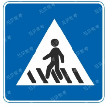
 

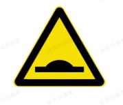
减速丘
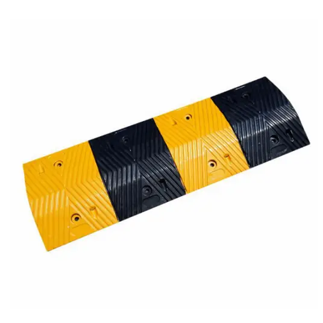
 
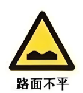
 

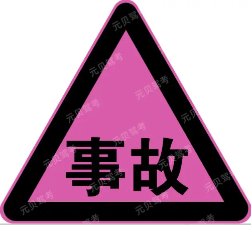
驼峰桥
 
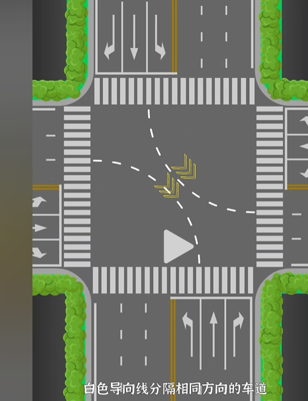 
白色的路口导向线是不是怕我左转的时候和对面路口出发准备左转的互相碰撞，所以分开。两个车在线的外面。黄色导向线的是对于不同路口，比如这个黄色的车在左转，要是他左边的路口有车在右转，怕他们碰到，所以划线分开。
 

你的观察非常敏锐，理解的大方向是正确的，但细节上有一点点小偏差。我们可以根据交通规则中 **“白同黄异”**的核心原则来精确区分一下：

### 1. 白色路口导向线：防止“并排打架”

正如你第一张图所示，白色虚线的作用是**分隔同向行驶的车道**。

* **你的理解：** 怕左转时和对面左转的撞。
* **实际情况：** 它更多是怕你和**“并排”**的队友撞。
* **场景描述：** 当一个路口有两个或两个以上的左转车道时，大家一起左转。如果没有这两条白线，内侧车道（左1）的车可能会转得太宽，外侧车道（左2）的车可能会转得太急，两人就在弯道里“亲”上了。
* **核心目的：** 划定各自的转弯轨迹，确保**多车道同时转弯**时互不干扰。

---

### 2. 黄色路口导向线：划清“楚河汉界”

第二张图里的黄色虚线，作用是**分隔不同方向（通常是对向）的车流**。

* **你的理解：** 怕左边路口有车右转碰到，所以分开。
* **实际情况：** 它的主要作用是**“防逆行”或“防越界”**。
* **场景描述：** 这条线相当于把马路中间的黄色双实线（中心线）延伸到了路口里。
* **左转时：** 提醒你左转不能“抄近道”切得太死，如果切过了黄线，你就跑到对面车道（逆行区域）去了。
* **对向车：** 同样，对向过来的车也不能跨过这条黄线。

* **核心目的：** 明确路口的**中心边界**。正如你所说，它可以防止你和左侧路口右转出来的车、或者是对面左转过来的车发生正面冲突。

---

### 总结与对比

| 特征 | 白色导向线 (图1) | 黄色导向线 (图2) |
| --- | --- | --- |
| **口诀** | **白同**：分隔同向车道 | **黄异**：分隔对向车道 |
| **防谁** | 防旁边的“队友”挤你 | 防对面的“对手”撞你 |
| **位置** | 通常出现在多条转弯车道之间 | 通常出现在路口中心区域，延伸中心线 |
| **你的位置** | 你应该在**两条白线中间**行驶 | 你应该在**黄线的右侧**行驶 |

**一句话记法：**
白线是**“跑道线”**，大家各跑各的车道；黄线是**“分界线”**，千万不能跨到对面去。

你在考驾照或者在研究交通规则吗？如果需要，我可以帮你整理一份**“路口常见标线及违章陷阱”**的清单。